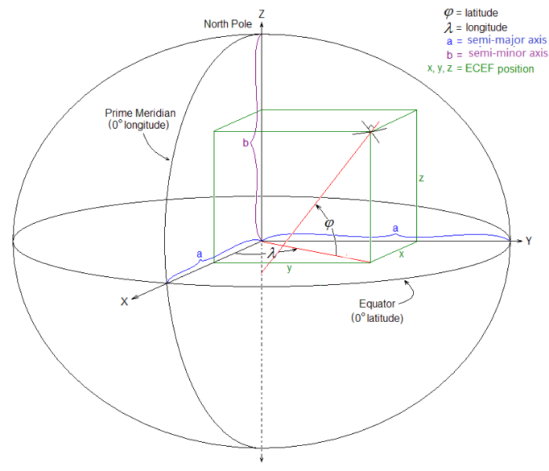

# CESIUM_scene_crs

## Contributors

- Don McCurdy, Independent

## Status

Cesium Vendor Extension - Supported in all Cesium implementations of the 3D Tiles [`3DTILES_content_gltf`](https://github.com/CesiumGS/3d-tiles/tree/3d-tiles-next/extensions/3DTILES_content_gltf) extension.

## Dependencies

Written against the glTF 2.0 spec.

## Overview

The `CESIUM_scene_crs` extension declares the Coordinate Reference System (CRS) in which a glTF 2.0 asset was authored, which may differ from the default — right-handed, +Y up, +Z forward, and -X right — as defined in the [Coordinate System and Units](https://www.khronos.org/registry/glTF/specs/2.0/glTF-2.0.html#coordinate-system-and-units) section of the glTF specification.

glTF assets used in certain contexts, and notably as [3D Tiles](https://github.com/CesiumGS/3d-tiles/) content, are georeferenced and aligned with a larger geospatial dataset. "+Y up" or "+Z up" are meaningless conventions in this context – there is no single "Up" vector on the surface of a globe.

Rather than requiring client implementations to transform generic glTF assets into a geospecific orientation at runtime, this extension allows content pipelines producing 3D Tiles with glTF content to prepare data as needed (e.g. orienting and perhaps splitting an asset) to be delivered in a 3D Tiles tileset. In order to identify that such processing has been applied and the default coordinate system no longer applies, scenes are annotated with a CRS.

See [`3DTILES_content_gltf`](https://github.com/CesiumGS/3d-tiles/tree/3d-tiles-next/extensions/3DTILES_content_gltf) for additional details on the use of glTF 2.0 assets in 3D Tiles.

## Extending Scenes

Scenes annotated with the `crs` property are declared to have been authored for geospecific usage, with a particular CRS. Without this property, scenes in a glTF 2.0 asset are understood to have been authored using the coordinate system of the base glTF 2.0 specification.

> **Example:** Scene within a glTF asset, annotated to indicate a EPSG:4978 CRS.
>
> ```jsonc
> {
>   "asset": {"version": "2.0", "generator": "Cesium Ion v123"},
>   "extensionsUsed": ["CESIUM_scene_crs"],
>   "extensionsRequired": ["CESIUM_scene_crs"],
>   "scenes": [
>       "nodes": [0, 1, 2],
>       "extensions": {"CESIUM_scene_crs": {"crs": "EPSG:4978"}}
>   ]
> }
> ```

This extension currently supports only a single CRS: EPSG:4978, an [Earth-centered, Earth-fixed (ECEF)](https://en.wikipedia.org/wiki/Earth-centered,_Earth-fixed_coordinate_system) coordinate system.

<figure>
    
    <figcaption>
        <small><b>Source:</b> <a href="https://en.wikipedia.org/wiki/Earth-centered,_Earth-fixed_coordinate_system" target="_blank">Earth-centered, Earth-fixed coordinate system</a>, Wikipedia, October 2021.</small>
    </figcaption>
</figure>


> **Implementation note:** EPSG:4978 defines `0,0,0` as the center of mass on Earth, where +Z extends through true north (i.e. the geodetic North Pole) and +X intersects the sphere of the earth at 0° latitude (the equator) and 0° longitude (the prime meridian which passes through Greenwich). As a result, no discrete "Up" vector exists relative to a ground plane.

> **Implementation note:** Scenes are annotated with `EPSG:4978` as an informative declaration of their contents. Client implementations are not required to transform content to or from any particular CRS, and may choose simply to reject input not matching their expected CRS. Notably, 3D Tiles implementations require EPSG:4978 for glTF assets included with `3DTILES_content_gltf` and will have undefined behavior when the `crs` property is set to other values or omitted. Providing the CRS is an indication that required pre-processing has been done, and not a replacement for such pre-processing.

## Schema

* [scene.CESIUM_scene_crs.schema.json](./schema/scene.CESIUM_scene_crs.schema.json)
