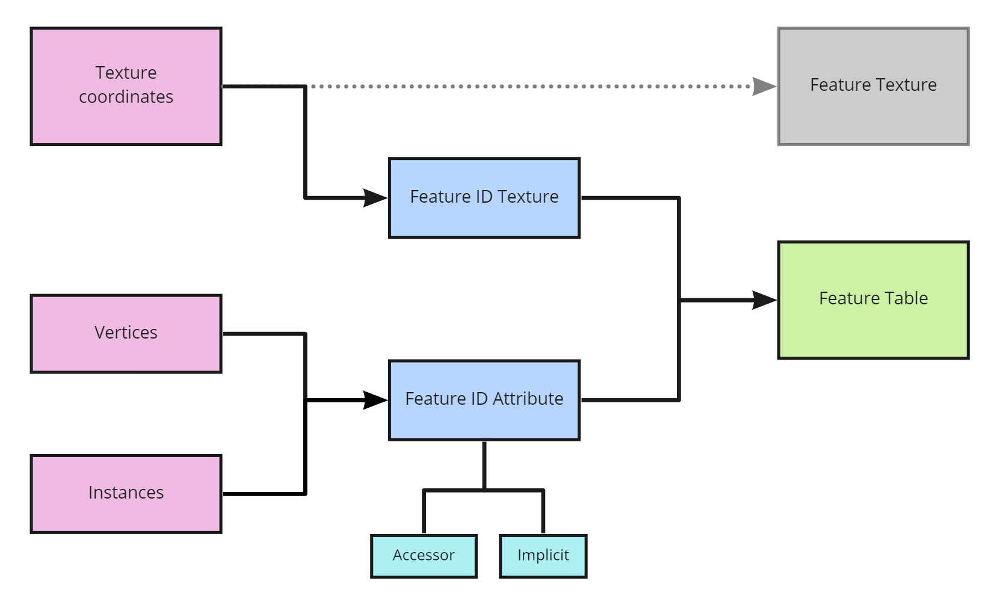
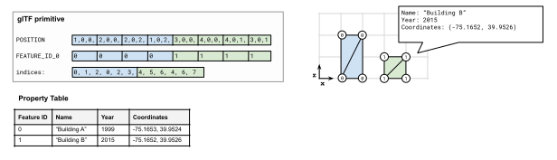
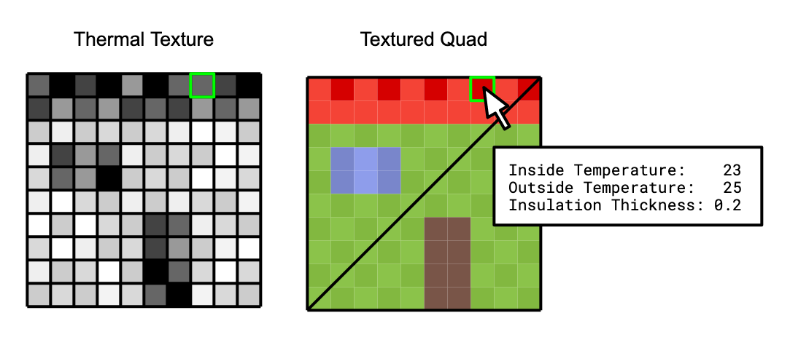
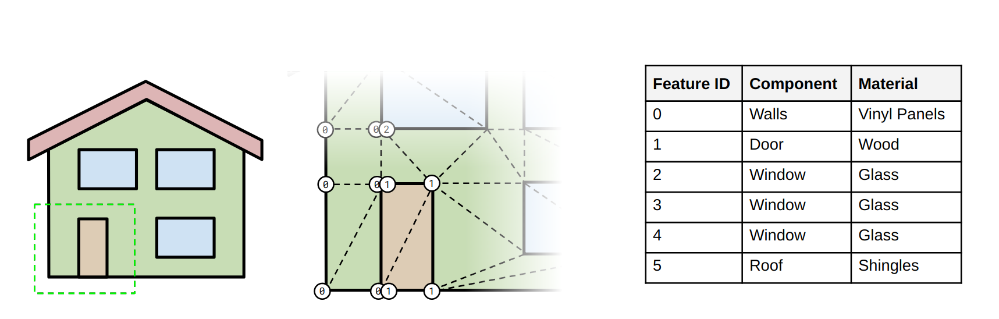
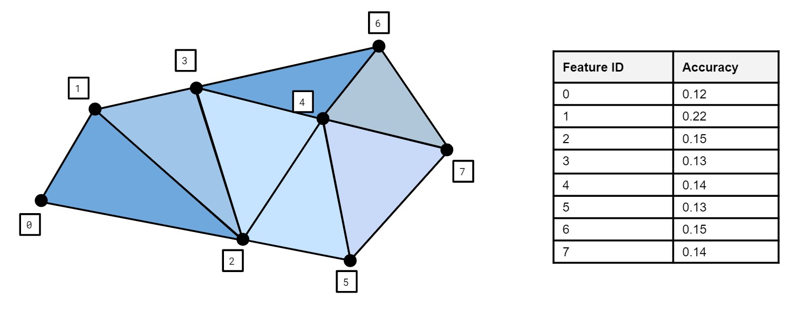
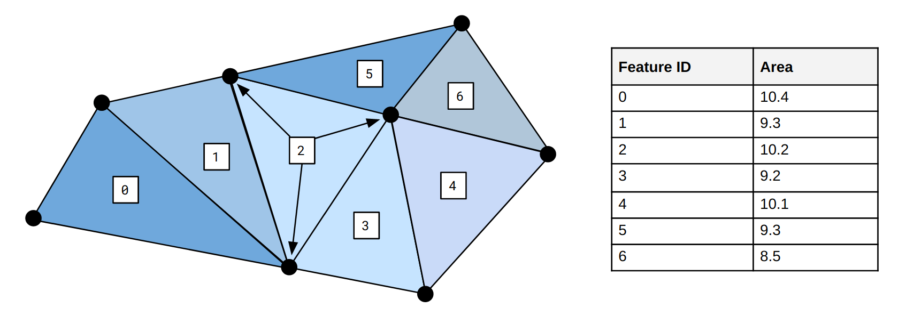
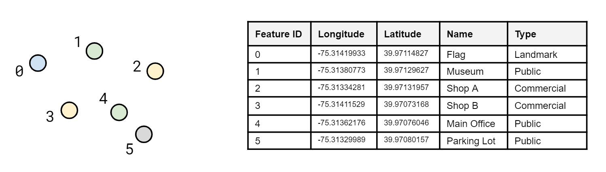
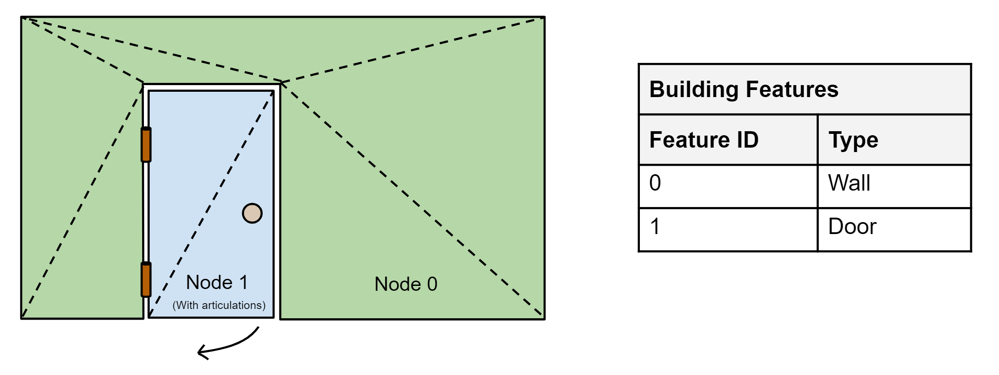
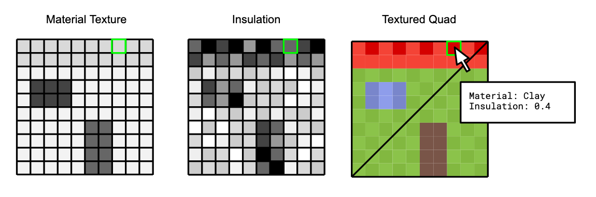

<!-- omit in toc -->
# EXT_mesh_features

<!-- omit in toc -->
## Contributors

* Peter Gagliardi, Cesium
* Sean Lilley, Cesium
* Sam Suhag, Cesium
* Patrick Cozzi, Cesium
* Bao Tran, Cesium
* Samuel Vargas, Cesium

<!-- omit in toc -->
## Status

Draft

<!-- omit in toc -->
## Dependencies

Written against the glTF 2.0 specification.

Optionally, this extension may be used in conjunction with [`EXT_mesh_gpu_instancing`](../../EXT_mesh_gpu_instancing). When used together, certain GPU instance attributes defined by `EXT_mesh_gpu_instancing` are employed by this extension for additional functionality.

<!-- omit in toc -->
## Table of Contents

- [Overview](#overview)
- [Feature IDs](#feature-ids)
  - [Feature ID by Vertex](#feature-id-by-vertex)
    - [Vertex Attribute](#vertex-attribute)
    - [Implicit Vertex Attribute](#implicit-vertex-attribute)
  - [Feature ID by Texture Coordinates](#feature-id-by-texture-coordinates)
  - [Feature ID by GPU Instance](#feature-id-by-gpu-instance)
- [Feature Properties](#feature-properties)
  - [Schema Definitions](#schema-definitions)
    - [Schema](#schema)
    - [Class](#class)
    - [Enum](#enum)
    - [Enum Values](#enum-values)
    - [Class Property](#class-property)
  - [Property Tables](#property-tables)
  - [Property Textures](#property-textures)
- [Binary Data Storage](#binary-data-storage)
- [Optional vs. Required](#optional-vs-required)
- [Schema](#schema-1)
- [Examples](#examples)
- [Revision History](#revision-history)

## Overview

This extension defines a means of storing structured metadata associated with geometry and subcomponents of geometry within a glTF 2.0 asset.

In most realtime 3D contexts, performance requirements demand minimizing the number of nodes and meshes in an asset. These requirements compete with interactivity, as applications may wish to merge static objects while still supporting some level of interaction or inspection on those objects. Common performance optimizations, like merging or GPU instancing, may destroy references to distinct objects, their features, and their behaviors.

By defining a representation of conceptual objects ("features") distinct from rendered geometry, and a means of associating structured metedata ("properties") with those features, this extension allows applications to preserve granular details of 3D assets for inspection and interaction without compromising runtime performance and draw calls.

Concepts and terminology used throughout this document are references to the [Cesium 3D Metadata Specification](https://github.com/CesiumGS/3d-tiles/blob/3d-tiles-next/specification/Metadata/README.md), which should be considered a normative reference for definitions and requirements. This extension specification also provides inline definitions of terms where appropriate.

See [Examples](#examples) for a more detailed list of use cases for this extension.

> **Disambiguation:** glTF has other methods of storing details that could similarly be described as metadata or properties, including [`KHR_xmp_json_ld`](https://github.com/KhronosGroup/glTF/tree/main/extensions/2.0/Khronos/KHR_xmp_json_ld), Extras, and Extensions. While those methods associate data with discrete objects in a glTF asset — nodes, materials, etc. — `EXT_mesh_features` is uniquely suited for properties of more granular conceptual features, like detailed subregions of a geometry or texture.

## Feature IDs

A **feature** is conceptual object associated with both geometry and properties. Similar concepts exist in various industries and domains. In Geographic Information Systems (GIS) a feature is an entity such as a point, polyline, or polygon that represents some element on a map. In another domain like CAD/BIM a feature might be a component of a design model, such as a pipe. A feature could also be a 3D building in a city, a tree in a forest, a sample point in a weather model, or a patch of texels on a 3D model.

Features are identified within a 3D asset by **Feature IDs** — unique identifiers associated with parts of the asset in one of three ways:

* **Feature ID by Vertex:** Per-vertex ID, in a vertex attribute or implicitly by index
* **Feature ID by Texture Coordinates:** Per-texel ID, in a channel of a Feature ID Texture
* **Feature ID by GPU Instance:** Per-instance ID, in an instance attribute accessor (requires [`EXT_mesh_gpu_instancing`](../../EXT_mesh_gpu_instancing))

```diff
-! DO NOT SUBMIT: Several concepts in this illustration are not yet defined. !-
```



### Feature ID by Vertex

#### Vertex Attribute

Per-vertex feature IDs may be defined explicitly in a vertex attribute accessor.

Names of feature ID attribute semantics follow the naming convention `FEATURE_ID_n` where `n` must start with 0 and continue with consecutive positive integers: `FEATURE_ID_0`, `FEATURE_ID_1`, etc. Indices must not use leading zeroes to pad the number of digits (e.g., `FEATURE_ID_01` is not allowed).

Values of feature IDs are non-negative integers in the range `[0, count - 1]` (inclusive), where `count` is the total number of features in the property table. Values outside this range indicate that no feature is associated.

The attribute's accessor `type` must be `"SCALAR"` and `normalized` must be false. Accessor's `componentType` is not restricted.

> **Implementation Note:** since glTF accessors do not support `UNSIGNED_INT` types for 32-bit integers, `FLOAT` may be used instead allowing integer feature IDs up to 2²⁴. For smaller ranges of feature IDs, `UNSIGNED_BYTE` or `UNSIGNED_SHORT` should be used. As with other vertex attributes, each element of a feature ID accessor must align to 4-byte boundaries.

```diff
-! DO NOT SUBMIT: Change illustration back to PNG. !-
```



```jsonc
{
  "primitives": [
    {
      "attributes": {
        "POSITION": 0,
        "FEATURE_ID_0": 1
      },
      "indices": 2,
      "mode": 4,
      "extensions": {
        "EXT_mesh_features": {
          "propertyTables": [0],
          "featureIds": [{"attribute": 0}]
        }
      }
    }
  ]
}
```

#### Implicit Vertex Attribute

Per-vertex feature IDs may also be defined implicitly, as a function of vertex index within the primitive. Implicit feature IDs reduce storage costs in several common cases, when all vertices in a primitive share the same feature ID, or each sequential group of `N` vertices (such as a triangle face) share the same feature ID.

Implicit feature IDs are a strictly ascending function of the vertex index, configured by `offset` and `repeat` parameters.

* `offset` specifies the initial value for the vertex feature ID range. The default is `0`.
* `repeat`, if defined, specifies the number of vertices for which to repeat each feature ID before incrementing the ID by 1. If `repeat` is undefined, the feature ID for all vertices is `offset`.

For example

* If `offset` is 0 or undefined and `repeat` is undefined, the feature IDs are `[0, 0, 0, ...]`
* If `offset` is 0 and `repeat` is 1, the feature IDs are `[0, 1, 2, ...]`
* If `offset` is 0 and `repeat` is 2, the feature IDs are `[0, 0, 1, 1, 2, 2, ...]`
* If `offset` is 2 and `repeat` is 3, the feature IDs are `[2, 2, 2, 3, 3, 3, 4, 4, 4, ...]`
* If `offset` is 2 and `repeat` is undefined, the feature IDs are `[2, 2, 2, ...]`

`offset` and `repeat` must be omitted when `attribute` is used. These two methods of assigning feature IDs are mutually exclusive.

```diff
-! DO NOT SUBMIT: Update wording (Feature Table, constant, divisor) in illustration. !-
```


```jsonc
{
  "primitives": [
    {
      "attributes": {
        "POSITION": 0
      },
      "mode": 0,
      "extensions": {
        "EXT_mesh_features": {
          "propertyTables": [0],
          "featureIds": [{"offset": 0, "repeat": 1}]
        }
      }
    }
  ]
}
```
### Feature ID by Texture Coordinates

Feature ID textures classify the pixels of an image into different features. Some examples include image segmentation or marking regions on a map. Often per-texel feature IDs provide finer granularity than per-vertex feature IDs, as in the example below.

```diff
-! DO NOT SUBMIT: Update wording in illustration. !-
```


```jsonc
{
  "primitives": [
    {
      "attributes": {
        "POSITION": 0,
        "TEXCOORD_0": 1
      },
      "indices": 2,
      "material": 0,
      "extensions": {
        "EXT_mesh_features": {
          "propertyTables": [0],
          "featureIds": [
            {"index": 0, "texCoord": 0, "channel": 0}
          ]
        }
      }
    }
  ]
}
```

The `featureId` entry for a feature ID texture extends the glTF [`textureInfo`](../../../../../specification/2.0/schema/textureInfo.schema.json) object. Each `channel` must be a non-negative integer corresponding to a channel of the source texture. Channels of an `RGBA` texture are numbered 0–3 respectively, although specialized texture formats may allow additional channels. Feature IDs are non-negative integers in the range `[0, count - 1]` (inclusive), stored in linear space, where `count` is the total number of features in the property table. Values outside this range indicate that no feature is associated.

Texture filtering must be `9728` (NEAREST), or undefined, for any texture object referenced as a feature ID texture.

### Feature ID by GPU Instance

Feature IDs may also be assigned to individual GPU instances when using the [`EXT_mesh_gpu_instancing` extension](../../EXT_mesh_gpu_instancing). Feature IDs may be stored in instance attributes or generated implicitly by index, as with per-vertex feature IDs. Nodes with `EXT_mesh_features` must also define an `EXT_mesh_gpu_instancing` extension, and are invalid without this dependency.

```jsonc
{
  "nodes": [
    {
      "mesh": 0,
      "extensions": {
        "EXT_mesh_gpu_instancing": {
          "attributes": {
            "TRANSLATION": 0,
            "ROTATION": 1,
            "SCALE": 2,
            "FEATURE_ID_0": 3
          },
        },
        "EXT_mesh_features": {
          "propertyTables": [0],
          "featureIds": [{"attribute": 0}]
        }
      }
    }
  ]
}
```

## Feature Properties

Feature properties describe attributes or characteristics of a feature. Data types and semantic meanings of these properties are defined by a schema. Schema definitions are generic, and do not describe storage location or layout of the data.

Conceptually, a feature is an instantiation of a generic class defined in the schema, with specific property values and storage information. Properties may be associated with features in one of two ways:

- **Property Tables** store property values as numeric arrays in a parallel, column-based binary layout. Property tables are indexed by Feature IDs, used as the index for a given feature into each property array.
- **Property Textures** store property values in channels of a texture, suitable for very high-frequency data mapped to less-detailed 3D surfaces. Property textures are indexed by texture coordinates, and do not have associated Feature IDs.

Both storage formats are appropriate for storing property values in large quantities.

### Schema Definitions

Data types and semantic meanings of properties are provided by a schema, as defined in the [Cesium 3D Metadata Specification](https://github.com/CesiumGS/3d-tiles/blob/3d-tiles-next/specification/Metadata/) and summarized below:

- **Schema:** Top-level definitions for type and semantic information. The schema provides a set of *classes* and *enums* the asset can reference.
- **Class:** Template for features. Classes provide a list of properties with type and semantic information. Every feature must be associated with a class, and the feature's properties must conform to the class's property definitions. Features whose properties conform to a class are considered instances of that class.
- **Class Property:** Properties are defined abstractly in a class by their semantic meaning and data type (numeric, boolean, string, enum, or array), and are instantiated in a feature with specific values conforming to that definition.
- **Enum:** Set of categorical types, defined as `name: integer` pairs. Enum properties use an enum as their data type.

A schema may be embedded in the extension directly or referenced externally with the `schemaUri` property. Multiple glTF assets may refer to the same external schema to avoid duplication.

#### Schema

A schema is defined by an `EXT_mesh_features` extension attached to the glTF root object.

- `schema.name`: The name of the schema, e.g. for display purposes.
- `schema.description`: The description of the schema.
- `schema.version`: Application-specific version of the schema.
- `schema.classes`: Dictionary, where each key is a class ID and each value is an object defining the class.
- `schema.enums`: Dictionary, where each key is an enum ID and each value is an object defining the values for the enum.

*Defined in [schema.schema.json](./schema/schema.schema.json).*

#### Class

Classes are defined as entries in the `schema.classes` dictionary, indexed by an alphanumeric class ID. Each class may contain:

- `class.name`: The name of the class, e.g. for display purposes.
- `class.description`: The description of the schema.
- `class.properties`: Dictionary, where each key is a property ID and each value is an object defining the property.

*Defined in [class.schema.json](./schema/class.schema.json).*

#### Enum

Enums are defined as entries in the `schema.enums` dictionary, indexed by an alphanumeric enum ID. Each enum may contain:

- `enum.name`: The name of the enum, e.g. for display purposes.
- `enum.description`: The description of the enum.
- `enum.valueType`: The type of the integer enum value. Default is `"UINT16"`.
- `enum.values`: Array of enum values.

*Defined in [enum.schema.json](./schema/enum.schema.json).*

#### Enum Values

Enum values are defined as entries in the `enum.values` array. Duplicate names or duplicate integer values are not allowed. Each enum value may contain:

- `enumValue.name`: The name of the enum value.
- `enumValue.description`: The description of the enum value.
- `enumValue.value`: The integer enum value.

*Defined in [enum.value.schema.json](./schema/enum.value.schema.json).*

#### Class Property

Class properties are defined as entries in the `class.properties` dictionary, indexed by an alphanumeric property ID. Each property may contain:

- `property.name`: The name of the property, e.g. for display purposes.
- `property.description`: The description of the property.
- `property.type`: Element type represented by each property value. `VECN` is a vector with `N` components. `MATN` is an `N ⨉ N` matrix. `ARRAY` is fixed-length when `componentCount` is defined, and is variable-length otherwise.
- `property.componentType`: Data type of an element's components. When `type` is `SINGLE`, then `componentType` is also the data type of the element. When `componentType` is `ENUM`, `enumType` is required.
- `property.componentCount`: Number of components per element for fixed-length `ARRAY` elements. Always undefined for variable-length `ARRAY` and all other element types.
- `property.enumType`: Enum ID as declared in the `enums` dictionary. Required when `componentType` is `ENUM`.
- `property.normalized`: Specifies whether integer values are normalized. When true, signed component types are normalized between `[-1, 1]` and unsigned component types are normalized between `[0, 1]`.
- `property.min`: Minimum allowed value for the property.
- `property.max`: Maximum allowed value for the property.
- `property.required`:
- `property.noData`:
- `property.semantic`:

*Defined in [class.property.schema.json](./schema/class.property.schema.json).*

### Property Tables

A property table stores property values as arrays in a parallel, column-based binary layout. Each property array corresponds to a class property. The values contained within a property array must match the data type of the class property. Furthermore, the set of property arrays must match one-to-one with the class properties. There is one exception - if a property specifies a `noData` value, the property table may omit that property.

The schema and property tables are defined in the root extension object in the glTF model. See the example below:

```jsonc
{
  "extensions": {
    "EXT_mesh_features": {
      "schema": {
        "classes": {
          "tree": {
            "properties": {
              "height": {
                "description": "Height of tree measured from ground level",
                "type": "FLOAT32"
              },
              "birdCount": {
                "description": "Number of birds perching on the tree",
                "type": "UINT8"
              },
              "species": {
                "description": "Species of the tree",
                "type": "STRING"
              }
            }
          }
        }
      },
      "propertyTables": [{
        "name": "tree",
        "class": "tree",
        "count": 10,
        "properties": {
          "height": {
            "bufferView": 0
          },
          "birdCount": {
            "bufferView": 1
          },
          "species": {
            "bufferView": 2,
            "stringOffsetBufferView": 3
          }
        }
      }]
    }
  }
}
```

`class` is the ID of the class in the schema. `count` is the number of features in the property table, as well as the length of each property array. Property arrays are stored in glTF buffer views and use the binary encoding defined in the [Table Format](https://github.com/CesiumGS/3d-tiles/tree/3d-tiles-next/specification/Metadata#table-format) section of the [Cesium 3D Metadata Specification](https://github.com/CesiumGS/3d-tiles/tree/3d-tiles-next/specification/Metadata).

As in the core glTF specification, values of NaN, +Infinity, and -Infinity are never allowed.

Each buffer view `byteOffset` must be aligned to a multiple of 8 bytes.

```diff
-! DO NOT SUBMIT: Update wording in illustration below. !-
```

> **Example:**
>
> 
>
> In the image above, a glTF consists of two houses batched together into a single primitive. A feature ID attribute on the primitive indicates that all of the vertices making up the first house have a feature ID of 0, while all vertices making up the second house have the feature ID 1. The feature ID is then used to access the building's properties from the property table.

### Property Textures

Property textures use textures rather than parallel arrays to store values. Property textures are accessed directly by texture coordinates, and do not require feature IDs. Property textures are especially useful when texture mapping high frequency data to less detailed 3D surfaces. Unlike textures used in glTF materials, property textures are not necessarily visible in a rendered scene.

For each property that does not specify a `noData` value, a mapping to the corresponding texture channel or channels is required. Properties with a `noData` value are optional in property textures instantiating a given class.

Property textures use the [Raster Format](https://github.com/CesiumGS/3d-tiles/tree/3d-tiles-next/specification/Metadata#raster-format) of the [Cesium 3D Metadata Specification](https://github.com/CesiumGS/3d-tiles/tree/3d-tiles-next/specification/Metadata) with a few additional constraints:

* A scalar property cannot be encoded into multiple channels. For example, it is not possible to encode a `UINT32` property in an `RGBA8` texture.
* Components of fixed-length array properties must be separate channels within the same texture.
* Variable-length arrays are not supported.

Additionally, the data type and bit depth of the image must be compatible with the property type. An 8-bit per pixel RGB image is only compatible with `UINT8` or normalized `UINT8` properties, and array properties thereof with three components or less. Likewise, a floating point property requires a floating point-compatible image format like KTX2 which may require additional extensions.

Property textures are defined with the following steps:

1. A class is defined in the root `EXT_mesh_features` extension object. This is used to describe the properties in the texture.
2. A property texture is defined in the root `EXT_mesh_features.propertyTextures` object. This must reference the class ID defined in step 1.
3. A property texture is associated with a primitive by listing the property texture ID in the `primitive.EXT_mesh_features.propertyTextures` array.


_Class and property texture_

```jsonc
{
  "extensions": {
    "EXT_mesh_features": {
      "schema": {
        "classes": {
          "heatSample": {
            "properties": {
              "heatLoss": {
                "type": "UINT8",
                "normalized": true
              },
              "insulation": {
                "type": "UINT8",
                "normalized": true
              },
            }
          }
        }
      },
      "propertyTextures": [{
        "class": "heatSample",
        "index": 0,
        "texCoord": 0,
        "properties": {
          "heatLoss": [0],
          "insulation": [1]
        }
      }]
    }
  }
}
```

_Primitive_

```jsonc
{
  "primitives": [
    {
      "attributes": {
        "POSITION": 0,
        "TEXCOORD_0": 1
      },
      "indices": 2,
      "material": 0,
      "extensions": {
        "EXT_mesh_features": {
          "propertyTextures": [0]
        }
      }
    }
  ]
}
```


A `propertyTexture` object extends the glTF [`textureInfo`](../../../../../specification/2.0/schema/textureInfo.schema.json) object. `texCoord` refers to the texture coordinate set of the referring primitive. The `properties` map specifies the texture channels providing data for all required class properties, and perhaps optional class properties. An array of integer index values identify channels, where multiple channels may be used only for fixed-length arrays of 2, 3, or 4 components. Channels of an `RGBA` texture are numbered 0–3 respectively, although specialized texture formats may allow additional channels. All values are stored in linear space.

Texture filtering must be `9728` (NEAREST), `9729` (LINEAR), or undefined, for any texture object referenced as a property texture.

## Binary Data Storage

Feature properties are stored in a compact binary tabular format described in the [Cesium 3D Metadata Specification](https://github.com/CesiumGS/3d-tiles/tree/3d-tiles-next/specification/Metadata). `EXT_mesh_features` imposes additional binary data alignment requirements on an asset, extending the 4-byte alignment in the core glTF specification:

- GLB-stored `JSON` chunk must be padded with trailing `Space` characters (`0x20`) to 8-byte boundary.
- GLB-stored `BIN` chunk must be padded with trailing zeroes (`0x00`) to 8-byte boundary.

As a result, byte length of the `BIN` chunk may be up to 7 bytes larger than JSON-defined `buffer.byteLength` to satisfy alignment requirements.

## Optional vs. Required

This extension is optional, meaning it should be placed in the `extensionsUsed` list, but not in the `extensionsRequired` list.

## Schema

* [gltf.EXT_mesh_features.schema.json](./schema/gltf.EXT_mesh_features.schema.json)
* [primitive.EXT_mesh_features.schema.json](./schema/primitive.EXT_mesh_features.schema.json)
* [node.EXT_mesh_features.schema.json](./schema/node.EXT_mesh_features.schema.json)

## Examples

_This section is non-normative_

The examples below shows the breadth of possible use cases for this extension.

Example|Description|Image
--|--|--
Triangle mesh|Feature IDs are assigned to each vertex to distinguish components of a building.|
Per-vertex metadata|An implicit feature ID is assigned to each vertex. The property table stores `FLOAT64` accuracy values. |
Per-triangle metadata|An implicit feature ID is assigned to each set of three vertices. The property table stores `FLOAT64` area values.|
Per-point metadata|An implicit feature ID is assigned to each point. The property table stores `FLOAT64` , `STRING`, and `ENUM` properties, which are not possible through glTF vertex attribute accessors alone.|
Per-node metadata|Vertices in node 0 and node 1, not batched together, are assigned different `offset` feature IDs.|
Multi-point features|A point cloud with two property tables, one storing metadata for groups of points and the other storing metadata for individual points.|
Multi-instance features|Instanced tree models where trees are assigned to groups with a per-GPU-instance feature ID attribute. One property table stores per-group metadata and the other stores per-tree metadata.|
Material classification|A textured mesh using a property texture to store both material enums and normalized `UINT8` thermal temperatures.|
Composite|A glTF containing a 3D mesh (house), a point cloud (tree), and instanced models (fencing) with three property tables.|

## Revision History

* **Version 0.0.0** December 4, 2020
  * Initial draft
* **Version 1.0.0** February 24, 2021
  * Changes to class properties
    * Removed `FLOAT16` type
    * Removed `BLOB` type
    * Added `ENUM` to the list of supported types and component types and added `enumType` to refer to the chosen enum
    * `min` and `max` are now numbers instead of single-element arrays for non-`ARRAY` properties
  * Changes to property table
    * Removed `offsetBufferViews`, replaced with `arrayOffsetBufferView` and `stringOffsetBufferView`
    * Removed `blobByteLength`
    * Removed `stringByteLength`
    * Removed `name` and `description`
    * Removed `elementCount` and redefined `count` to mean the element count
    * Added optional `semantic` property
  * Changes to feature ID attribute
    * Removed `vertexStride` and `instanceStride`
    * Added `divisor` for incrementing feature IDs at fixed intervals, e.g. per-triangle or per-quad
  * Changes to `EXT_feature_metadata` object
    * Removed `classes` dictionary. Classes and enums are now contained in the `schema` object.
    * Added `schema` and `schemaUri`. The schema object contains class and enum definitions. `schemaUri` refers to an external schema JSON file. `schema` and `schemaUri` are mutually exclusive.
    * Added optional `statistics` object which provides aggregate information about select properties within the model
  * Other changes
    * Added `EXT_feature_metadata` extension to the [`EXT_mesh_gpu_instancing`](https://github.com/KhronosGroup/glTF/tree/master/extensions/2.0/Vendor/EXT_mesh_gpu_instancing) extension for assigning metadata to instances
* **Version 2.0.0** September 2021
  * Renamed extension from `EXT_feature_metadata` to `EXT_mesh_features`
  * Renamed `constant` to `offset`, and `divisor` to `repeat`
  * Removed `statistics` specification, to be considered as a future extension
  * Renamed `featureTable` → `propertyTable` and `featureTexture` → `propertyTexture`
  * Removed `featureIdAttributes` and `featureIdTextures`, replaced with `featureIds`
  * Removed string ID references to property tables and textures, replaced with integer IDs
