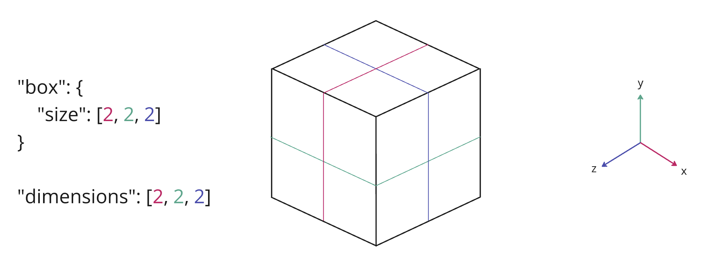

# EXT_primitive_voxels

<p align="center">
  
</p>

## Contributors

- Daniel Krupka, Cesium
- Ian Lilley, Cesium
- Sean Lilley, Cesium
- Janine Liu, Cesium
- Jeshurun Hembd, Cesium

## Status

Draft

## Dependencies

Written against the glTF 2.0 specification. Depends on the [`KHR_implicit_shapes`](https://github.com/eoineoineoin/glTF/tree/refs/heads/collisionShapeMerge/extensions/2.0/Khronos/KHR_implicit_shapes) extension.

## Overview

This extension allows mesh primitives to represent volumetric (voxel) data via custom attributes. Primitives that use this extension must set their `mode` to the constant `0x7FFFFFFF` (`2147483647`) used to indicate voxels.

Typical mesh primitives make use of the `POSITION` attribute to store positional mesh data. However, `POSITION` is neither required nor used by `EXT_primitive_voxels` Instead, this extension relies on the `KHR_implicit_shapes` extension to describe the shape of the voxel grid.

```json
{
  "extensions": { 
    "KHR_implicit_shapes": {
      "shapes": [
        {
          "type": "box",
          "box": {
            "size": [2, 2, 2]
          }
        }
      ]
    }
  },
  "meshes": [
    {
      "primitives": [
        {
          "attributes": {
            "_TEMPERATURE": 0
          },
          "mode": 2147483648,
          "extensions": {
            "EXT_primitive_voxels": {
                "shape": 0,
                "dimensions": [8, 8, 8]
            }
          }
        }
      ]
    }
  ]
}
```

Though voxels are commonly associated with cubic geometry on a box-based grid, this extension allows voxels to be based on other types of grid geometry. This currently includes cylinder-based regions specified by [`EXT_implicit_cylinder_region`](../EXT_implicit_cylinder_region/) as well as ellipsoid-based regions specified by [`EXT_implicit_ellipsoid_region`](../EXT_implicit_ellipsoid_region/). The supported shapes are visualized below.

|Box|Cylinder|Region|
| ------------- | ------------- | ------------- |
||||

Voxels exist inside a bounding volume that conforms to the shape of the grid. The `dimensions` property refers to the number of subdivisions _within_ this bounding volume. Each value of `dimensions` must be a positive integer.

The relationship between `dimensions` and the grid geometry is explained in detail below.

### Box Grid

A **box** grid is a Cartesian grid defined by `x`, `y`, and `z` axes with equally-sized boxes. The `dimensions` correspond to the subdivisions of the box along the `x`, `y`, and `z` axes respectively.


<p align="center"><i>A box grid spanning from -1 to 1 in all three axes, subdivided into two cells along each axis. The origin is in the center of the box.</i></p>

These properties may be used to define the scale of the box grid, independent of the `scale` applied by a node. Additionally, the `dimensions` may be non-uniform.


<p align="center"><i>A box grid that is non-uniformly scaled due to its min and max properties. It is also non-uniformly subdivided.</i></p>

Elements are laid out in memory where the `x` data is contiguous (up to stride).

### Cylinder Region Grid

A **cylinder** region grid is subdivided along the radius, height, and angle ranges of the region, visualized below.


The cylinder is aligned with the `y`-axis in the primitive's local space. As such, the `height` is subdivided along that local `y`-axis. Subdivisions along the radius are concentric, centered around the `y`-axis and extending outwards. The angle is subdivided around the circumference of the cylinder.

Elements are laid out in memory where the radius data is contiguous (up to stride).

### Ellipsoid Region Grid

An **ellipsoid** region grid is subdivided along the longitude, latitude, and height ranges of the region, visualized below.

Elements are laid out in memory where the `longitude` data is contiguous (up to stride).

### Padding

```json
"extensions": {
  "EXT_primitive_voxels": {
    "shape": 0,
    "dimensions": [8, 8, 8],
    "padding": {
      "before": [1, 1, 1],
      "after": [1, 1, 1]
    }
  }
}
```

The `padding` property specifies how many rows of attribute data in each dimension come from neighboring grids. This is useful in situations where the primitive represents a single tile in a larger grid, and data from neighboring tiles is needed for non-local effects e.g. trilinear interpolation, blurring, antialiasing. `padding.before` and `padding.after` specify the number of rows before and after the grid in each dimension, e.g. a `padding.before` of 1 and a `padding.after` of 2 in the `y` dimension mean that each series of values in a given `y`-slice is preceded by one value and followed by two.

The padding data must be supplied with the rest of the voxel data - this means if `dimensions` is `[d1, d2, d3]`, `padding.before` is `[b1, b2, b3]`, and `padding.after` is `[a1, a2, a3]`, the attribute must supply `(d1 + a1 + b1)*(d2 + a2 + b2)*(d3 + a3 + b3)` elements.

### No Data Values

```json
"meshes": [
  {
    "primitives": [
      {
        "attributes": {
          "_TEMPERATURE": 0,
          "_SALINITY": 1,
          "_DATA_LOSS": 2
        },
        "mode": 2147483648,
        "extensions": {
          "EXT_primitive_voxels": {
              "shape": 0,
              "dimensions": [8, 8, 8],
              "noData": {
                "_TEMPERATURE": -999.99,
                "_SALINITY": -999
              }
          }
        }
      }
    ]
  }
]
```

### Metadata

This extension may be paired with the `EXT_structural_metadata` extension to convey more semantic information about the voxel attributes.

```json
{
  "extensions": {
    "KHR_implicit_shapes": {
      "shapes": [
        {
          "box": {
            "size": [2, 2, 2]
          }
        }
      ]
    },
    "EXT_structural_metadata": {
      "schema": {
        "classes": {
          "voxels": {
            "properties": {
              "temperature": {
                // ...
              }
            }
          }
        }
      }
      "propertyAttributes": [
        {
          "class": "voxels",
          "properties": {
            "temperature":{
              "attribute": "_TEMPERATURE"
            }
          }
        }
      ]
    }
  },
  "meshes": [
    {
      "primitives": [
        {
          "attributes": {
            "_TEMPERATURE": 0
          },
          "extensions": {
            "EXT_primitive_voxels": {
              "dimensions": [8, 8, 8],
              "padding": {
                "before": [1, 1, 1],
                "after": [1, 1, 1]
              }
            },
            "EXT_structural_metadata": {
              "propertyAttributes": [0]
            }
          }
        }
      ]
    }
  ]
}
```

## Optional vs. Required
This extension is required, meaning it should be placed in both the `extensionsUsed` list and `extensionsRequired` list.
