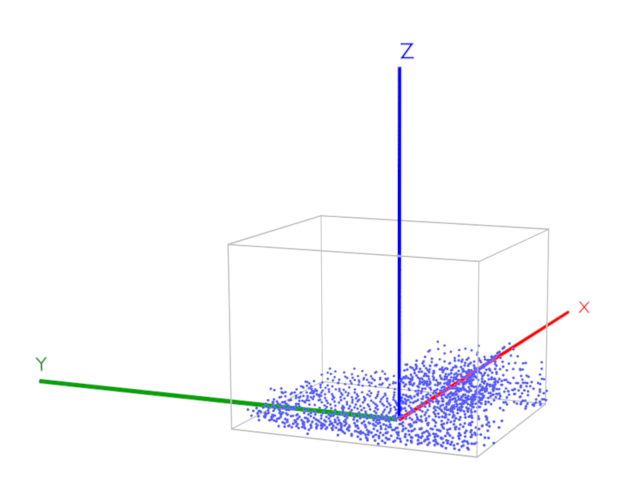
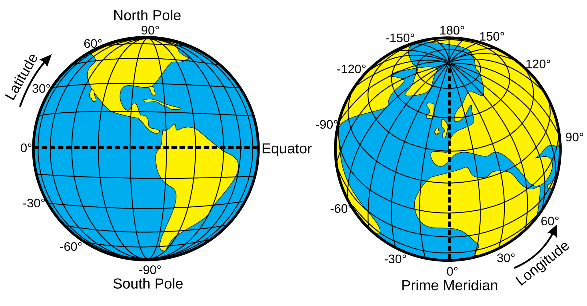
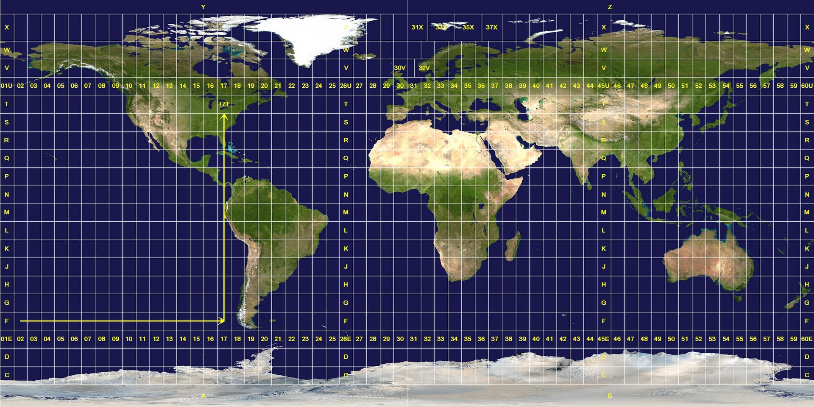

# 3DTILES\_crs

## Contributors

- Sean Lilley, Cesium
- Don McCurdy, Cesium
- Björn Blissing, Vantor

## Status

Draft

## Dependencies

Written against the glTF 2.1 spec.

## Optional vs. Required

This extension is required, meaning it **MUST** be placed in both `extensionsRequired` and `extensionsUsed`.

## Contents

- [Overview](#overview)
- [Types](#types)
- [Sub-Extensions](#sub-extensions)
  - [Example: EPSG](#example-epsg)
  - [Example: IAU](#example-iau)
  - [Example: WKT2](#example-wkt2)
- [External Assets](#external-assets)
  - [Example: Local -> Local](#example-local---local)
  - [Example: Geocentric -> Local](#example-geocentric---local)
- [Appendix](#appendix)
  - [Precision](#precision)

## Overview

This extension declares the Coordinate Reference System (CRS) in which a glTF 2.0 asset was authored, which may differ from the default — right-handed, +Y up, +Z forward, and -X right — as defined in the [Coordinate System and Units](https://www.khronos.org/registry/glTF/specs/2.0/glTF-2.0.html#coordinate-system-and-units) section of the glTF specification.

The following example shows an asset annotated to indicate a [WGS 84](https://epsg.org/ellipsoid_7030/WGS-84.html) Earth-centered, Earth-fixed (ECEF) geocentric coordinate reference system ([EPSG 4978](https://epsg.org/crs_4978/WGS-84.html)).

```json
{
  "asset": {
    "version": "2.1"
  },
  "extensions": {
    "3DTILES_crs": {
      "type": "geocentric"
    },
    "3DTILES_crs_epsg": {
      "code": "EPSG:4978"
    }
  }
}
```


Assets with the `3DTILES_crs` extension are declared to have been authored for geospecific usage, with a particular CRS. Without this extension, glTF assets are understood to have been authored using the coordinate system of the base glTF specification.

## Types

This extension defines a single property `type` which can be one of the following values:

`type`|Description|Diagram
--|--|--
`"local"`|A local coordinate system. By default, a right-handed Cartesian coordinate system in meters where `+X` faces east, `+Y` faces north, and `+Z` axis faces up. A local coordinate system other than the default **MAY** be provided by a [sub-extension](#sub-extensions).|
`"geocentric"`|A geocentric (planetocentric) coordinate system. By default, [`EPSG:4978`](https://epsg.org/crs_4978/WGS-84.html), a right-handed Cartesian coordinate system in meters where the origin is the center of the Earth, `+X` points through the intersection of the equator and the prime meridian, `+Y` points through the intersection of the equator and 90° longitude, and `+Z` points through the north pole. A geocentric coordinate system other than the default **MAY** be provided by a [sub-extension](#sub-extensions). For floating point precision considerations, see [Precision](#precision).|
`"geographic"`|A geographic (planetographic) coordinate system. By default, [`EPSG:4979`](https://epsg.org/crs_4979/WGS-84.html), where coordinates are latitude and longitude in decimal degrees and height above (or below) the WGS84 ellipsoid in meters. A geographic coordinate system other than the default **MAY** be provided by a [sub-extension](#sub-extensions).|
`"projected"`|A projected coordinate system. There is no default CRS; the CRS **MUST** be provided by a [sub-extension](#sub-extensions).|

Additional types may be defined by extensions.

> **Note:** Implementations are only required to support `"local"` and `"geocentric"`. Other types may be used for application-specific purposes, but are discouraged as they often require dedicated coordinate transformation libraries and ancillary data, such as grid shift files, in order to be rendered in 3D globe engines.

## Sub-Extensions

Coordinate reference systems can represented in multiple ways such as [EPSG](https://epsg.org/home.html) codes, [IAU](https://www.iau.org/) codes, [WKT2](https://www.ogc.org/standards/wkt-crs/) strings, or other mechanisms. Aiming for maximum conformance and interoperability these are split into separate sub-extensions including:

- [3DTILES_crs_epsg](../3DTILES_crs_epsg/README.md)
- [3DTILES_crs_iau](../3DTILES_crs_iau/README.md)
- [3DTILES_crs_wkt2](../3DTILES_crs_wkt2/README.md)

When used together, `3DTILES_crs` indicates the type of CRS and sub-extensions provide the specific CRS, overriding the default CRS.

### Example: EPSG

```json
{
  "asset": {
    "version": "2.1"
  },
  "extensions": {
    "3DTILES_crs": {
      "type": "geocentric"
    },
    "3DTILES_crs_epsg": {
      "code": "EPSG:4978",
      "epoch": "2019.81"
    }
  }
}
```

### Example: IAU

```json
{
  "asset": {
    "version": "2.1"
  },
  "extensions": {
    "3DTILES_crs": {
      "type": "geocentric"
    },
    "3DTILES_crs_iau": {
      "code": "IAU_2015:30100",
      "body": "Moon"
    }
  }
}
```

### Example: WKT2

```json
{
  "asset": {
    "version": "2.1"
  },
  "extensions": {
    "3DTILES_crs": {
      "type": "projected"
    },
    "3DTILES_wkt2": {
      "string": "PROJCRS[\"WGS 84 / UTM zone 11N\",BASEGEOGCRS[\"WGS 84\",ENSEMBLE[\"World Geodetic System 1984 ensemble\",MEMBER[\"World Geodetic System 1984 (Transit)\"],MEMBER[\"World Geodetic System 1984 (G730)\"],MEMBER[\"World Geodetic System 1984 (G873)\"],MEMBER[\"World Geodetic System 1984 (G1150)\"],MEMBER[\"World Geodetic System 1984 (G1674)\"],MEMBER[\"World Geodetic System 1984 (G1762)\"],MEMBER[\"World Geodetic System 1984 (G2139)\"],MEMBER[\"World Geodetic System 1984 (G2296)\"],ELLIPSOID[\"WGS 84\",6378137,298.257223563,LENGTHUNIT[\"metre\",1]],ENSEMBLEACCURACY[2.0]],PRIMEM[\"Greenwich\",0,ANGLEUNIT[\"degree\",0.0174532925199433]],ID[\"EPSG\",4326]],CONVERSION[\"UTM zone 11N\",METHOD[\"Transverse Mercator\",ID[\"EPSG\",9807]],PARAMETER[\"Latitude of natural origin\",0,ANGLEUNIT[\"degree\",0.0174532925199433],ID[\"EPSG\",8801]],PARAMETER[\"Longitude of natural origin\",-117,ANGLEUNIT[\"degree\",0.0174532925199433],ID[\"EPSG\",8802]],PARAMETER[\"Scale factor at natural origin\",0.9996,SCALEUNIT[\"unity\",1],ID[\"EPSG\",8805]],PARAMETER[\"False easting\",500000,LENGTHUNIT[\"metre\",1],ID[\"EPSG\",8806]],PARAMETER[\"False northing\",0,LENGTHUNIT[\"metre\",1],ID[\"EPSG\",8807]]],CS[Cartesian,2],AXIS[\"(E)\",east,ORDER[1],LENGTHUNIT[\"metre\",1]],AXIS[\"(N)\",north,ORDER[2],LENGTHUNIT[\"metre\",1]],USAGE[SCOPE[\"Navigation and medium accuracy spatial referencing.\"],AREA[\"Between 120°W and 114°W, northern hemisphere between equator and 84°N, onshore and offshore. Canada - Alberta; British Columbia (BC); Northwest Territories (NWT); Nunavut. Mexico. United States (USA).\"],BBOX[0,-120,84,-114]],ID[\"EPSG\",32611]]"
    }
  }
}
```

## External Assets

Assets may reference external assets, each with their own CRS. For example, an asset could start in a geocentric CRS and then transition to a local engineering reference frame for higher precision.

 The following rules apply for CRS transitions:

- Local assets **SHOULD** only reference other local assets.
- Geocentric assets **SHOULD** only reference local assets or geocentric assets with the same CRS.
- Geographic assets **SHOULD** only reference geographic assets with the same CRS.
- Projected assets **SHOULD** only reference projected assets with the same CRS.

When an asset reference an external asset with a different, but compatible CRS, the parent asset **SHOULD** transform the child asset into the parent's coordinate reference system. See the examples below.

### Example: Local -> Local

This example shows an asset with a `"local"` CRS referencing a glTF asset without a CRS. The `matrix` applies a y-up to z-up transform to the external asset.

```json
{
  "extensions": {
    "3DTILES_crs": {
      "type": "local"
    }
  },
  "nodes": {
    "matrix": [1, 0, 0, 0, 0, 0, 1, 0, 0, -1, 0, 0, 0, 0, 0, 1],
    "externalAsset": 0,
  }
}
```

### Example: Geocentric -> Local

This example shows an asset with a `"geocentric"` CRS referencing an asset with a `"local"` CRS. The `matrix` applies an [east-north-up to fixed frame](https://cesium.com/learn/cesiumjs/ref-doc/Transforms.html#.eastNorthUpToFixedFrame) transform to the external asset.

```json
{
  "extensions": {
    "3DTILES_crs": {
      "type": "geocentric"
    }
  },
  "nodes": [
    {
      "matrix": [
        0.9666375032746054, 0.2561482720282086, 0, 0,
        -0.1644807445119026, 0.6207079007514229, 0.7665949299529525, 0,
        0.1963619666530344, -0.741019409112693, 0.6421309939338141, 0,
        1254155.6492890134, -4732859.901600141, 4073808.321459836, 1
      ],
      "externalAsset": 0
    }
  ]
}
```

Alternatively, [`3DTILES_georeference`](../3DTILES_georeference/README.md) may be used:

```json
{
  "extensions": {
    "3DTILES_crs": {
      "type": "geocentric"
    }
  },
  "nodes": [
    {
      "extensions": {
        "3DTILES_georeference": {
          "longitude": -75.15836368768382,
          "latitude": 39.95090650840344,
          "height": -21.668226434267066
        },
      },
      "externalAsset": 0
    }
  ]
}
```

## Appendix

### Precision

Geocentric coordinates often can't be adequately represented in 32-bit floating-point, which is the highest precision allowed by `POSITION` attribute accessors.

For example, given the geocentric coordinates:

- `x: 1254151.3944734565`
- `y: -4732843.845023793`
- `z: 4073794.407620059`

The closest representable values in 32-bit floating-point would be

- `x: 1254151.375`
- `y: -4732844`
- `z: 4073794.5`

The results in an error of about 0.25 meters.

To mitigate floating-point error, coordinates may be transformed to a local tangent plane such that 32-bit floating-point precision is adequate to describe the distance between each position and the origin of the tangent plane. These relative positions are stored in the glTF vertex data. The transformation from the local tangent plane to the ellipsoid's fixed reference frame is stored in the node's `matrix` property in full precision in JSON, or the transformation may be expressed with [`3DTILES_georeference`](../3DTILES_georeference/README.md).

<p align="center">
  <br/>
</p>

For more details on this approach see [Precisions, Precisions](https://help.agi.com/STKComponents/html/BlogPrecisionsPrecisions.htm).
