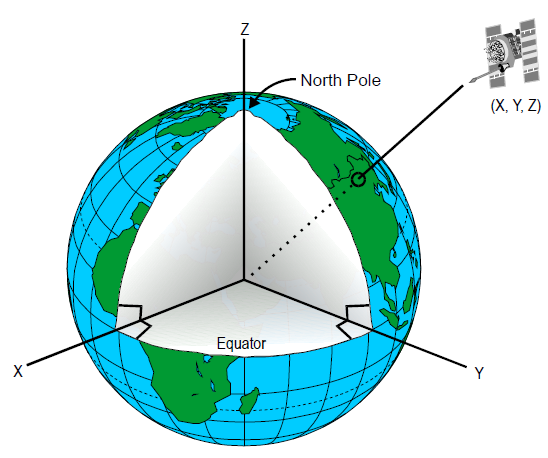

# 3DTILES\_crs\_geocentric

## Contributors

- Sean Lilley, Cesium

## Status

Draft

## Dependencies

Written against the glTF 2.1 spec.

## Optional vs. Required

This extension is required, meaning it **MUST** be placed in both `extensionsRequired` and `extensionsUsed`.

## Overview

This extension indicates that the glTF is in a geocentric coordinate system such as a [WGS 84](https://epsg.org/ellipsoid_7030/WGS-84.html) Earth-centered, Earth-fixed (ECEF) reference frame ([EPSG 4978](https://epsg.org/crs_4978/WGS-84.html)).

```json
{
  "extensions": {
    "3DTILES_crs_geocentric": {
      "crs": "EPSG:4978"
    }
  }
}
```

A geocentric coordinate system is a right-handed Cartesian coordinate system (x, y, z) where:

- The origin (0, 0, 0) is located at the center of the central body.
- The X-axis points through the intersection of the equator and the prime meridian.
- The Y-axis points through the intersection of the equator and 90° longitude.
- The Z-axis points to the north pole.

<p align="center">
  <br/>
</p>

This extension is strictly limited to geocentric coordinate systems and does not allow for arbitrary projected or geographic coordinate systems that would require more complex coordinate transformations provided by libraries such as [PROJ](https://proj.org/en/stable/).

## Precision Considerations

_This section is non-normative._

Geocentric coordinates are often quite large and lose precision when stored in 32-bit floating point.

For example, given a set of geocentric coordinates:

* `x: 1254151.3944734565`
* `y: -4732843.845023793`
* `z: 4073794.407620059`

The closest representable values in 32-bit floating point would be

* `x: 1254151.375`
* `y: -4732844`
* `z: 4073794.5`

The results in an error of about 0.25 meters.

To mitigate floating point precision issues, geocentric coordinates should be transformed into a local reference frame so that values are closer to zero. The inverse transform (local to global) can be set on the node transform in full precision in JSON.

For more details about this approach see [Precisions, Precisions](https://help.agi.com/STKComponents/html/BlogPrecisionsPrecisions.htm).

## Schema

The extension defines a single property `crs`.

```json
{
  "extensions": {
    "3DTILES_crs_geocentric": {
      "crs": "EPSG:4978"
    }
  }
}
```


Values for `crs` incude, but are not limited to:

`crs` | Description
--|--
`"EPSG:4978"` | WGS 84
`"EPSG:7656"` | WGS 84 (G730)
`"EPSG:7658"` | WGS 84 (G873)
`"EPSG:7660"` | WGS 84 (G1150)
`"EPSG:7662"` | WGS 84 (G1674)
`"EPSG:7664"` | WGS 84 (G1762)
`"EPSG:9753"` | WGS 84 (G2139)
`"EPSG:7842"` | GDA2020
`"UNKNOWN"` | CRS is unknown
