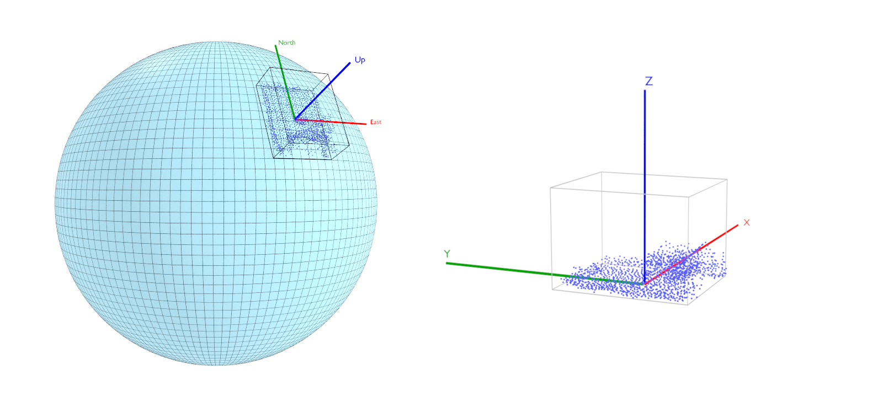

# 3DTILES\_georeference

## Contributors

- Sean Lilley, Cesium

## Status

Draft

## Dependencies

Written against the glTF 2.1 spec.

## Optional vs. Required

This extension is required, meaning it **MUST** be placed in both `extensionsRequired` and `extensionsUsed`.

## Overview

This extension georeferences a node to the provided geographic coordinates.

```json
{
  "extensions": {
    "3DTILES_georeference": {
      "longitude": -75.15836368768382,
      "latitude": 39.95090650840344,
      "height": -21.668226434267066
    }
  },
  "mesh": 0
}
```

`longitude` and `latitude` are specified in degrees. `height` above (or below) the ellipsoid is specified in meters.

The extension is most useful when implementations use it to apply an additional transform on the node (see [Transformation Order](./README.md#transformation-order)). In this case local coordinates will be transformed to planetocentric coordinates (also see [`3DTILES_crs`](../3DTILES_crs/README.md)).

This extension uses WGS84 ([EPSG:4979](https://epsg.org/crs_4979/WGS-84.html)) as the default coordinate reference system. A different coordinate reference system may be specified with [`3DTILES_crs`](../3DTILES_crs/README.md). In this case the longitude, latitude, and height values are geographic coordinates on the provided ellipsoid instead of the WGS84 ellipsoid.

The extension georeferences a node by attaching the local coordinate origin to the provided geospatial location by a translation. The extension will also adjust the orientation of the node. It will set the orientation by a rotation around the local origin to align the local coordinate system axes with the tangent plane to the selected ellipsoid at the specified location (see figure). These alignments differ depending on the use of [`3DTILES_crs`](../3DTILES_crs/README.md).

The alignment of the glTF standard axes without use of [`3DTILES_crs`](../3DTILES_crs/README.md) applies a rotation which has the following results:

- The `+x` axis (local left) faces north
- The `+y` axis (local up) faces up (normal to the tangent plane)
- The `+z` axis (local forward) faces east

When [`3DTILES_crs`](../3DTILES_crs/README.md) is used the applied rotation results in:

- The `+x` axis faces east
- The `+y` axis faces north
- The `+z` axis faces up

Note that in both cases, the node is expected to use local, and not planetocentric coordinates. This differs from using [`3DTILES_crs`](../3DTILES_crs/README.md) by itself.

<p align="center">
  <br/>
</p>

## Transformation Order

The georeference transform is applied **after** the node transform.

In this example the node has a local 110° heading that is applied before the georeference transform. The heading is converted into a rotation quaternion about the local y (up) axis in the example.

<table>
  <tr>
    <td><pre><code>{
  "extensions": {
    "3DTILES_georeference": {
      "longitude": -75.15836368768382,
      "latitude": 39.95090650840344,
      "height": -21.668226434267066
    }
  },
  "rotation": [0, -0.173648, 0, 0.984807],
  "mesh": 0,
}</code></pre></td>
    <td></td>
  </tr>
</table>

## Appendix

For computing the transformation matrix from local east-north-up (ENU) coordinates to planetocentric coordinates see [`Cesium.Transforms.eastNorthUpToFixedFrame`](Cesium.Transforms.eastNorthUpToFixedFrame).
