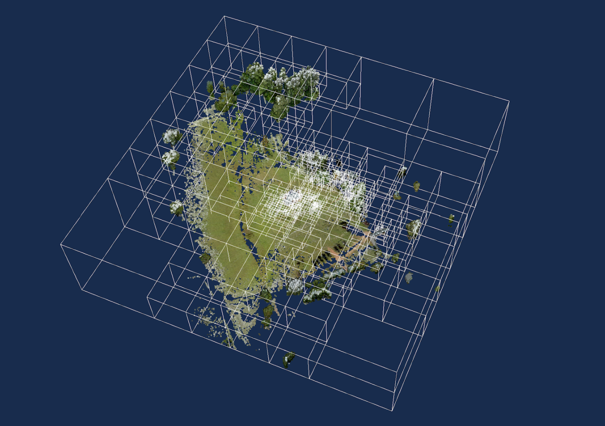

# 3DTILES\_implicit\_tiling

## Contributors

- Sean Lilley, Cesium

## Status

Draft

## Dependencies

Written against the glTF 2.1 spec.

Depends on [3DTILES_tileset](../3DTILES_tileset/README.md).

## Optional vs. Required

This extension is required, meaning it **MUST** be placed in both `extensionsRequired` and `extensionsUsed`.

## Overview

Implicit tiling defines a concise representation of quadtrees and octrees in 3D Tiles. This regular pattern allows for random access of tiles based on their tile coordinates which enables accelerated spatial queries, new traversal algorithms, and efficient updates of tile content, among other use cases.

Implicit tiling also allows for better interoperability with existing GIS data formats with implicitly defined tiling schemes. Some examples are [TMS](https://wiki.osgeo.org/wiki/Tile_Map_Service_Specification), [WMTS](https://www.ogc.org/standards/wmts), [S2](http://s2geometry.io/), and [CDB](https://docs.opengeospatial.org/is/15-113r5/15-113r5.html).

In order to support sparse datasets, *availability* data determines which tiles exist. To support massive datasets, availability is partitioned into fixed-size *subtrees*. Subtrees may store *metadata* for available tiles and contents.

An `implicitTiling` object may be added to any tile in the tileset. The object defines how the tile is subdivided and where to locate content resources. It may be added to multiple tiles to create more complex subdivision schemes.



_A point cloud organized into a sparse octree. Data source: Trimble_

## Implicit Root Tile

An `implicitTiling` object may be added to any tile in the tileset. Such a tile is called an *implicit root tile*, to distinguish it from the root tile of the tileset.

```json
{
  "boundingVolume": {
    "shape": 0
  },
  "extensions": {
    "3DTILES_tileset": {
      "geometricError": 5000.0,
      "refine": "REPLACE"
    },
    "3DTILES_implicit_tiling": {
      "contentUri": "content/{level}/{x}/{y}.glb",
      "subtreeUri": "subtrees/{level}/{x}/{y}.json",
      "subdivisionScheme": "QUADTREE",
      "availableLevels": 21,
      "subtreeLevels": 7
    }
  }
}
```

The `3DTILES_implicit_tiling` extension has the following properties:

Property | Description
--|--
`contentUri`|[Template URI]((#template-uris)) for locating content files.
`subtreeUri`|[Template URI]((#template-uris)) for locating subtree files.
`subdivisionScheme`|Either `QUADTREE` or `OCTREE`. See [Subdivision scheme](#subdivision-scheme).
`availableLevels`|How many levels there are in the tree with available tiles.
`subtreeLevels`|How many levels there are in each subtree.

The following constraints apply to implicit root tiles:

- The `children` property **MUST NOT** be defined
- The `externalAsset` property **MUST NOT** be defined
- The contents referenced by `contentUri` **MUST NOT** be [external tilesets](../3DTILES_external_tileset/README.md)

## TODO

- Finish extension
- Template URI bypasses glTF 2.1 `files` mechanism, which would prevent [packaging external assets](https://github.com/KhronosGroup/glTF/issues/2589).
