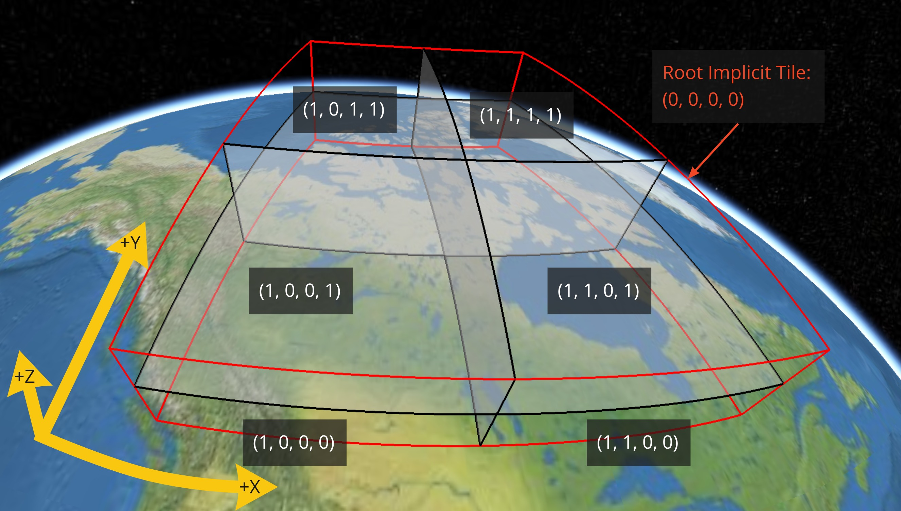

<!--
SPDX-FileCopyrightText: 2026 Bentley Systems, Incorporated

SPDX-License-Identifier: CC-BY-4.0
-->

# 3DTILES\_implicit\_tiling

## Contributors

- Sean Lilley, Cesium

## Status

Draft

## Dependencies

Written against the glTF 2.1 spec.

Depends on [3DTILES_tileset](../3DTILES_tileset/README.md).

## Optional vs. Required

This extension is required, meaning it **MUST** be placed in both `extensionsRequired` and `extensionsUsed`.

## Overview

Implicit tiling defines a concise representation of quadtrees and octrees in 3D Tiles. This regular pattern allows for random access of tiles based on their tile coordinates which enables accelerated spatial queries, new traversal algorithms, and efficient updates of tile content, among other use cases.

Implicit tiling also allows for better interoperability with existing GIS data formats with implicitly defined tiling schemes. Some examples are [TMS](https://wiki.osgeo.org/wiki/Tile_Map_Service_Specification), [WMTS](https://www.ogc.org/standards/wmts), [S2](http://s2geometry.io/), and [CDB](https://docs.opengeospatial.org/is/15-113r5/15-113r5.html).

In order to support sparse datasets, *availability* data determines which tiles exist. To support massive datasets, availability is partitioned into fixed-size *subtrees*. Subtrees may store *metadata* for available tiles and contents.

An `implicitTiling` object may be added to any tile in the tileset. The object defines how the tile is subdivided and where to locate content resources. It may be added to multiple tiles to create more complex subdivision schemes.

<p align="center">
  <br/>
  A point cloud organized into a sparse octree. Data source: Trimble.
</p>

## Implicit Root Tile

An `implicitTiling` object may be added to any tile in the tileset. Such a tile is called an *implicit root tile*, to distinguish it from the root tile of the tileset.

```json
{
  "boundingVolume": {
    "shape": 0
  },
  "extensions": {
    "3DTILES_tileset": {
      "geometricError": 5000.0,
      "refine": "REPLACE"
    },
    "3DTILES_implicit_tiling": {
      "contentUri": "content/{level}/{x}/{y}.glb",
      "subtreeUri": "subtrees/{level}/{x}/{y}.json",
      "subdivisionScheme": "QUADTREE",
      "availableLevels": 21,
      "subtreeLevels": 7
    }
  }
}
```

The `3DTILES_implicit_tiling` extension has the following properties:

Property | Description
--|--
`contentUri`|[Template URI]((#template-uris)) for locating content files.
`subtreeUri`|[Template URI]((#template-uris)) for locating subtree files.
`subdivisionScheme`|Either `QUADTREE` or `OCTREE`. See [Subdivision scheme](#subdivision-scheme).
`availableLevels`|How many levels there are in the tree with available tiles.
`subtreeLevels`|How many levels there are in each subtree.

The following constraints apply to implicit root tiles:

- The `children` property **MUST NOT** be defined
- The `externalAsset` property **MUST NOT** be defined
- The contents referenced by `contentUri` **MUST NOT** be [external tilesets](../3DTILES_tileset/README.md#external-tilesets)

## Subdivision Scheme

A *subdivision scheme* is a recursive pattern for dividing a bounding volume of a tile into smaller children tiles that take up the same space.

A *quadtree* divides space only on the `x` and `y` dimensions. It divides each tile into 4 smaller tiles where the `x` and `y` dimensions are halved. The quadtree `z` minimum and maximum remain unchanged. The resulting tree has 4 children per tile.

<p align="center">
  <br/>
</p>

An *octree* divides space along all 3 dimensions. It divides each tile into 8 smaller tiles where each dimension is halved. The resulting tree has 8 children per tile.

<p align="center">
  <br/>
</p>

Sphere bounding volumes are disallowed, as these cannot be divided into a quadtree or octree.

- For subdivision of ellipsoid region bounding volumes refer to  [3DTILES_shape_ellipsoid_region](../3DTILES_shape_ellipsoid_region/README.md#implicit-subdivision)
- For subdivision of cylinder region bounding volumes refer to [3DTILES_shape_cylinder_region](../3DTILES_shape_cylinder_region/README.md#implicit-subdivision)
- For subdivision of S2 bounding volumes refer to [3DTILES_bounding_volume_S2](../3DTILES_bounding_volume_S2/README.md#implicit-subdivision)

## Subdivision Rules

Implicit tiling only requires defining the subdivision scheme, refinement strategy, bounding volume, and geometric error at the implicit root tile. For descendant tiles, these properties are computed automatically, based on the following rules:

Subdivision rules for implicit tiling:

Property|Subdivision Rule
--|--
`subdivisionScheme`|Constant for all descendant tiles.
`refine`|Constant for all descendant tiles.
`boundingVolume`|Divided into four or eight parts depending on the `subdivisionScheme`.
`geometricError`|Each child's `geometricError` is half of its parent's `geometricError`.

> [!NOTE]
> In order to maintain numerical stability during this subdivision process, the actual bounding volumes should not be computed progressively by subdividing a non-root tile volume. Instead, the exact bounding volumes should be computed directly for a given level.
>
> Let the extent of the root bounding volume along one dimension *d* be *(min<sub>d</sub>, max<sub>d</sub>)*. The number of bounding volumes along that dimension for a given level  is *2<sup>level</sup>*. The size of each bounding volume at this level, along dimension *d*, is *size<sub>d</sub> = (max<sub>d</sub> - min<sub>d</sub>) / 2<sup>level</sup>*. The extent of the bounding volume of a child can then be computed directly as *(min<sub>d</sub> + size<sub>d</sub> * i, min<sub>d</sub> + size<sub>d</sub> * (i + 1))*, where *i* is the index of the child in dimension *d*.

The computed tile `boundingVolume` and `geometricError` can be overridden with [tile metadata](#tile-metadata), if desired. Content bounding volumes are not computed automatically but they may be provided by [content metadata](#content-metadata). Tile and content bounding volumes shall maintain [spatial coherence](../3DTILES_tileset/README.md#spatial-coherence).

## Tile Coordinates

*Tile coordinates* are a tuple of integers that uniquely identify a tile. Tile coordinates are either `(level, x, y)` for quadtrees or `(level, x, y, z)` for octrees. All tile coordinates are 0-indexed.

`level` is 0 for the implicit root tile. This tile's children are at level 1, and so on.

`x`, `y`, and `z` coordinates define the location of the tile within the level.

For `box` bounding volumes:

Coordinate|Positive Direction
--|--
`x`|Along the `+x` axis of the bounding box
`y`|Along the `+y` axis of the bounding box
`z`|Along the `+z` axis of the bounding box


For `region` bounding volumes:

Coordinate|Positive Direction
--|--
`x`|From west to east (increasing longitude)
`y`|From south to north (increasing latitude)
`z`|From bottom to top (increasing height)



## Template URIs

A *Template URI* is a URI pattern used to refer to tiles by their tile coordinates.

Template URIs shall include the variables `+{level}+`, `+{x}+`, `+{y}+`. Template URIs for octrees shall also include `+{z}+`. When referring to a specific tile, the tile's coordinates are substituted for these variables.

Template URIs, when given as relative paths, are resolved relative to the tileset JSON file.

.Examples of template URIs to identify the content for implicit tiles
image::figures/template-uri.png[]

## Subtrees

In order to support sparse datasets, additional information is needed to indicate which tiles or contents exist. This is called *availability*.

*Subtrees* are fixed size sections of the tileset tree used for storing availability. The tileset is partitioned into subtrees to bound the size of each availability buffer for optimal network transfer and caching. The `subtreeLevels` property defines the number of levels in each subtree. The subdivision scheme determines the number of children per tile.

.The structure of a subtree for implicit tiling
image::figures/subtree-anatomy.png[subtree anatomy]

After partitioning a tileset into subtrees, the result is a tree of subtrees.

.A tree of subtrees representing an implicit tileset
image::figures/subtree-tree.png[Tree of subtrees]

### Availability

Each subtree contains tile availability, content availability, and child subtree availability.

- *Tile availability* indicates which tiles exist within the subtree
- *Content availability* indicates which tiles have associated content resources
- *Child subtree availability* indicates what subtrees are reachable from this subtree

Each type of availability is represented as a separate bitstream. Each bitstream is a 1D array where each element represents a node in the quadtree or octree. A 1 bit indicates that the element is available, while a 0 bit indicates that the element is unavailable. Alternatively, if all the bits in a bitstream are the same, a single constant value can be used instead.

To form the 1D bitstream, the tiles are ordered with the following rules:

- Within each level of the subtree, the tiles are ordered using the [Morton Z-order curve](https://en.wikipedia.org/wiki/Z-order_curve)
- The bits for each level are concatenated into a single bitstream

.The computation of indices for accessing an availability bitstream, based on the coordinates of implicit tiles
image::figures/availability-ordering.png[Availability Ordering]

In the diagram above, colored cells represent 1 bits, grey cells represent 0 bits.

Storing tiles in Morton order provides these benefits:

* Efficient indexing - The Morton index for a tile is computed in constant time by interleaving bits.
* Efficient traversal - The Morton index for a parent or child tile are computed in constant time by removing or adding bits, respectively.
* Locality of reference - Consecutive tiles are near to each other in 3D space.
* Better Compression - Locality of reference leads to better compression of availability bitstreams.

For more detailed information about working with Morton indices and availability bitstreams, see xref:{url-specification-implicittiling-availability}#implicittiling-availability-indexing[Availability Indexing].

#### Tile Availability

Tile availability determines which tiles exist in a subtree.

Tile availability has the following restrictions:

* If a non-root tile's availability is 1, its parent tile's availability shall also be 1.
* A subtree shall have at least one available tile.


.Illustration of a tile availability bitstream. Tiles that are available are represented with a `1` in the bitstream.
image::figures/tile-availability.png[Tile Availability]

#### Content Availability

Content availability determines which tiles have a content resource. The content resource is located using the template URI of the tile content. When the tile has xref:{url-specification}README.adoc#core-tile-content[multiple contents], then there is one content availability bitstream for each content. If there are no tiles with a content resource, then `tile.content` and `tile.contents` shall be omitted.

Content availability has the following restrictions:

* If content availability is 1 its corresponding tile availability shall also be 1. Otherwise, it would be possible to specify content files that are not reachable by the tiles of the tileset.
* If content availability is 0 and its corresponding tile availability is 1 then the tile is considered to be an empty tile.

.Illustration of a content availability bitstream. Tiles that have associated content are represented with a `1` in the bitstream.
image::figures/content-availability.png[Content Availability]

#### Child Subtree Availability

Child subtree availability determines which subtrees are reachable from the deepest level of this subtree. This links subtrees together to form a tree.

Unlike tile and content availability, which store bits for every level in the subtree, child subtree availability stores bits for nodes one level deeper than the deepest level of the subtree, and represent the root nodes of child subtrees. This is used to determine which other subtrees are reachable before requesting tiles. If availability is 0 for all child subtrees, then the tileset does not subdivide further.

.Illustration of a child subtree availability bitstream. Tiles that are the roots of available subtrees are represented by a `1` in the bitstream.
image::figures/child-subtree-availability.png[Child Subtree Availability]

### Metadata

Subtrees may store metadata at multiple granularities.

* *Tile metadata* - metadata for available tiles in the subtree
* *Content metadata* - metadata for available content in the subtree
* *Subtree metadata* - metadata about the subtree as a whole

#### Tile Metadata

When tiles are listed explicitly within a tileset, each tile's metadata is also embedded explicitly within the tile definition. When the tile hierarchy is _implicit_, as enabled by implicit tiling, tiles are not listed exhaustively and metadata cannot be directly embedded in tile definitions. To support metadata for tiles within implicit tiling schemes, property values for all available tiles in a subtree are encoded in a xref:{url-specification-metadata-referenceimplementation-propertytable}README.adoc#metadata-referenceimplementation-propertytable-property-table-implementation[property table]. The binary representation is particularly efficient for larger datasets with many tiles.

Tile metadata exists only for available tiles and is tightly packed by an increasing tile index according to the <<implicittiling-availability,Availability Ordering>>. Each available tile shall have a value -- representation of missing values within a tile is possible only with the `noData` indicator defined by the xref:{url-specification-metadata}README.adoc#metadata-binary-table-format[_Binary Table Format_] specification.

> [!NOTE]
>
> To determine the index into a property value array for a particular tile, count the number of available tiles occurring before that index, according to the tile Availability Ordering. If `i` available tiles occur before a particular tile, that tile's property values are stored at index `i` of each property value array. These indices may be precomputed for all available tiles, as a single pass over the subtree availability buffer.

Tile properties can have xref:{url-specification-metadata-semantics}README.adoc#metadata-semantics-3d-metadata-semantic-reference[Semantics] which define how property values should be interpreted. In particular, `TILE_BOUNDING_BOX`, `TILE_BOUNDING_REGION`, `TILE_BOUNDING_SPHERE`, `TILE_MINIMUM_HEIGHT`, and `TILE_MAXIMUM_HEIGHT` semantics each define a more specific bounding volume for a tile than is implicitly calculated from implicit tiling. If more than one of these semantics are available for a tile, clients may select the most appropriate option based on use case and performance requirements.

> [!NOTE]
>
> The following diagram shows how tile height semantics may be used to define tighter bounding regions for an implicit tileset: The overall height of the bounding region of the whole tileset is 320. The bounding regions for the child tiles will be computed by splitting the bounding regions of the respective parent tile at its center. By default, the height will remain constant. By storing the _actual_ height of the contents in the respective region, and providing it as the `TILE_MAXIMUM_HEIGHT` for each available tile, it is possible to define the tightest-fitting bounding region for each level.

.Illustration of storing the actual heights of individual tiles using the `TILE_MAXIMUM_HEIGHT` semantic
image::figures/tile-height-semantics.png[]
====

The `TILE_GEOMETRIC_ERROR` semantic allows tiles to provide a geometric error that overrides the implicitly computed geometric error.

#### Content Metadata

Subtrees may also store metadata for tile content. Content metadata exists only for available content and is tightly packed by increasing tile index. Binary property values are encoded in a compact xref:{url-specification-metadata}README.adoc#metadata-binary-table-format[_Binary Table Format_] defined by the 3D Metadata Specification and are stored in a xref:{url-specification-metadata-referenceimplementation-propertytable}README.adoc#metadata-referenceimplementation-propertytable-property-table-implementation[property table]. If the implicit root tile has multiple contents then content metadata is stored in multiple property tables.

Content bounding volumes are not computed automatically by implicit tiling but may be provided by properties with semantics `CONTENT_BOUNDING_BOX`, `CONTENT_BOUNDING_REGION`, `CONTENT_BOUNDING_SPHERE`, `CONTENT_MINIMUM_HEIGHT`, and `CONTENT_MAXIMUM_HEIGHT`.

If the tile content is assigned to a xref:{url-specification}README.adoc#core-tile-content[`group`] then all contents in the implicit tree are assigned to that group.

#### Subtree Metadata

Properties assigned to subtrees provide metadata about the subtree as a whole. Subtree metadata is encoded in JSON according to the xref:{url-specification-metadata}README.adoc#metadata-json-format[JSON Format] specification.

## TODO

- Finish extension
- Template URI bypasses glTF 2.1 `files` mechanism, which would prevent [packaging external assets](https://github.com/KhronosGroup/glTF/issues/2589).
