<!--
SPDX-FileCopyrightText: 2026 Bentley Systems, Incorporated

SPDX-License-Identifier: CC-BY-4.0
-->

# 3DTILES\_implicit\_tiling

## Contributors

- Sean Lilley, Cesium

## Status

Draft

## Dependencies

Written against the glTF 2.1 spec.

Depends on [3DTILES_tileset](../3DTILES_tileset/README.md).

This extension references glTF assets with the [3DTILES_subtree](../3DTILES_subtree/README.md) extension.


## Required

This extension is required, meaning it **MUST** be placed in both `extensionsRequired` and `extensionsUsed`.

## Overview

Implicit tiling defines a concise representation of quadtrees and octrees in 3D Tiles. This regular pattern allows for random access of tiles based on their tile coordinates which enables accelerated spatial queries, new traversal algorithms, and efficient updates of tile content, among other use cases.

Implicit tiling also allows for better interoperability with existing GIS data formats with implicitly defined tiling schemes. Some examples are [TMS](https://wiki.osgeo.org/wiki/Tile_Map_Service_Specification), [WMTS](https://www.ogc.org/standards/wmts), [S2](http://s2geometry.io/), and [CDB](https://docs.opengeospatial.org/is/15-113r5/15-113r5.html).

In order to support sparse datasets, *availability* data determines which tiles exist. To support massive datasets, availability is partitioned into fixed-size *subtrees*. Subtrees may store *attributes* and application-specific *properties* for available tiles and contents.

The `3DTILES_implicit_tiling` extension may be added to any tile in the tileset. The extension defines how the tile is subdivided and where to locate content resources. It may be added to multiple tiles to create more complex subdivision schemes.

> 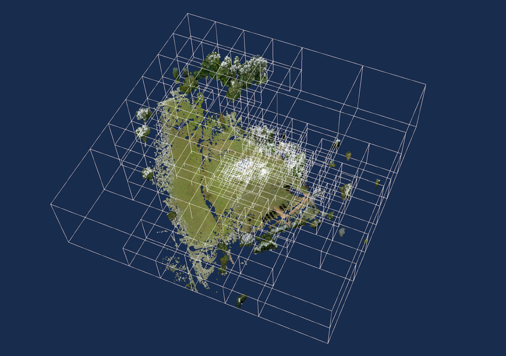
>
> A point cloud organized into a sparse octree. Data source: Trimble.

## Implicit Root Tile

The `3DTILES_implicit_tiling` extension may be added to any tile in the tileset. Such a tile is called an *implicit root tile*, to distinguish it from the root tile of the tileset. The implicit root tile is [unconditionally refinable](../3DTILES_tileset/README.md#unconditional-refinement).

```json
{
  "extensions": {
    "3DTILES_tileset": {
      "geometricError": 5000.0,
      "refine": "REPLACE"
    },
    "3DTILES_implicit_tiling": {
      "contentUri": "content/{level}/{right}/{forward}.glb",
      "subtreeUri": "subtrees/{level}/{right}/{forward}.subtree.glb",
      "subdivisionScheme": "QUADTREE",
      "availableLevels": 21,
      "subtreeLevels": 7
    }
  },
  "boundingVolume": {
    "shape": 0
  }
}
```

The `3DTILES_implicit_tiling` extension has the following properties:

|Property | Description|
|---|---|
|`contentUri`|[Template URI](#template-uris) for locating content files.|
|`subtreeUri`|[Template URI](#template-uris) for locating subtree files.|
|`subdivisionScheme`|Either `QUADTREE` or `OCTREE`. See [Subdivision scheme](#subdivision-scheme).|
|`availableLevels`|How many levels there are in the tree with available tiles.|
|`subtreeLevels`|How many levels there are in each subtree.|

The following constraints apply to implicit root tiles:

- The `children` property **MUST NOT** be defined
- The `externalAsset` property **MUST NOT** be defined
- The contents referenced by `contentUri` **MUST NOT** be [external tilesets](../3DTILES_tileset/README.md#external-tilesets)

## Subdivision Scheme

A *subdivision scheme* is a recursive pattern for dividing a bounding volume of a tile into smaller children tiles that take up the same space.

A *quadtree* divides space only on the first two dimensions. It divides each tile into 4 smaller tiles where the dimensions are halved. The third dimension remains unchanged. The resulting tree has 4 children per tile.

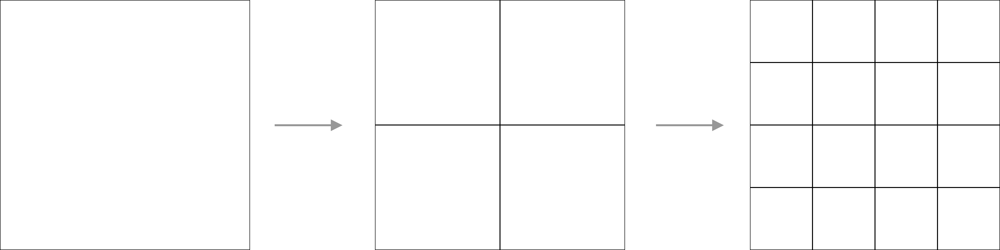

An *octree* divides space along all 3 dimensions. It divides each tile into 8 smaller tiles where each dimension is halved. The resulting tree has 8 children per tile.

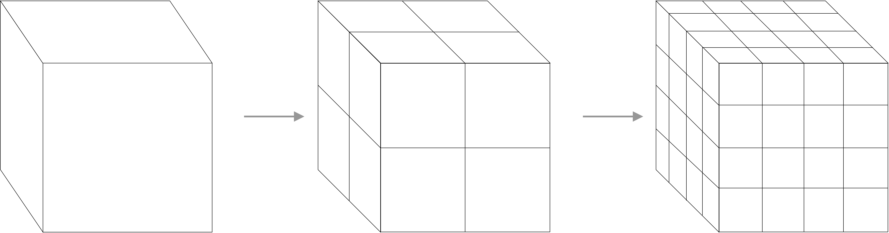

## Subdivision Rules

Implicit tiling only requires defining the subdivision scheme, refinement strategy, bounding volume, and geometric error at the implicit root tile. For descendant tiles, these properties are computed automatically, based on the following rules:

|Property|Subdivision Rule|
|---|---|
|`subdivisionScheme`|Constant for all descendant tiles.|
|`refine`|Constant for all descendant tiles.|
|`boundingVolume`|Divided into four or eight parts depending on the `subdivisionScheme`.|
|`geometricError`|Each child's `geometricError` is half of its parent's `geometricError`.|

> [!NOTE]
> In order to maintain numerical stability during this subdivision process, the actual bounding volumes should not be computed progressively by subdividing a non-root tile volume. Instead, the exact bounding volumes should be computed directly for a given level.
>
> Let the extent of the root bounding volume along one dimension $d$ be $(min_{d}, max_{d})$. The number of bounding volumes along that dimension for a given level  is $2^{level}$. The size of each bounding volume at this level, along dimension $d$, is $size_{d} = (max_{d} - min_{d}) / 2^{level}$. The extent of the bounding volume of a child can then be computed directly as $(min_{d} + size_{d} * i, min_{d} + size_{d} * (i + 1))$, where $i$ is the index of the child in dimension $d$.

The computed tile `boundingVolume` and `geometricError` can be overridden with [tile attributes](#attributes), if desired. Content bounding volumes are not computed automatically but they may be provided by [content attributes](#attributes). Tile and content bounding volumes **SHOULD** maintain [spatial coherence](../3DTILES_tileset/README.md#spatial-coherence).

## Tile Coordinates

*Tile coordinates* are a tuple of integers that uniquely identify a tile. All tile coordinates are 0-indexed.

`level` is the level of the tile, which is 0 for the implicit root tile, 1 for its immediate children, and so on.

Additional tile coordinates define the indices of the tile within the level.

For `box` bounding volumes:

|Axis|Coordinate|Positive Direction|
|---|---|---|
|0|`right`|Along the right axis of the bounding box (`+x` to `-x`)|
|1|`forward`|Along the forward axis of the bounding box (`-z` to `+z`)|
|2|`up`|Along the up axis of the bounding box (`-y` to `+y`)|

So together the tile coordinates for `box` are `(level, right, forward, up)`

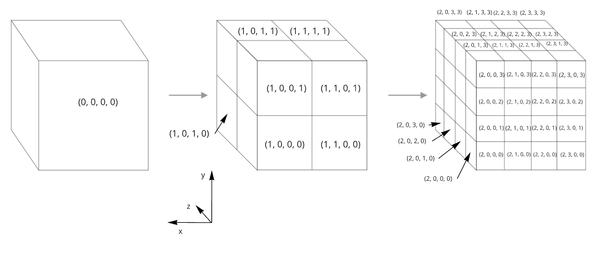

For other bounding volumes see:

- [3DTILES_shape_ellipsoid_region](../3DTILES_shape_ellipsoid_region/README.md#implicit-subdivision)
- [3DTILES_shape_cylinder_region](../3DTILES_shape_cylinder_region/README.md#implicit-subdivision)
- [3DTILES_shape_s2](../3DTILES_shape_s2/README.md#implicit-subdivision)

Sphere bounding volumes are disallowed, as these cannot be divided into a quadtree or octree.

## Template URIs

A *Template URI* is a URI pattern used to refer to tiles by their tile coordinates. When referring to a specific tile, the tile's coordinates are substituted for these variables. Tile coordinates may appear in any order in the template URI.

Template URIs, when given as relative paths, are resolved relative to the tileset JSON file.

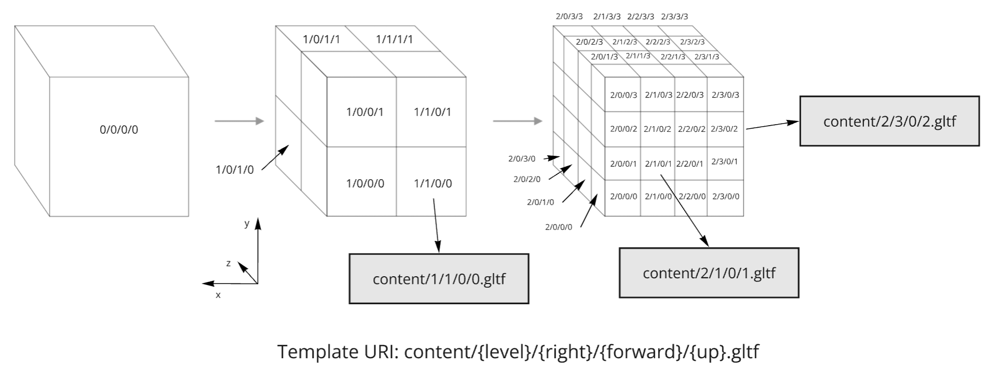

Tile and content [properties](#properties) may also be used as template variables, e.g.

```json
"3DTILES_implicit_tiling": {
  "contentUri": "content/{level}/{tileId}/{timestamp}.glb",
}
```

This is useful for resolving tile content through mechanisms other than just its implicit tile coordinates.

In case of name collisions, the following precedence order is used (from highest priority to lowest priority):

|Precedence|Source|
|---|---|
|1|Content property|
|2|Tile property|
|3|Implicit tile coordinates|

For example, if the content and tile both have a `level` property, the content property value is used. The implicit tile coordinate level is not used.

Template variables are substituted with property values stores in the [subtree](#subtrees). The fully resolved values are used, i.e. after [`noData`/`default` substitution](https://github.com/CesiumGS/3d-tiles/blob/main/specification/Metadata/README.adoc#required-properties-no-data-values-and-default-values) and [`normalized`](https://github.com/CesiumGS/3d-tiles/blob/main/specification/Metadata/README.adoc#normalized-values) and [`offset` and `scale`](https://github.com/CesiumGS/3d-tiles/blob/main/specification/Metadata/README.adoc#offset-and-scale) transformations have been applied.

The following restrictions apply:

- The property must be required, i.e. `"required": true`
- The property must not be an array property, i.e. `"array": false`
- The property's `type` must be `SCALAR`, `STRING`, or `ENUM`

For `ENUM` properties, the enumeration's `name` is used instead of its integer value.

The resolved URI must be a valid [URI](https://registry.khronos.org/glTF/specs/2.0/glTF-2.0.html#uris), e.g. string property values cannot have spaces or other restricted characters.

## Subtrees

In order to support sparse datasets, additional information is needed to indicate which tiles or contents exist. This is called *availability*.

*Subtrees* are fixed size sections of the tileset tree used for storing availability. The tileset is partitioned into subtrees to bound the size of each availability buffer for optimal network transfer and caching. The `subtreeLevels` property defines the number of levels in each subtree. The subdivision scheme determines the number of children per tile.

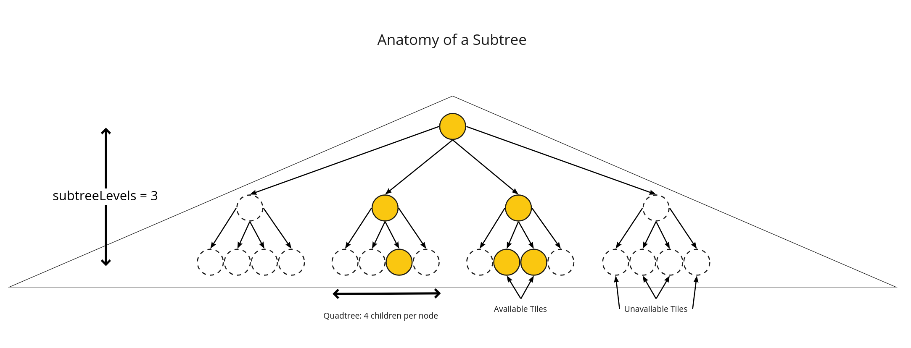

After partitioning a tileset into subtrees, the result is a tree of subtrees.

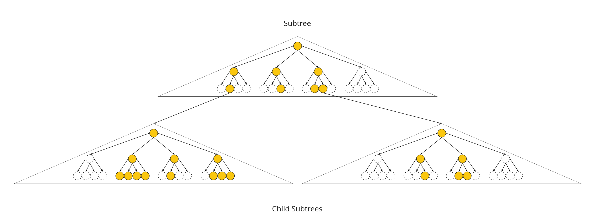

### Availability

Each subtree contains tile availability, content availability, and child subtree availability.

- *Tile availability* indicates which tiles exist within the subtree
- *Content availability* indicates which tiles have associated content resources
- *Child subtree availability* indicates which subtrees are reachable from this subtree

Each type of availability is represented as a separate bitstream. Each bitstream is a 1D array where each element represents a node in the quadtree or octree. A 1 bit indicates that the element is available, while a 0 bit indicates that the element is unavailable. Alternatively, if all the bits in a bitstream are the same, a single constant value can be used instead.

To form the 1D bitstream, the tiles are ordered with the following rules:

- Within each level of the subtree, the tiles are ordered using the [Morton Z-order curve](https://en.wikipedia.org/wiki/Z-order_curve)
- The bits for each level are concatenated into a single bitstream

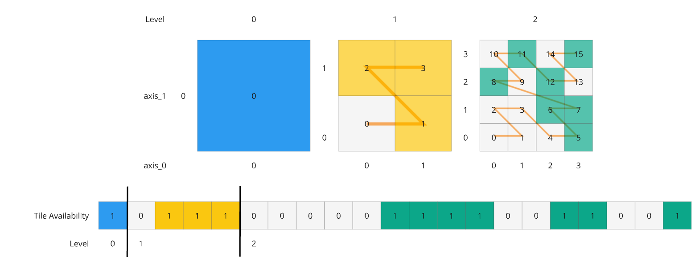

In the diagram above, colored cells represent 1 bits, grey cells represent 0 bits.

Storing tiles in Morton order provides these benefits:

- Efficient indexing - The Morton index for a tile is computed in constant time by interleaving bits.
- Efficient traversal - The Morton index for a parent or child tile are computed in constant time by removing or adding bits, respectively.
- Locality of reference - Consecutive tiles are near to each other in 3D space.
- Better Compression - Locality of reference leads to better compression of availability bitstreams.

For more detailed information about working with Morton indices and availability bitstreams, see [Appendix A: Availability Indexing](#appendix-a-availability-indexing).

#### Tile Availability

Tile availability determines which tiles exist in a subtree.

Tile availability has the following restrictions:

- If a non-root tile's availability is 1, its parent tile's availability **MUST** also be 1.
- A subtree **MUST** have at least one available tile.


#### Content Availability

Content availability determines which tiles have a content resource. The content resource is located using the template URI of the tile content. If there are no tiles with a content resource, then `contentUri` **MUST** be omitted.

Content availability has the following restrictions:

- If content availability is 1 its corresponding tile availability **MUST** also be 1. Otherwise, it would be possible to specify content files that are not reachable by the tiles of the tileset.
- If content availability is 0 and its corresponding tile availability is 1 then the tile is considered to be an empty tile.

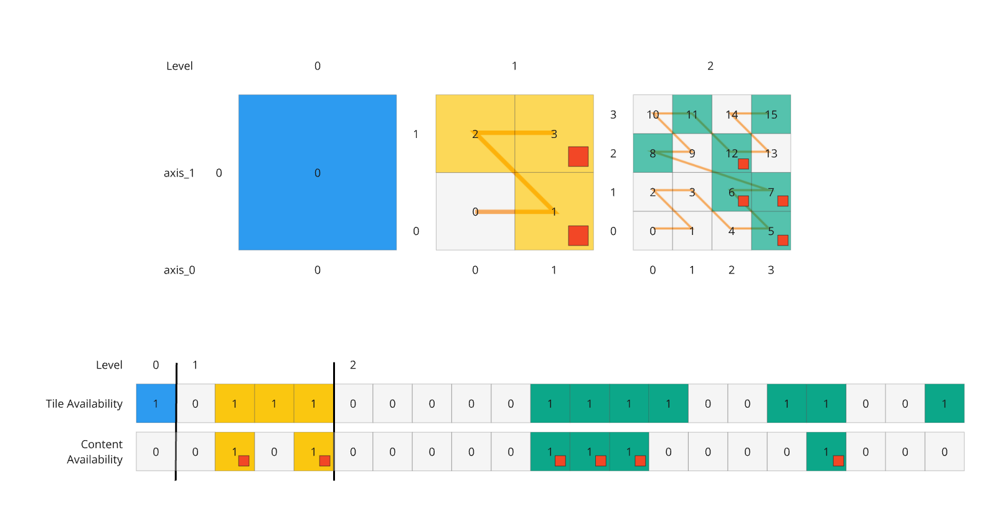

#### Child Subtree Availability

Child subtree availability determines which subtrees are reachable from the deepest level of this subtree. This links subtrees together to form a tree.

Unlike tile and content availability, which store bits for every level in the subtree, child subtree availability stores bits for nodes one level deeper than the deepest level of the subtree, and represent the root nodes of child subtrees. This is used to determine which other subtrees are reachable before requesting tiles. If availability is 0 for all child subtrees, then the tileset does not subdivide further.

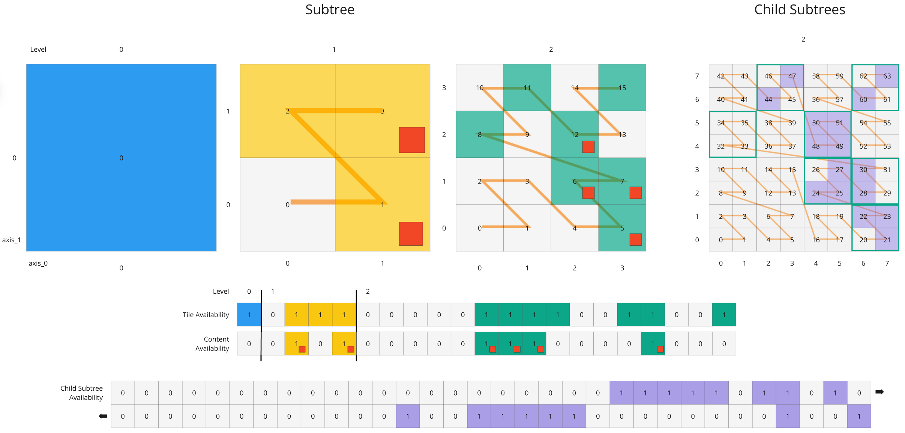

### Attributes

Each subtree may store attribute values for available tiles and contents. This may include, for example, tighter fitting bounding volumes than those computed automatically based on [Subdivision Rules](#subdivision-rules).

Attribute values are tightly packed by an increasing tile index according to the [Availability Ordering](#availability).

For the full list of attribute semantics, see [tile attributes](../3DTILES_subtree/README.md#tile-attributes) and [content attributes](../3DTILES_subtree/README.md#content-attributes).

### Properties

Each subtree may store application-specific properties for available tiles and contents. Property values are stored in [property tables](https://github.com/CesiumGS/glTF/tree/3d-tiles-next/extensions/2.0/Vendor/EXT_structural_metadata#property-tables) with [EXT_structural_metadata](https://github.com/CesiumGS/glTF/tree/3d-tiles-next/extensions/2.0/Vendor/EXT_structural_metadata). The binary representation is particularly efficient for larger datasets with many tiles.

Property values are tightly packed by an increasing tile index according to the [Availability Ordering](#availability). Each available tile **MUST** have a value — representation of missing values within a tile is possible only with the `noData` indicator defined by the [schema](https://github.com/CesiumGS/glTF/tree/3d-tiles-next/extensions/2.0/Vendor/EXT_structural_metadata#schema).

> [!NOTE]
>
> To determine the index into a property value array for a particular tile, count the number of available tiles occurring before that index, according to the tile Availability Ordering. If `i` available tiles occur before a particular tile, that tile's property values are stored at index `i` of each property value array. These indices may be precomputed for all available tiles, as a single pass over the subtree availability buffer.

### Subtree Files

The `subtreeUri` property in the extension object is used for locating external subtree files. A subtree file is a glTF with the `3DTILES_subtree` extension that encodes availability, attributes, and application-specific properties.

For more information about the subtree format, see [`3DTILES_subtree`](../3DTILES_subtree/README.md).

## Appendix A: Availability Indexing

### Converting from Tile Coordinates to Morton Index

A [Morton index](https://en.wikipedia.org/wiki/Z-order_curve) is computed by interleaving the bits of the tile coordinates of a tile. Specifically:

```js
quadtreeMortonIndex = interleaveBits(index_0, index_1)
octreeMortonIndex = interleaveBits(index_0, index_1, index_2)
```

For example:

```js
// Quadtree
interleaveBits(0b11, 0b00) = 0b0101
interleaveBits(0b1010, 0b0011) = 0b01001110
interleaveBits(0b0110, 0b0101) = 0b00110110

// Octree
interleaveBits(0b001, 0b010, 0b100) = 0b100010001
interleaveBits(0b111, 0b000, 0b111) = 0b101101101
```

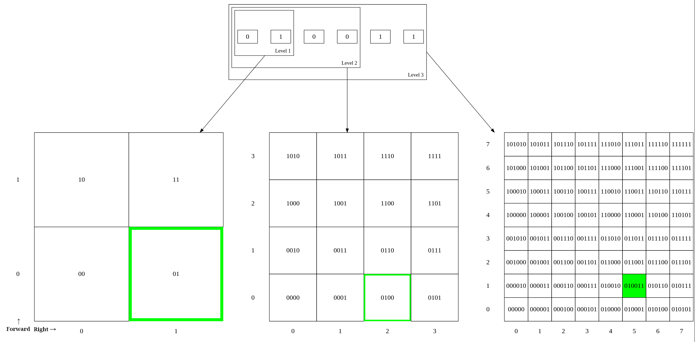

### Availability Bitstream Lengths

|Availability Type | Length (bits) | Description|
|---|---|---|
|Tile availability|`+(N^subtreeLevels - 1)/(N - 1)+`|Total number of nodes in the subtree|
|Content availability|`+(N^subtreeLevels - 1)/(N - 1)+`|Since there is at most one content per tile, this is the same length as tile availability|
|Child subtree availability|`+(N^subtreeLevels - 1)/(N - 1)+`|Number of nodes one level deeper than the deepest level of the subtree|

Where `N` is 4 for quadtrees and 8 for octrees.

These lengths are in number of bits in a bitstream. To compute the length of the bitstream in bytes, the following formula is used:

```js
lengthBytes = ceil(lengthBits / 8)
```

### Accessing Availability Bits

For tile availability and content availability, the Morton index only determines the ordering within a single level of the subtree. Since the availability bitstream stores bits for every level of the subtree, a level offset shall be computed.

Given the `(level, mortonIndex)` of a tile relative to the subtree root, the index of the corresponding bit can be computed with the following formulas:

|Quantity | Formula | Description|
|---|---|---|
|`levelOffset`|`+(N^level - 1) / (N - 1)+`|This is the number of nodes at levels `+1, 2, ... (level - 1)+`|
|`tileAvailabilityIndex`|`levelOffset + mortonIndex`|The index into the buffer view is the offset for the tile's level plus the morton index for the tile|

Where `N` is 4 for quadtrees and 8 for octrees.

Since child subtree availability stores bits for a single level, no `levelOffset` is needed, i.e. `childSubtreeAvailabilityIndex = mortonIndex`, where the `mortonIndex` is the Morton
index of the desired child subtree relative to the root of the current subtree.

### Global and Local Tile Coordinates

When working with tile coordinates, it is important to consider which tile the coordinates are relative to. There are two main types used in implicit tiling:

* *global coordinates* - coordinates relative to the implicit root tile.
* *local coordinates* - coordinates relative to the root of a specific subtree.

Global coordinates are used for locating any tile in the entire implicit tileset. For example, template URIs use global coordinates to locate content files and subtrees. Meanwhile, local coordinates are used for locating data within a single subtree file.

In binary, a tile's global Morton index is the complete path from the implicit root tile to the tile. This is the concatenation of the path from the implicit root tile to the subtree root tile, followed by the path from the subtree root tile to the tile. This can be expressed with the following equation:

```js
tile.globalMortonIndex = concatBits(subtreeRoot.globalMortonIndex, tile.localMortonIndex)
```

> 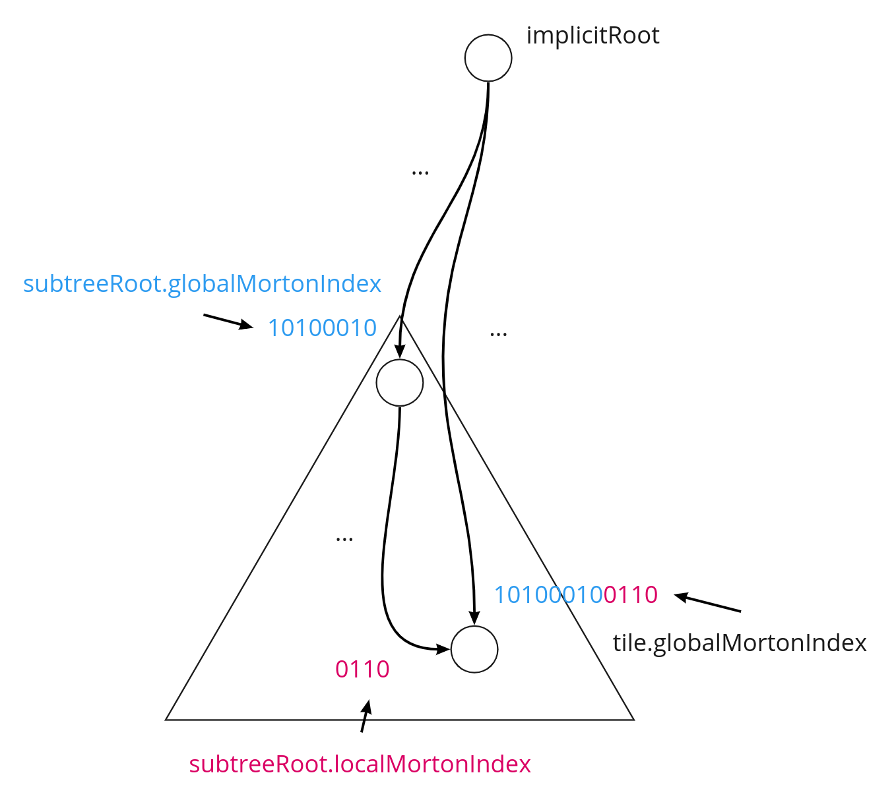
>
> Illustration of how to compute the global Morton index of a tile, from the global Morton index of the root of the containing subtree, and the local Morton index of the tile in this subtree.

Similarly, the global level of a tile is the length of the path from the implicit root tile to the tile. This is the sum of the subtree root tile's global level and the tile's local level relative to the subtree root tile:

```js
tile.globalLevel = subtreeRoot.globalLevel + tile.localLevel
```

> 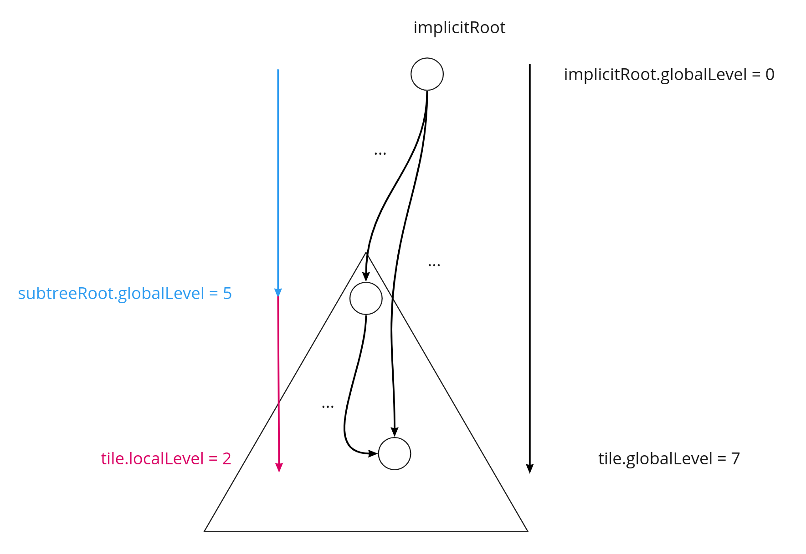
>
> Illustration of how to compute the global level of a tile, from the global level of the root of the containing subtree, and the local level of the tile in this subtree.

Tile coordinate indices follow the same pattern as Morton indices. The only difference is that the concatenation of bits happens component-wise. That is:

```js
tile.globalIndex0 = concatBits(subtreeRoot.globalIndex0, tile.localIndex0)
tile.globalIndex1 = concatBits(subtreeRoot.globalIndex1, tile.localIndex1)

// Octrees only
tile.globalIndex2 = concatBits(subtreeRoot.globalIndex2, tile.localIndex2)
```

> 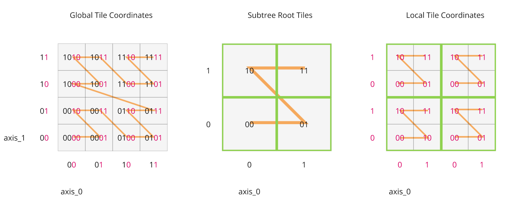
>
> Illustration of the computation of the global tile coordinates, from the global coordinates of the containing subtree, and the local coordinates of the tile in this subtree.

### Finding Parent and Child Tiles

The coordinates of a parent or child tile can also be computed with bitwise operations on the Morton index. The following formulas apply for both local and global coordinates.

```js
childTile.level = parentTile.level + 1
childTile.mortonIndex = concatBits(parentTile.mortonIndex, childIndex)
childTile.axis0 = concatBits(parentTile.axis0, childAxis0)
childTile.forward = concatBits(parentTile.axis1, childAxis1)

// Octrees only
childTile.up = concatBits(parentTile.up, childUp)
```

Where:

- `childIndex` is an integer in the range `[0, N)` that is the index of the child tile relative to the parent.
- `childAxis0`, `childAxis1`, and `childAxis2` are single bits that represent which half of the parent's bounding volume the child is in in each direction.

> 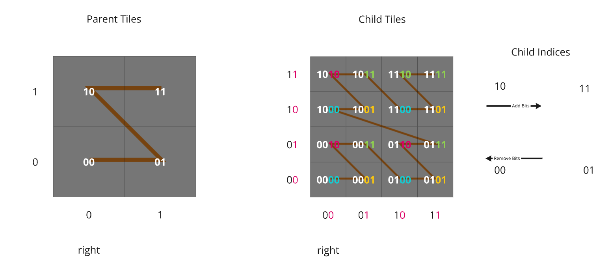
>
> Illustration of the computation of the coordinates of parent- and child tiles.

## Schema

- [node.3DTILES_implicit_tiling.schema.json](schema/node.3DTILES_implicit_tiling.schema.json)
