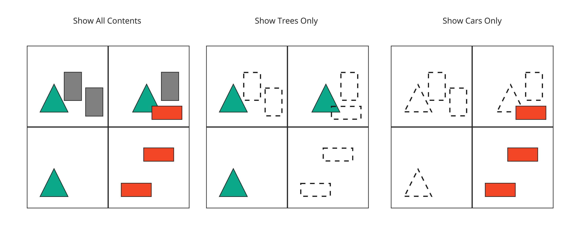

<!--
SPDX-FileCopyrightText: 2026 The Khronos Group Inc.

SPDX-License-Identifier: CC-BY-4.0
-->

# 3DTILES\_layers

## Contributors

- Sean Lilley, Cesium
- Don McCurdy, Cesium

## Status

Draft

## Dependencies

Written against the glTF 2.1 spec.

Depends on [3DTILES_tileset](../3DTILES_tileset/README.md).

## Optional

This extension is optional, meaning it should be placed in the glTF root's `extensionsUsed` list, but not in the `extensionsRequired` list.

## Overview

"Layers" are a common concept when working with geospatial data, representing semantic or functional groups of geometries requiring common handling by the application. For example, in a vector basemap, land and water boundaries are typically rendered behind geometries like roads and buildings, and will have different styling rules applied. In this case, semantic layers such as "water", "land", "roads", and "buildings" may be appropriate.

The document-level `3DTILES_layers` extension defines the layers in the tileset. Each layer has a `"name"` property. A layer may also have application-specific [properties](#properties) used for filtering and styling.

```json
{
  "extensionsUsed": ["3DTILES_tileset", "3DTILES_layers"],
  "extensionsRequired": ["3DTILES_tileset"],
  "asset": {
    "version": "2.1"
  },
  "extensions": {
    "3DTILES_layers": {
      "layers": [
        {
          "name": "cars"
        },
        {
          "name": "trees"
        }
      ]
    }
  }
}
```

Nodes may be assigned to layers. The node extension has a single property `"layer"` which is the index of the layer that this node belongs to. The value is an index into the array of `layers` that is defined in the document-level `3DTILES_layers` extension.

If there is no document-level `3DTILES_layers` extension and this asset is referenced by an external asset, it uses the `layers` of the referencing asset, recursively, until `layers` is found.

```json
{
  "extensions": {
    "3DTILES_tileset": {
      "geometricError": 0.0,
      "refine": "REPLACE"
    },
    "3DTILES_layers": {
      "layer": 0
    }
  },
  "boundingVolume": {
    "shape": 1
  },
  "externalAsset": 0
}
```

Below is an example of an empty root tile with two child tiles, each assigned to a different layer.

```json
{
  "extensionsUsed": ["3DTILES_tileset", "3DTILES_layers"],
  "extensionsRequired": ["3DTILES_tileset"],
  "asset": {
    "version": "2.1"
  },
  "extensions": {
    "3DTILES_tileset": {
      "geometricError": 240
    },
    "3DTILES_layers": {
      "layers": [
        {
          "name": "cars"
        },
        {
          "name": "trees"
        }
      ]
    }
  },
  "nodes": [
    {
      "extensions": {
        "3DTILES_tileset": {
          "geometricError": 70.0,
          "refine": "ADD"
        }
      },
      "boundingVolume": {
        "shape": 0
      },
      "children": [1, 2]
    },
    {
      "extensions": {
        "3DTILES_tileset": {
          "geometricError": 0.0
        },
        "3DTILES_layers": {
          "layer": 0
        }
      },
      "boundingVolume": {
        "shape": 1
      },
      "externalAsset": 0
    },
    {
      "extensions": {
        "3DTILES_tileset": {
          "geometricError": 0.0
        },
        "3DTILES_layers": {
          "layer": 1
        }
      },
      "boundingVolume": {
        "shape": 2
      },
      "externalAsset": 1
    }
  ]
}
```

## Properties

Application-specific properties may be assigned to a layer with [`EXT_structural_metadata`](../../../2.0/Vendor/EXT_structural_metadata).

This allows applications to perform styling or filtering based on the layer that the node belongs to.

```json
{
  "extensions": {
    "EXT_structural_metadata": {
      "schema": {
        "id": "schema",
        "classes": {
          "layer": {
            "properties": {
              "author": {
                "type": "STRING"
              },
              "color": {
                "type": "VEC3",
                "componentType": "FLOAT32"
              }
            }
          }
        }
      }
    },
    "3DTILES_layers": {
      "layers": [
        {
          "name": "cars",
          "extensions": {
            "EXT_structural_metadata": {
              "class": "layer",
              "properties": {
                "author": "Cesium",
                "color": [1.0, 0.0, 0.0]
              }
            }
          }
        },
        {
          "name": "trees",
          "extensions": {
            "EXT_structural_metadata": {
              "class": "layer",
              "properties": {
                "author": "Cesium",
                "color": [0.0, 1.0, 0.0]
              }
            }
          }
        }
      ]
    }
  }
}
```

> 
>
> Illustration of rendering options based on layers

## Subtree Attributes

This extension defines the following [subtree tile attribute semantics](../3DTILES_subtree/README.md#tile-attributes):

|Attribute Semantic|Accessor Type|Component Type|Description|
|---|---|---|---|
|`"TILE_LAYER_INDEX"`|`"SCALAR"`|`5124` (INT)|The index of the layer that this tile belongs to. The value is an index into the array of `layers` that is defined in the document-level `3DTILES_layers` extension. If there is no document-level `3DTILES_layers` extension and this asset is referenced by an external asset, it uses the `layers` of the referencing asset, recursively, until `layers` is found.|

## Schema

- [node.3DTILES_layers.schema.json](schema/node.3DTILES_layers.schema.json)
- [glTF.3DTILES_layers.schema.json](schema/glTF.3DTILES_layers.schema.json)
- [layer.schema.json](schema/layer.schema.json)
