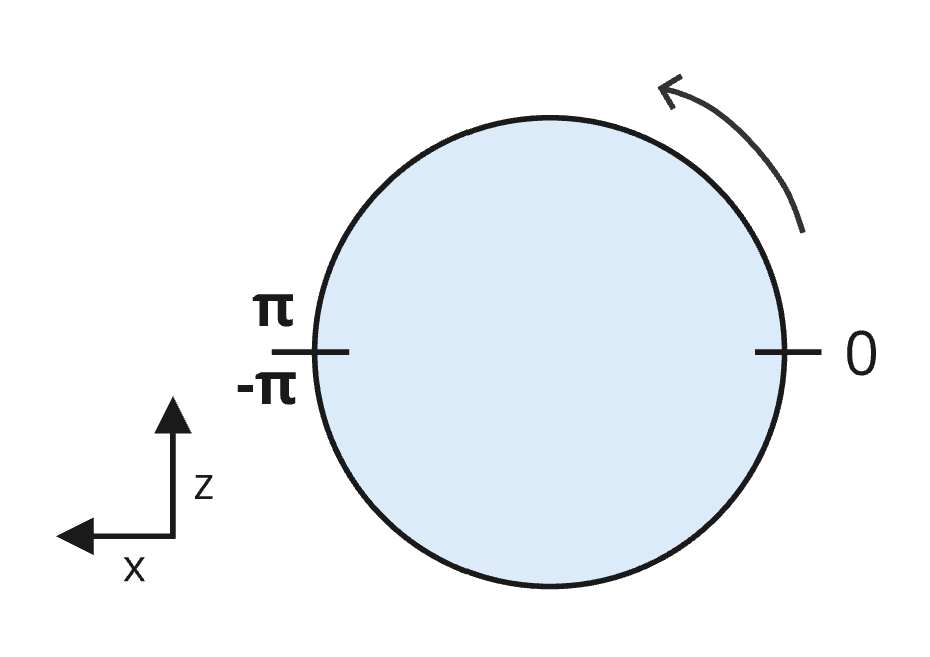
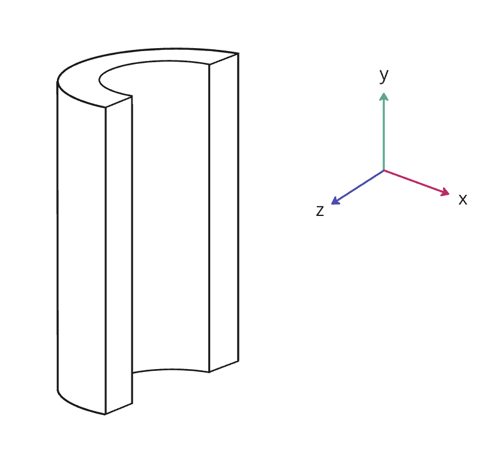

<!--
SPDX-FileCopyrightText: 2026 Bentley Systems, Incorporated

SPDX-License-Identifier: CC-BY-4.0
-->

# 3DTILES\_shape\_cylinder\_region

## Contributors

- Janine Liu, Cesium
- Sean Lilley, Cesium

## Status

Draft

## Dependencies

Written against the glTF 2.1 spec.

## Optional vs. Required

This extension is required, meaning it **MUST** be placed in both `extensionsRequired` and `extensionsUsed`.

## Overview

This extension defines a cylinder-conforming region as an additional shape type for glTF 2.1 shapes. These regions are useful for visualizing real-world data that has been captured by cylindrical sensors.

`3DTILES_shape_cylinder_region` extends the `shape` object in glTF 2.1. The `shape.type` should be set to `"cylinder region"`. The properties define a region following the surface of a cylinder between two different radius values.

The cylinder does not need to be completely represented by the volume—for instance, the region may be hollow inside like a tube. However, an inner radius of `0.0` results in a completely solid cylinder.

## Cylinder Region Shape

 A cylinder region shape is defined by adding the `3DTILES_shape_cylinder_region` extension to a `shape` object of type `"cylinder region"`.

### Properties

| Property | Type | Description | Required |
|---|---|---|---|
| **minimumRadius** | `number` | The inner radius of the cylinder region along the X and Z axes, in meters. | Yes, minimum: `0.0` |
| **maximumRadius** | `number` | The outer radius of the cylinder region along the X and Z axes, in meters. | Yes, minimum: `0.0` |
| **height** | `number` | The height of the cylinder in meters along the Y-axis. | Yes, minimum: `0.0` |
| **minimumAngle** | `number` | The minimum angle of the cylinder region in radians. Must be in the range `[-pi, pi]`. | No, default: `-3.14159265359` |
| **maximumAngle** | `number` | The maximum angle of the cylinder region in radians. Must be in the range `[-pi, pi]`. | No, default: `3.14159265359` |

### Details

The cylinder is centered at the origin, where the radius is measured along the `x` and `z` axes. The `height` of the cylinder is aligned with the `y` axis.

<table>
  <tr>
    <th>
    Example
    </th>
  </tr>
  <tr>
    <td>

```json
"shapes": [
  {
    "name": "Cylindrical Shell Region",
    "type": "cylinder region",
    "extensions": {
      "3DTILES_shape_cylinder_region": {
        "minimumRadius": 0.5,
        "maximumRadius": 1.0,
        "height": 2.0
      }
    }
  }
]
```

  </td>
    <td>
    
    </td>
  </tr>
</table>

A cylinder region may also be confined to a certain angular range. The `minimumAngle` and `maximumAngle` properties define the angles at which the region starts and stops on the cylinder.

Angles are given in radians within the range `[-pi, pi]` and open counter-clockwise around the cylinder. The bounds are aligned such that an angle of `0` aligns with the glTF right axis, i.e., the `-x` axis (see figure below.)



<table>
  <tr>
    <th>
    Example
    </th>
  </tr>
  <tr>
    <td>

```json
"shapes": [
  {
    "name": "Cylindrical Sector Region",
    "type": "cylinder region",
    "extensions": {
      "3DTILES_shape_cylinder_region": {
        "minimumRadius": 0.5,
        "maximumRadius": 1.0,
        "height": 2.0,
        "minimumAngle": -1.570796,
        "maximumAngle": 1.570796
      }
    }
  }
]
```
</td>
    <td>
    
    </td>
  </tr>
</table>
