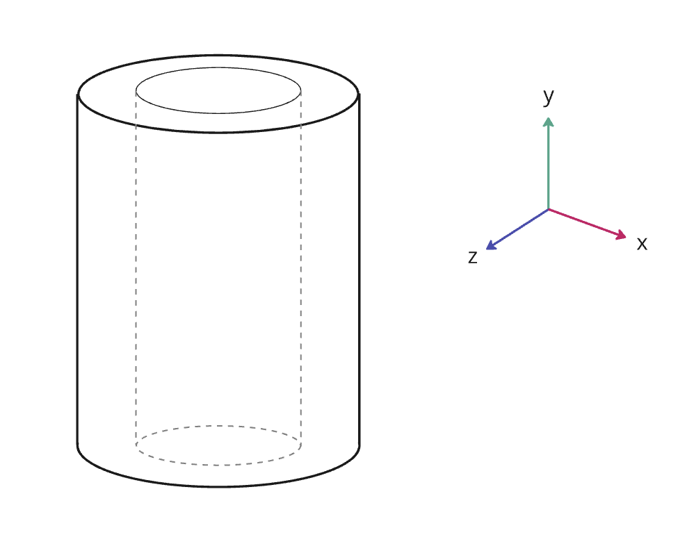
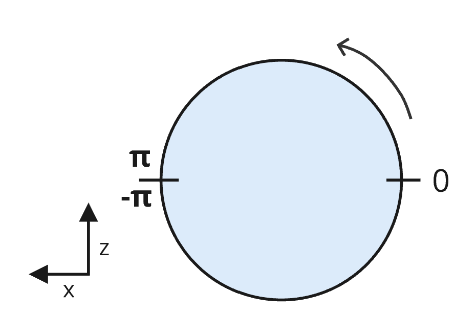
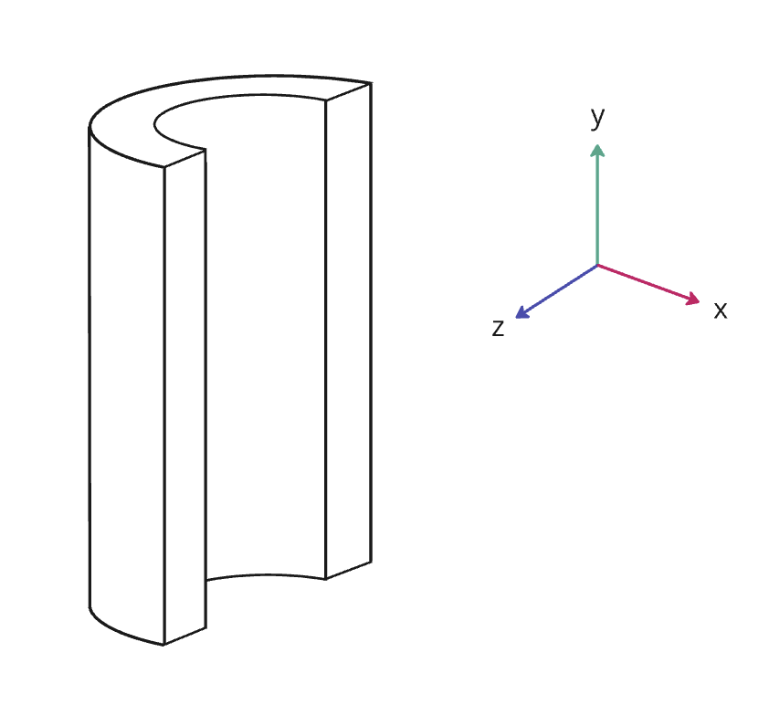
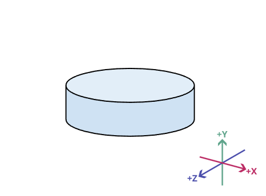
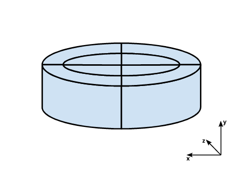
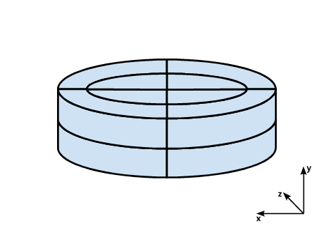

<!--
SPDX-FileCopyrightText: 2026 Bentley Systems, Incorporated

SPDX-License-Identifier: CC-BY-4.0
-->

# 3DTILES\_shape\_cylinder\_region

## Contributors

- Janine Liu, Cesium
- Sean Lilley, Cesium
- Adam Morris, Cesium

## Status

Draft

## Dependencies

Written against the glTF 2.1 spec.

## Required

This extension is required, meaning it **MUST** be placed in both `extensionsRequired` and `extensionsUsed`.

## Overview

This extension defines a cylinder-conforming region as an additional shape type for glTF 2.1 shapes. These regions are useful for visualizing real-world data that has been captured by cylindrical sensors.

`3DTILES_shape_cylinder_region` extends the `shape` object in glTF 2.1. The `shape.type` **MUST** be set to `"cylinder region"`. The `minimumRadius`, `maximumRadius`, and `height` properties are required. These properties define a region following the surface of a cylinder between two different radius values. Two optional properties, `minimumAngle` and `maximumAngle`, define the maximum angle of the cylinder region in radians.

The cylinder does not need to be completely represented by the volume—for instance, the region may be hollow inside like a tube. However, an inner radius of `0.0` results in a completely solid cylinder.

## Cylinder Region Shape

 A cylinder region shape is defined by adding the `3DTILES_shape_cylinder_region` extension to a `shape` object of type `"cylinder region"`.

### Properties

| Property | Type | Description | Required |
|---|---|---|---|
| **minimumRadius** | `number` | The minimum (inner) radius of the cylinder region along the X and Z axes, in meters. | Yes, minimum: `0.0` |
| **maximumRadius** | `number` | The maximum (outer) radius of the cylinder region along the X and Z axes, in meters. | Yes, minimum: `0.0` |
| **height** | `number` | The height of the cylinder in meters along the Y-axis. | Yes, minimum: `0.0` |
| **minimumAngle** | `number` | The minimum angle of the cylinder region in radians. See [angular range limits](#angular-range-limits). | No, default: `-3.14159265359` |
| **maximumAngle** | `number` | The maximum angle of the cylinder region in radians. See [angular range limits](#angular-range-limits). | No, default: `3.14159265359` |

#### Radius

The inner and outer radii are defined using the `minimumRadius` and `maximumRadius` properties. The outer radius of the cylinder is defined by the value stored in `maximumRadius`, and the inner radius of the cylinder is defined by the value stored in `minimumRadius`. The inner radius allows the creation of a hole in the middle of the cylinder. These properties are required.

The property values are stored as float point values and **MUST** satisfy the conditions:

$$\begin{align}
radius_{min} &\leqslant 0.0 \\
radius_{max} &\leqslant 0.0 \\
radius_{min} &\leqslant radius_{max}
\end{align}$$

#### Height

The height of the cylinder region in meters is defined by the `height` property. This property is required. The height is stored as a floating point value and **MUST** satisfy the condition:

$$0.0 \leqslant height$$

#### Angle

The `minimumAngle` and `maximumAngle` represent optional properties that allow defining an arc for the cylinder region, oriented along `x` and `y` axes of the cylinder. The value of `minimumAngle` defaults to $-\pi$ and the value of `maximumAngle` defaults to $\pi$ when these properties are omitted, representing a full cylinder.

To preserve sampling at the antemeridian, the minimum and maximum angles **MUST** satisfy the conditions:

$$\begin{align}
angle_{min} \leqslant angle_{max} \\
0 \leqslant | angle_{max} - angle_{min} | \leqslant 2 \cdot pi
\end{align}$$

### Details

The cylinder is centered at the origin, where the radius is measured along the `x` and `z` axes. The `height` of the cylinder is aligned with the `y` axis.

<table>
  <tr>
    <th>
    Example
    </th>
  </tr>
  <tr>
    <td>

> **Example**
>
> ```json
> "shapes": [
>   {
>     "name": "Cylindrical Shell Region",
>     "type": "cylinder region",
>     "extensions": {
>       "3DTILES_shape_cylinder_region": {
>         "minimumRadius": 0.5,
>         "maximumRadius": 1.0,
>         "height": 2.0
>       }
>     }
>   }
> ]
> ```
>
> 

A cylinder region may also be confined to a certain angular range. The `minimumAngle` and `maximumAngle` properties define the angles at which the region starts and stops on the cylinder.

Angles are given in radians within the range `[-pi, pi]` and open counter-clockwise around the cylinder. The bounds are aligned such that an angle of `0` aligns with the glTF right axis, i.e., the `-x` axis (see figure below.)



> ```json
> "shapes": [
>   {
>     "name": "Cylindrical Sector Region",
>     "type": "cylinder region",
>     "extensions": {
>       "3DTILES_shape_cylinder_region": {
>         "minimumRadius": 0.5,
>         "maximumRadius": 1.0,
>         "height": 2.0,
>         "minimumAngle": -1.570796,
>         "maximumAngle": 1.570796
>       }
>     }
>   }
> ]
> ```
>
> 

## Implicit Subdivision

When used with [Implicit Tiling](../3DTILES_implicit_tiling/README.md), the implicit tile coordinates are interpreted as `(radius, angle, height)` for the cylinder region.

A `QUADTREE` subdivision will subdivide along the radius and angle axes. An `OCTREE` subdivision will subdivide along the radius, angle, and height axes.

| Root Cylinder  | Quadtree | Octree |
|---|---|---|
|   |   |   |

Coordinate|Positive Direction
--|--
radius| From the center outwards (increasing radius)
angle| From $-\pi$ to $\pi$ (counter-clockwise angle)
height| From bottom to top (increasing height)

## Schema

- [shape.3DTILES_shape_cylinder_region.schema.json](schema/shape.3DTILES_shape_cylinder_region.schema.json)
