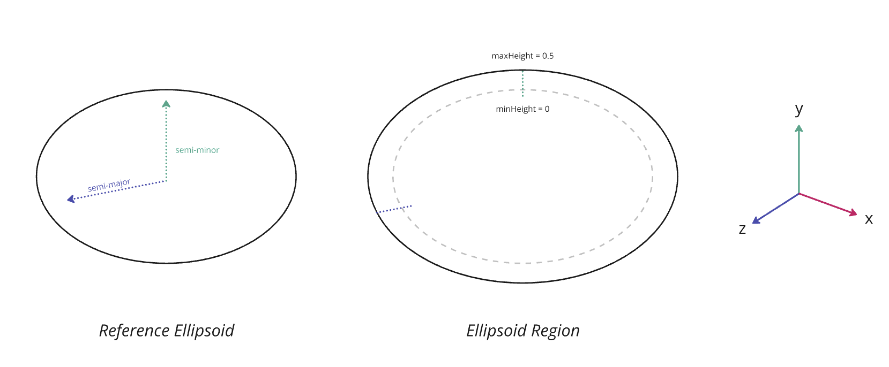
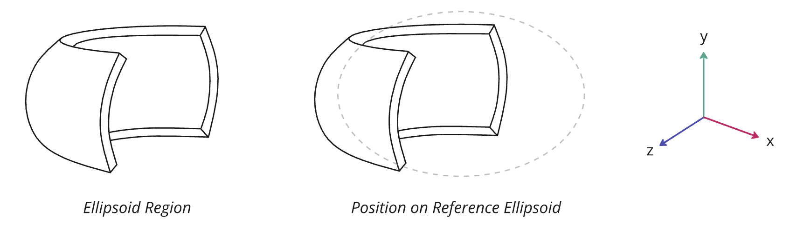

<!--
SPDX-FileCopyrightText: 2026 Bentley Systems, Incorporated

SPDX-License-Identifier: CC-BY-4.0
-->

# 3DTILES\_shape\_ellipsoid\_region

## Contributors

- Janine Liu, Cesium
- Sean Lilley, Cesium

## Status

Draft

## Dependencies

Written against the glTF 2.1 spec.

## Overview

This extension defines an ellipsoid-conforming region as an additional shape type for glTF 2.1 shapes. These regions are commonly used in geospatial applications to describe volumes that conform to the curvature of the Earth, or other bodies.

`3DTILES_shape_ellipsoid_region` extends the `shape` object in glTF 2.1. The `shape.type` should be set to `"ellipsoid region"`. The properties define the region following the surface of the ellipsoid between two different height values.

The volume does not necessarily contain the full ellipsoid—and for many geospatial use cases, it will not. Rather, the ellipsoid is used as a reference from which the actual region is extruded. However, a region may extend beneath the surface of the ellipsoid. Given the right height values, the region could contain the entire ellipsoid if desired.

## Ellipsoid Region Shape

An ellipsoid region shape is defined by adding the `3DTILES_shape_ellipsoid_region` extension to a `shape` object of type `"ellipsoid region"`.

### Properties

| Property | Type | Description | Required |
|---|---|---|---|
| **semiMajorAxisRadius** | `number` | The radius along the semi-major axis of the reference ellipsoid in meters. Corresponds to the radii along the X and Z axes. | Yes, minimum: `0.0` |
| **semiMinorAxisRadius** | `number` | The radius along the semi-minor axis of the reference ellipsoid in meters. Corresponds to the radius along the Y-axis. | Yes, minimum: `0.0` |
| **minHeight** | `number` | The minimum height of the region relative to the ellipsoid's surface, in meters. May be negative. | Yes |
| **maxHeight** | `number` | The maximum height of the region relative to the ellipsoid's surface, in meters. May be negative. | Yes |
| **minLatitude** | `number` | The minimum latitude (a.k.a. polar angle) of the region, in radians. Must be in the range `[-pi/2, pi/2]`. | No, default: `-1.57079632679` |
| **maxLatitude** | `number` | The maximum latitude (a.k.a. polar angle) of the region, in radians. Must be in the range `[-pi/2, pi/2]`. | No, default: `1.57079632679` |
| **minLongitude** | `number` | The minimum longitude (a.k.a. azimuthal angle) of the region, in radians. Must be in the range `[-pi, pi]`. | No, default: `-3.14159265359` |
| **maxLongitude** | `number` | The maximum longitude (a.k.a. azimuthal angle) of the region, in radians. Must be in the range `[-pi, pi]`. | No, default: `3.14159265359` |

### Details

The reference ellipsoid is centered at the origin. The `semiMajorAxisRadius` indicates the radius of the ellipsoid in meters along the `x` and `z` axes. The `semiMinorAxisRadius` indicates the radius of the ellipsoid in meters along the `y` axis.

> [!NOTE]
> The `x` and `z` radii are made equal to simplify the math required to render implicit regions along the ellipsoid.

The `minHeight` and `maxHeight` properties indicate the heights of the region from the ellipsoid's surface in meters. A height of `0` sits right at the surface. Negative heights are also valid—they simply extend underneath the ellipsoid's surface.

This example corresponds to the image below it:

```json
"shapes": [
  {
    "name": "Global Ellipsoidal Height Region",
    "type": "ellipsoid region",
    "extensions": {
      "3DTILES_shape_ellipsoid_region": {
        "semiMajorAxisRadius": 3.5,
        "semiMinorAxisRadius": 2.0,
        "minHeight": 0.0,
        "maxHeight": 0.5
      }
    }
  }
]
```



An ellipsoid region may also be confined to a specific latitude and/or longitude range. The `minLatitude` and `maxLatitude` properties represent the latitude values at which the region starts and stops, defined in the range `[-pi/2, pi/2]`. Similarly, the `minLongitude` and `maxLongitude` properties represent the longitude bounds within the range `[-pi, pi]`.

```json
"shapes": [
  {
    "name": "Geographic Bounding Region (Ellipsoid)",
    "type": "ellipsoid region",
    "extensions": {
      "3DTILES_shape_ellipsoid_region": {
        "semiMajorAxisRadius": 3.5,
        "semiMinorAxisRadius": 2.0,
        "minHeight": 0.0,
        "maxHeight": 0.5,
        "minLongitude": 0.0,
        "maxLongitude": 1.57079632679,
        "minLatitude": -0.78539816339,
        "maxLatitude": 0.78539816339
      }
    }
  }
]
```



It is valid for the `maxLongitude` property to be less than `minLongitude`. This would define a region that crosses over the line at `-pi` or `pi`, equivalent to the International Date Line on Earth.

## Optional vs. Required

This extension is required, meaning it **MUST** be placed in both `extensionsRequired` and `extensionsUsed`.
