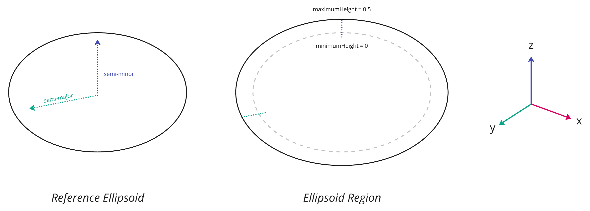
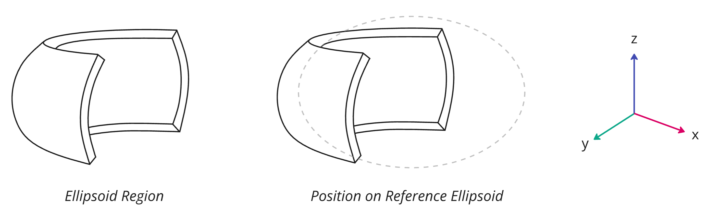
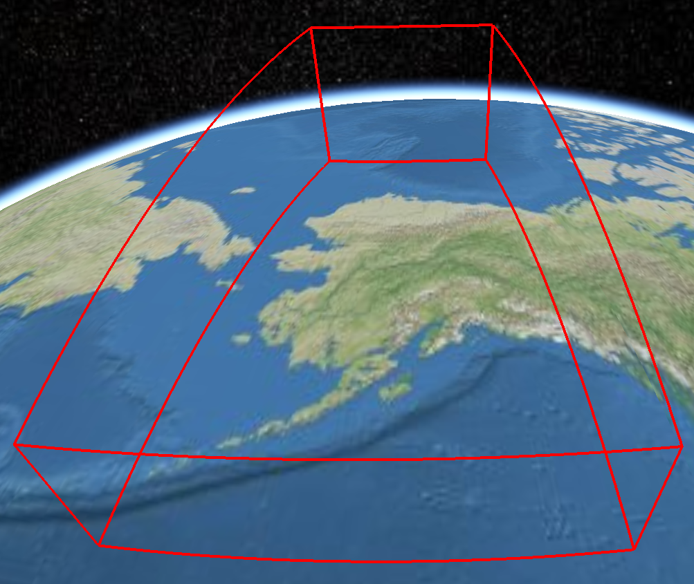
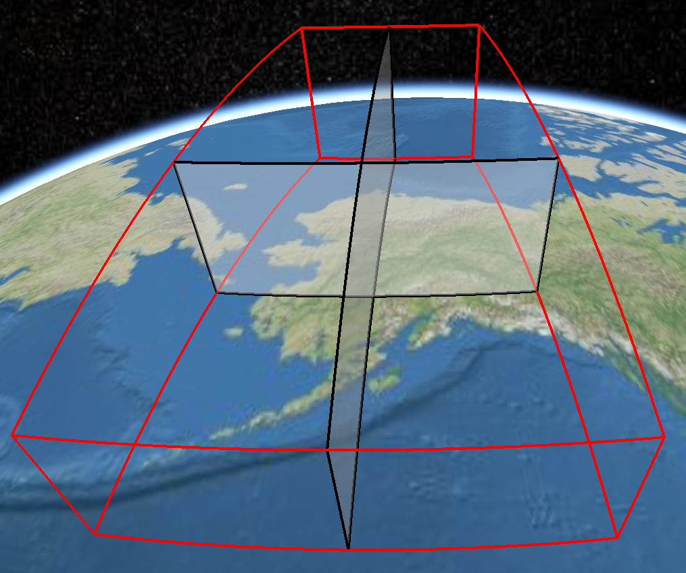
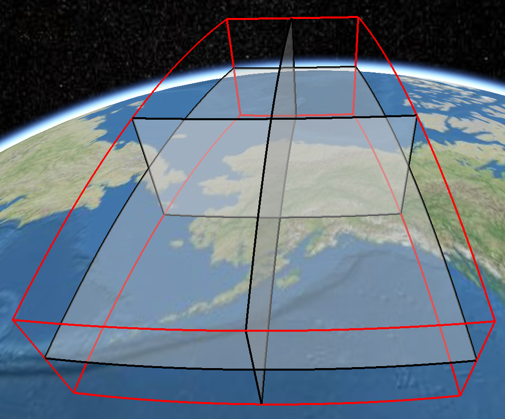

<!--
SPDX-FileCopyrightText: 2026 Bentley Systems, Incorporated

SPDX-License-Identifier: CC-BY-4.0
-->

# 3DTILES\_shape\_ellipsoid\_region

## Contributors

- Janine Liu, Cesium
- Sean Lilley, Cesium
- Adam Morris, Cesium

## Status

Draft

## Dependencies

Written against the glTF 2.1 spec.

## Required

This extension is required, meaning it **MUST** be placed in both `extensionsRequired` and `extensionsUsed`.

## Overview

This extension defines an ellipsoid-conforming region as an additional shape type for glTF 2.1 shapes. These regions are commonly used in geospatial applications to describe volumes that conform to the curvature of the Earth, or other bodies.

`3DTILES_shape_ellipsoid_region` extends the `shape` object in glTF 2.1. The `shape.type` **MUST** be set to `"ellipsoid region"`. The properties define the region following the surface of the ellipsoid between two different height values.

The ellipsoid shape **MUST** conform to a global-geocentric coordinate reference system. The default coordinate reference system used is [WGS 84](https://en.wikipedia.org/wiki/World_Geodetic_System#WGS_84) ([EPSG:4978](https://epsg.org/crs_4978/WGS-84.html)). The coordinate reference system in use **MAY** be configured by adding a [EXT_geospatial_crs](../EXT_geospatial_crs/README.md) extension to the glTF asset. If defined, implementations **MUST** use the coordinate reference system defined by `EXT_geospatial_crs`.

The volume does not necessarily contain the full ellipsoid—and for many geospatial use cases, it will not. Rather, the ellipsoid is used as a reference from which the actual region is extruded. However, a region may extend beneath the surface of the ellipsoid. Given the right height values, the region could contain the entire ellipsoid if desired.

## Ellipsoid Region Shape

An ellipsoid region shape is defined by adding the `3DTILES_shape_ellipsoid_region` extension to a `shape` object of type `"ellipsoid region"`.

### Properties

| Property | Type | Description | Required |
|---|---|---|---|
| **minimumHeight** | `number` | The minimum height of the region relative to the ellipsoid's surface, in meters. May be negative. | Yes |
| **maximumHeight** | `number` | The maximum height of the region relative to the ellipsoid's surface, in meters. May be negative. | Yes |
| **minimumLatitude** | `number` | The minimum latitude of the region, in radians. Must be in the range `[-pi/2, pi/2]`. | No, default: `-1.57079632679` |
| **maximumLatitude** | `number` | The maximum latitude of the region, in radians. Must be in the range `[-pi/2, pi/2]`. | No, default: `1.57079632679` |
| **minimumLongitude** | `number` | The minimum longitude of the region, in radians. See [Longitude](#longitude) for evaluation details. | No, default: `-3.14159265359` |
| **maximumLongitude** | `number` | The maximum longitude of the region, in radians. See [Longitude](#longitude) for evaluation details. | No, default: `3.14159265359` |

#### Height

The minimum and maximum height of the region relative to the ellipsoid's surface is defined by the `minimumHeight` and `maximumHeight` properties. These represent the height in meters referenced to the surface. Negative values are below the surface, and positive values are above the service.

The height values must satisfy the condition $height_{min} \leqslant height_{max}$.

#### Latitude

The latitudinal span of the region is defined using the `minimumLatitude` and `maximumLatitude` properties. The values are the geodetic latitude represented in radians.

Both `minimumLatitude` and `maximumLatitude` **MUST** be in the range $-\frac{\pi}{2} \leqslant latitude \leqslant \frac{\pi}{2}$ and satisfy the condition $latitude_{min} \leqslant latitude_{max}$.

#### Longitude

The longitudinal span of the region is defined using the `minimumLongitude` and `maximumLongitude` properties. These values are stored as radians.

When evaluated, the `minimumLongitude` and `maximumLongitude` values **MUST** satisfy this requirement:

$$0 \leqslant | longitude_{max} - longitude_{min} | \leqslant 2 \cdot \pi$$

This helps to preserve sampling at the antemeridian.

### Details

The `minimumHeight` and `maximumHeight` properties indicate the heights of the region from the ellipsoid's surface in meters. A height of `0` sits right at the surface. Negative heights are also valid—they simply extend underneath the ellipsoid's surface.

This example corresponds to the image below it:

```json
"shapes": [
  {
    "name": "Global Ellipsoidal Height Region",
    "type": "ellipsoid region",
    "extensions": {
      "3DTILES_shape_ellipsoid_region": {
        "minimumHeight": 0.0,
        "maximumHeight": 0.5
      }
    }
  }
]
```



An ellipsoid region may also be confined to a specific latitude and/or longitude range. The `minimumLatitude` and `maximumLatitude` properties represent the latitude values at which the region starts and stops, defined in the range `[-pi/2, pi/2]`. Similarly, the `minimumLongitude` and `maximumLongitude` properties represent the longitude bounds within the range `[-pi, pi]`.

```json
"shapes": [
  {
    "name": "Geographic Bounding Region (Ellipsoid)",
    "type": "ellipsoid region",
    "extensions": {
      "3DTILES_shape_ellipsoid_region": {
        "minimumHeight": 0.0,
        "maximumHeight": 0.5,
        "minimumLongitude": 0.0,
        "maximumLongitude": 1.57079632679,
        "minimumLatitude": -0.78539816339,
        "maximumLatitude": 0.78539816339
      }
    }
  }
]
```



It is valid for the `maximumLongitude` property to be less than `minimumLongitude`. This would define a region that crosses over the line at `-pi` or `pi`, equivalent to the International Date Line on Earth.

## Implicit Subdivision

When used with [Implicit Tiling](../../3DTILES_implicit_tiling/README.md), the implicit tile coordinates are interpreted as `(longitude, latitude, height)` for the ellipsoid region.

A `QUADTREE` subdivision will subdivide along the longitude and latitude axes. An `OCTREE` subdivision will subdivide along the longitude, latitude, and height axes.

| Root Region  | Quadtree | Octree |
|---|---|---|
|   |   |   |

Coordinate|Positive Direction
--|--
longitude| From west to east (increasing longitude)
latitude| From south to north (increasing latitude)
height| From bottom to top (increasing height)

## Subtree Attributes

This extension defines the following [subtree tile attribute semantics](../3DTILES_subtree/README.md#tile-attributes):

Attribute Semantic|Accessor Type|Component Type|Description
--|--|--|--
`"TILE_BOUNDING_REGION"`|`"VEC4"`|`5130` (DOUBLE)|The bounding region of the tile, in the order `(minimum longitude, minimum latitude, maximum longitude, maximum latitude)`.
`"TILE_MINIMUM_HEIGHT"`|`"SCALAR"`|`5130` (DOUBLE)|The minimum height of the tile above (or below) the ellipsoid.

This extension defines the following [subtree content attribute semantics](../3DTILES_subtree/README.md#content-attributes):

Attribute Semantic|Accessor Type|Component Type|Description
--|--|--|--
`"CONTENT_BOUNDING_REGION"`|`"VEC4"`|`5130` (DOUBLE)|The bounding region of the content, in the order `(minimum longitude, minimum latitude, maximum longitude, maximum latitude)`.
`"CONTENT_MINIMUM_HEIGHT"`|`"SCALAR"`|`5130` (DOUBLE)|The minimum height of the content above (or below) the ellipsoid.
