<!--
SPDX-FileCopyrightText: 2026 Bentley Systems, Incorporated
SPDX-FileCopyrightText: 2026, 2026 Bentley Systems, Incorporated

SPDX-License-Identifier: CC-BY-4.0
-->

# 3DTILES\_tileset

## Contributors

- Sean Lilley, Cesium
- Adam Morris, Cesium
- Tamrat Belayneh, ESRI

## Status

Draft

## Dependencies

Written against the glTF 2.1 spec.

## Optional vs. Required

This extension is required, meaning it **MUST** be placed in both `extensionsRequired` and `extensionsUsed`.

## Contents

- [Overview](#overview)
- [File Extensions](#file-extensions)
- [Constraints](#constraints)
- [Concepts](#concepts)
  - [3D Tiles](#3d-tiles)
  - [Tileset](#tileset)
  - [Tile](#tile)
  - [Geometric Error](#geometric-error)
  - [Refinement](#refinement)
  - [Bounding Volumes](#bounding-volumes)
  - [Transforms](#transforms)
  - [Spatial Coherence](#spatial-coherence)
  - [Spatial Data Structures](#spatial-data-structures)
  - [Coordinate Reference System](#coordinate-reference-system-crs)
- [Supporting Extensions](#supporting-extensions)
  - [Implicit Tiling](#implicit-tiling)
  - [External Tilesets](#external-tilesets)
  - [Metadata](#metadata)
  - [Declarative Styling](#declarative-styling)
- [Appendix A: Spatial Data Structures](#appendix-a-spatial-data-structures)

## Overview

This extension specifies a well defined subset of glTF 2.1 for representing a tileset in [3D Tiles](https://github.com/CesiumGS/3d-tiles/tree/main/specification/). It extends the node hierarchy to support Hierarchical Level of Detail (HLOD) for streaming massive 3D scenes. Additionally, it depends on core glTF 2.1 features like external assets and bounding volumes.

## File Extensions

Assets that use the `3DTILES_tileset` extension **SHOULD** use the `.tileset.gltf` or `.tileset.glb` file extensions. Though not required, this convention helps differentiate tileset files from content files.

The entry tileset **SHOULD** be named `root.tileset.gltf` to differentiate the entry tileset from [External Tilesets](#external-tilesets).

## Constraints

The following constraints apply when using the `3DTILES_tileset` extension:

- The document **MUST** have exactly one scene with exactly one node, the single root node

The following constraints apply to all nodes:

- The `3DTILES_tileset` extension **MUST** be defined
- The `"boundingVolume"` property **MUST** be defined. The bounding volume shape type **MUST** be `"box"` or `"sphere"` unless additional shape types are enabled through extensions.
- The `"mesh"` property **MUST NOT** be defined. `3DTILES_tileset` only allows references to external assets.

## Concepts

### 3D Tiles

In 3D Tiles, a *tileset* is a set of *tiles* organized in a spatial data structure, the *tree*. Each tile may reference renderable *content*.

The content references a set of *features*, such as 3D models representing buildings or trees, or points in a point cloud. Each feature has position and appearance properties and additional application-specific properties. A client may choose to select features at runtime and retrieve their properties for visualization or analysis.

Tiles are organized in a tree which incorporates the concept of Hierarchical Level of Detail (HLOD) for optimal rendering of spatial data. Each tile has a *bounding volume*, an object defining a spatial extent completely enclosing its content. The tree has [spatial coherence](#spatial-coherence); the content for child tiles are completely inside the parent’s bounding volume.

<p align="center">
  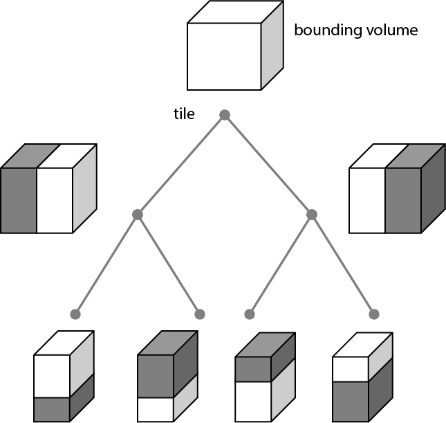
</p>

A tileset may use a 2D spatial tiling scheme similar to raster and vector tiling schemes (like a Web Map Tile Service (WMTS) or XYZ scheme) that serve predefined tiles at several levels of detail (or zoom levels). However since the content of a tileset is often non-uniform or may not easily be organized in only two dimensions, the tree can be any spatial data structure with spatial coherence, including k-d trees, quadtrees, octrees, and grids. [Implicit tiling](#implicit-tiling) defines a concise representation of quadtrees and octrees.

Application-specific *metadata* may be provided at multiple granularities within a tileset. Properties may be associated with high-level entities like tilesets, tiles, contents, or features, or with individual vertices and texels. Metadata conforms to a well-defined type system described by the [3D Metadata Specification](https://github.com/CesiumGS/3d-tiles/blob/main/specification/Metadata/), which may be extended with application- or domain-specific semantics.

Optionally a [3D Tiles Style](https://github.com/CesiumGS/3d-tiles/blob/main/specification/Styling/), or *style*, may be applied to a tileset. A style defines expressions to be evaluated which modify how each feature is displayed.

### Tileset

A tileset is a set of tiles organized in a spatial data structure, the tree. The tree has a single root tile. Each tile has zero or more children tiles. Tiles are represented as nodes in the glTF node hierarchy, or defined implicitly with [Implicit Tiling](#implicit-tiling).

3D Tiles uses one main tileset file as the entry point to define a tileset. To create a tree of trees, a tileset may also reference [external tilesets](#external-tilesets).

The following example shows a tree with a root tile and a child tile.

```json
{
  "extensionsUsed": ["3DTILES_tileset"],
  "extensionsRequired": ["3DTILES_tileset"],
  "asset": {
    "version": "2.1"
  },
  "scenes": [
    {
      "nodes": [0]
    }
  ],
  "scene": 0,
  "shapes": [
    {
      "type": "box",
      "box": {
        "size": [1.0, 1.0, 1.0]
      }
    },
    {
      "type": "box",
      "box": {
        "size": [0.9, 0.3, 1.0]
      }
    }
  ],
  "files": [
    {
      "mimeType": "model/gltf-binary",
      "uri": "root.glb"
    },
    {
      "mimeType": "model/gltf-binary",
      "uri": "child.glb"
    }
  ],
  "externalAssets": [
    {
      "file": 0
    },
    {
      "file": 1
    }
  ],
  "extensions": {
    "3DTILES_tileset": {
      "geometricError": 240
    },
    "EXT_crs_wkid": {
      "authority": "EPSG",
      "wkid": "4978"
    }
  },
  "nodes": [
    {
      "extensions": {
        "3DTILES_tileset": {
          "geometricError": 70.0,
          "refine": "ADD"
        }
      },
      "boundingVolume": {
        "shape": 0
      },
      "externalAsset": 0,
      "children": [1]
    },
    {
      "extensions": {
        "3DTILES_tileset": {
          "geometricError": 0.0
        }
      },
      "boundingVolume": {
        "shape": 1
      },
      "externalAsset": 1
    },
  ]
}
```

The top-level `3DTILES_tileset` extension has the following properties:

- `geometricError` is a nonnegative number that defines the error, in meters, that determines if the tileset is rendered. At runtime, the geometric error is used to compute *Screen-Space Error* (SSE), the error measured in pixels. If the SSE does not exceed a required minimum, the tileset should not be rendered, and none of its tiles should be considered for rendering. See [Geometric error](#geometric-error).

### Tile

Tiles consist of metadata used to determine if a tile is rendered, a reference to the renderable content, and an array of any children tiles.

The following example shows the root tile above.

```json
{
  "extensions": {
    "3DTILES_tileset": {
      "geometricError": 70.0,
      "refine": "ADD"
    }
  },
  "boundingVolume": {
    "shape": 0
  },
  "externalAsset": 0,
  "children": [1],
}
```

The `3DTILES_tileset` node extension has the following properties:

- `geometricError` is a nonnegative number that defines the error, in meters, introduced if this tile is rendered and its children are not. At runtime, the geometric error is used to compute *Screen-Space Error* (SSE), the error measured in pixels. The SSE determines if a tile is sufficiently detailed for the current view or if its children should be considered. See [Geometric error](#geometric-error).
- `refine` is a string that is either `"REPLACE"` for replacement refinement or `"ADD"` for additive refinement. It is required for the root tile of a tileset; it is optional for all other tiles. A tileset can use any combination of additive and replacement refinement. When the `refine` property is omitted, it is inherited from the parent tile. See [Refinement](#refinement).

The following glTF properties contribute to the tile definition:

- `boundingVolume` defines a volume enclosing the tile, and is used to determine which tiles to render at runtime. The bounding volume may define a shape transform by supplying any of the `translation`, `rotation`, and `scale` properties (not shown above). See [Bounding Volumes](#bounding-volumes) for the full list of supported shape types. The `boundingVolume` property is required if the node uses the `3DTILES_tileset` extension.
- `externalAsset` provides a reference to the tile's content. If the content uses the `3DTILES_tileset` extension then it is considered an [External tileset](#external-tilesets). When `externalAsset` is not defined the tile is considered an *empty tile*. The `externalAsset` object may have an optional `boundingVolume`, the content bounding volume. Unlike the tile bounding volume, the content bounding volume is a tightly fitting bounding volume enclosing just the tile's content. This enables tight view frustum culling, excluding from rendering any content not in the volume of what is potentially in view. When it is not defined, the tile’s bounding volume is still used for culling.
- `matrix` (not shown) or `translation`, `rotation`, `scale` (not shown) define a local space transform for the tile, see [Transforms](#transforms).
- `children` is an array of node indices to child tiles. Each child tile's content is fully enclosed by its parent tile's `boundingVolume`. For *leaf tiles*, there are no children, and `children` **MUST** not be defined.

### Geometric Error

Tiles are structured into a tree incorporating *Hierarchical Level of Detail* (HLOD) so that at runtime a client implementation will need to determine if a tile is sufficiently detailed for rendering and if the content of tiles should be successively refined by children tiles of higher resolution. An implementation will consider a maximum allowed *Screen-Space Error* (SSE), the error measured in pixels.

A tile’s geometric error defines the selection metric for that tile. Its value is a nonnegative number that defines the error, in meters, introduced if this tile is rendered and its children are not.

Generally, the root tile will have the largest geometric error, and each successive level of children will have a smaller geometric error than its parent, with leaf tiles having a geometric error of or close to 0. If the child tile's geometric error is greater than or equal to its parent's geometric error, the tile is considered *unconditionally refinable*.

In a client implementation, geometric error is used with other screen space metrics—​e.g., distance from the tile to the camera, screen size, and resolution—to calculate the SSE introduced if this tile is rendered and its children are not. If the introduced SSE exceeds the maximum allowed, then the tile is refined and its children are considered for rendering.

The geometric error is formulated based on a metric like point density, mesh or texture decimation, or another factor specific to that tileset. In general, a higher geometric error means a tile will refine more aggressively, and children tiles will be loaded and rendered sooner.

### Refinement

Refinement determines the process by which a lower resolution parent tile renders when its higher resolution children are selected to be rendered. Permitted refinement types are replacement (`"REPLACE"`) and additive (`"ADD"`). If the tile has replacement refinement, the children tiles are rendered in place of the parent, that is, the parent tile is no longer rendered. If the tile has additive refinement, the children are rendered in addition to the parent tile.

A tileset can use replacement refinement exclusively, additive refinement exclusively, or any combination of additive and replacement refinement.

A refinement type is required for the root tile of a tileset; it is optional for all other tiles. When omitted, a tile inherits the refinement type of its parent.

#### Replacement

If a tile uses replacement refinement, when refined it renders its children in place of itself.

Parent Tile|Refined
--|--
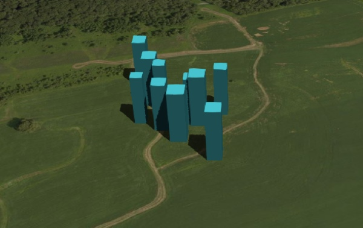|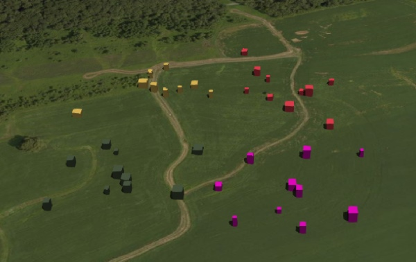

#### Additive

If a tile uses additive refinement, when refined it renders itself and its children simultaneously.

Parent Tile|Refined
--|--
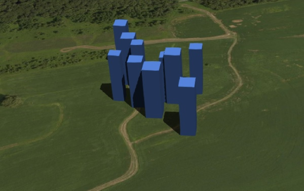|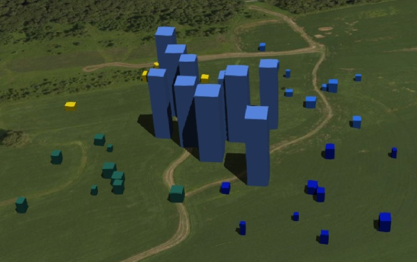

### Bounding Volumes

A bounding volume defines the spatial extent enclosing a tile or a tile’s content. The bounding volume shape type **MUST** be `"box"` or `"sphere"` unless additional shape types are enabled through extensions.

A list of extensions that enable additional shape types:

- [3DTILES_shape_ellipsoid_region](../3DTILES_shape_ellipsoid_region/README.md)
- [3DTILES_shape_cylinder_region](../3DTILES_shape_cylinder_region/README.md)
- [3DTILES_shape_s2](../3DTILES_shape_s2/README.md)

#### Bounding Box

The following example shows an oriented bounding box. The axis-aligned box is transformed by the bounding volume's `translation`, `rotation`, `scale` properties.

```json
{
  "shapes": [
    {
      "type": "box",
      "box": {
        "size": [1.0, 1.0, 1.0]
      }
    }
  ],
  "nodes": [
    {
    "boundingVolume": {
      "shape": 0,
      "translation": [-3923021.73, -931070.70, 4925458.17],
      "rotation": [0.26262, -0.20758, -0.58433, 0.73925],
      "scale": [100.0, 100.0, 100.0]
    },
    ...
    }
  ]
}
```

#### Bounding Sphere

The following example shows a bounding sphere.

```json
{
  "shapes": [
    {
      "type": "sphere",
      "sphere": {
        "radius": 6378137.0
      }
    }
  ],
  "nodes": [
    {
    "boundingVolume": {
      "shape": 0
    },
    ...
    }
  ]
}
```

### Transforms

A tile may define a local space transform using the standard glTF `matrix` or `translation`, `rotation`, `scale` node properties. The transform applies to the tile's bounding volume and content (if present).

Certain bounding volume types, such as `3DTILES_shape_ellipsoid_region` and `3DTILES_shape_s2`, are defined in a geospatial coordinate system and cannot be reasonably transformed. The tile's transform **MUST** be identity and the `EXT_georeference` extension **MUST NOT** be defined.

### Spatial Coherence

As described above, the tree has spatial coherence; each tile has a bounding volume completely enclosing its content, and the content for child tiles are completely inside the parent's bounding volume. This does not imply that a child's bounding volume is completely inside its parent's bounding volume. For example:

<p align="center">
  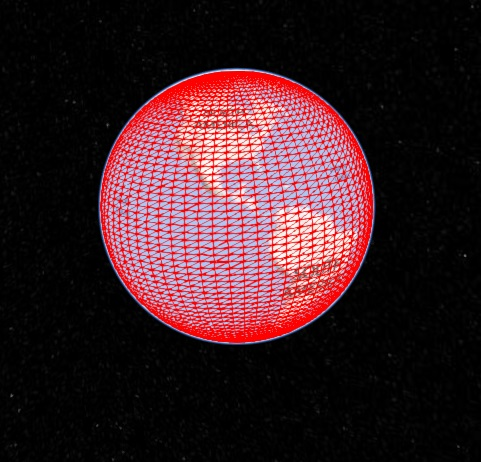<br/>
  Bounding sphere for a terrain tile.
</p>

<p align="center">
  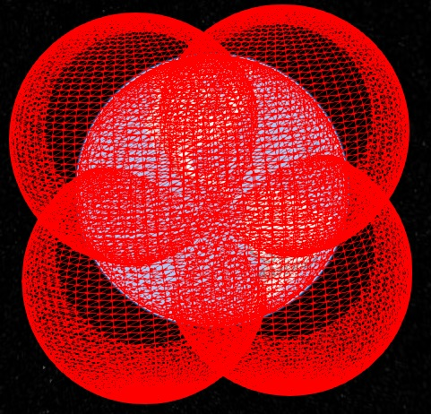<br/>
  Bounding spheres for the four child tiles. The children's content is completely inside the parent's bounding volume, but the children's bounding volumes are not since they are not tightly fit.
</p>

### Spatial Data Structures

3D Tiles incorporates the concept of Hierarchical Level of Detail (HLOD) for optimal rendering of spatial data. A tileset is composed of a tree, defined by `root` and, recursively, its `children` tiles, which can be organized by different types of spatial data structures.

A runtime engine is generic and will render any tree defined by a tileset. Any combination of tile formats and refinement approaches can be used, enabling flexibility in supporting heterogeneous datasets, see [Refinement](#refinement).

A tileset may use a 2D spatial tiling scheme similar to raster and vector tiling schemes (like a Web Map Tile Service (WMTS) or XYZ scheme) that serve predefined tiles at several levels of detail (or zoom levels). However since the content of a tileset is often non-uniform or may not easily be organized in only two dimensions, other spatial data structures may be more optimal.

[Appendix A: Spatial data structures](#appendix-a-spatial-data-structures) gives a brief description of how 3D Tiles can represent various spatial data structures.

### Coordinate Reference System (CRS)

3D Tiles uses a right-handed Cartesian coordinate system. A tileset’s global coordinate system will often be in a [WGS 84](https://epsg.org/ellipsoid_7030/WGS-84.html) Earth-centered, Earth-fixed (ECEF) reference frame ([EPSG 4978](https://epsg.org/crs_4978/WGS-84.html)), but it doesn’t have to be, e.g., a power plant may be defined fully in its local coordinate system.

A tileset **SHOULD** specify a coordinate reference system with one of the following extensions:

- [EXT_crs_enu](../EXT_crs_enu/README.md)
- [EXT_crs_wkid](../EXT_crs_wkid/README.md)
- [EXT_crs_wkt2](../EXT_crs_wkt2/README.md)

The example below shows a tileset defined in a [WGS 84](https://epsg.org/ellipsoid_7030/WGS-84.html) geocentric coordinate reference system.

```json
{
  "asset": {
    "version": "2.1"
  },
  "extensions": {
    "EXT_crs_wkid": {
      "authority": "EPSG",
      "wkid": 4978
    }
  }
}
```

> **Note:** 3D Tiles implementations are only required to support **local** and **geocentric (planetocentric)** coordinate reference systems. Other types, such as geographic and projected, may be used for application-specific purposes, but are discouraged as they often require dedicated coordinate transformation libraries and ancillary data, such as grid shift files, in order to be rendered in 3D globe engines.

Tilesets may reference external tilesets, each with their own CRS. For example, a tileset could start in a geocentric CRS and then transition to a local engineering reference frame for higher precision.

The following rules apply for CRS transitions:

- Local assets **SHOULD** only reference other local assets.
- Geocentric assets **SHOULD** only reference local assets or geocentric assets with the same CRS.

When an asset references an external asset with a different, but compatible CRS, the parent asset **SHOULD** transform the child asset into the parent's coordinate reference system, for example with a [node transform](#transforms) or with [EXT_georeference](../EXT_georeference/README.md).

## Supporting Extensions

### Implicit Tiling

The bounding volume hierarchy may be defined explicitly — as shown previously — which enables a wide variety of spatial data structures. Certain common data structures such as quadtrees and octrees may be defined implicitly without providing bounding volumes for every tile. This regular pattern allows for random access of tiles based on their tile coordinates which enables accelerated spatial queries, new traversal algorithms, and efficient updates of tile content, among other use cases.

Implicit tiling is enabled by using the [3DTILES_implicit_tiling](../3DTILES_implicit_tiling/README.md) extension.

<p align="center">
  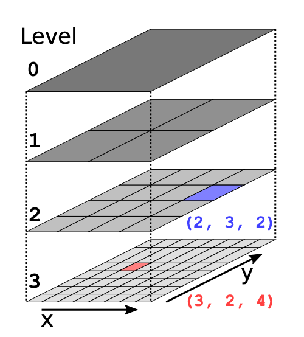
</p>

### External Tilesets

To create a tree of trees, a tile’s content can point to an external tileset (a glTF with the `3DTILES_tileset` extension). This enables, for example, storing each city in a tileset and then having a global tileset of tilesets.

External tilesets are enabled by using the [3DTILES_external_tileset](../extensions/3DTILES_external_tileset/README.md) extension.

<p align="center">
  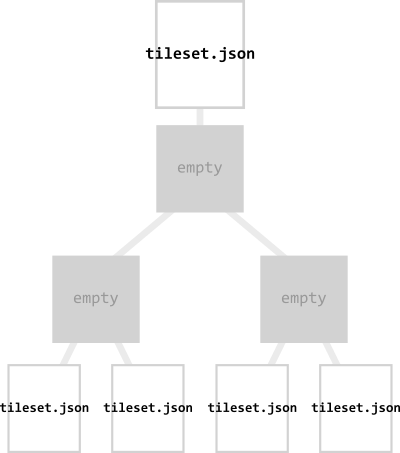
</p>

### Metadata

Application-specific *metadata* may be provided at multiple granularities within a tileset. Properties may be associated with tilesets, tiles, and contents within a tileset file using the `EXT_structural_metadata` extension. Properties may also be associated with features or with individual vertices and texels within content files.

The following example shows a tileset with tileset metadata, tile metadata, and content metadata. The referenced asset `root.glb` may also use `EXT_structural_metadata`, for example, for storing per-building metadata.

```json
{
  "extensionsUsed": ["3DTILES_tileset", "EXT_structural_metadata"],
  "extensionsRequired": ["3DTILES_tileset"],
  "externalAssets": [
    {
      "uri": "root.glb",
      "EXT_structural_metadata": {
        "class": "geometryData",
        "properties": {
          "vertices": 49534,
          "primitives": 2
        }
      }
    }
  ],
  "extensions": {
    "3DTILES_tileset": {
      "geometricError": 240
    },
    "EXT_structural_metadata": {
      "class": "city",
      "properties": {
        "name": "New York City",
        "country": "United States",
        "population": 8804190
      }
    }
  },
  "nodes": [
    {
      "extensions": {
        "3DTILES_tileset": {
          "geometricError": 0.0,
          "refine": "ADD"
        },
        "EXT_structural_metadata": {
          "class": "block",
          "properties": {
            "borough": "Manhattan",
            "zipCode": 10024,
            "population": 52428
          }
        }
      },
      "boundingVolume": {
        "shape": 0
      },
      "externalAsset": 0
    }
  ]
}
```

### Declarative Styling

3D Tiles includes concise declarative styling defined with JSON and expressions written in a small subset of JavaScript augmented for styling.

For complete details, see the [Declarative Styling](https://github.com/CesiumGS/3d-tiles/tree/main/specification/Styling/) specification.

## Appendix A: Spatial Data Structures

### Quadtrees

A quadtree is created when each tile has four uniformly subdivided children, similar to typical 2D geospatial tiling schemes. Empty child tiles can be omitted.

<p align="center">
  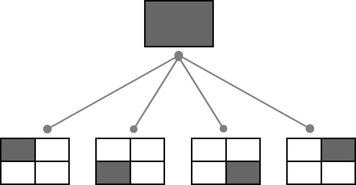<br/>
  Classic quadtree subdivision.
</p>

3D Tiles enable quadtree variations such as non-uniform subdivision and tight bounding volumes (as opposed to bounding, for example, the full 25% of the parent tile, which is wasteful for sparse datasets).

<p align="center">
  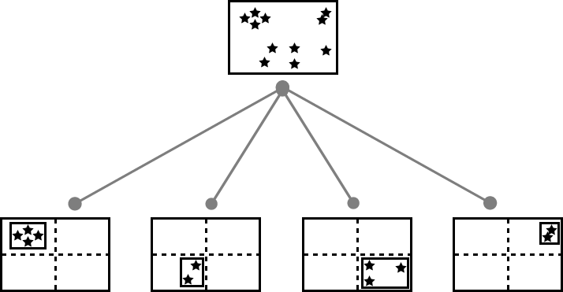<br/>
  Quadtree with tight bounding volumes around each child.
</p>

For example, here is the root tile and its children for Canary Wharf. Note the bottom left, where the bounding volume does not include the water on the left where no buildings will appear:

<p align="center">
  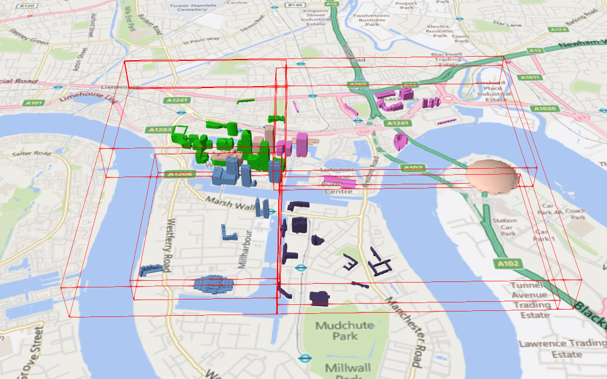<br/>
  Building data from <a href="http://www.cybercity3d.com/">CyberCity3D</a>. Imagery data from <a href="https://www.microsoft.com/maps/">Bing Maps</a>.
</p>

3D Tiles also enable other quadtree variations such as [loose quadtrees](http://www.tulrich.com/geekstuff/partitioning.html), where child tiles overlap but spatial coherence is still preserved, i.e., a parent tile completely encloses all of its children. This approach can be useful to avoid splitting features, such as 3D models, across tiles.

<p align="center">
  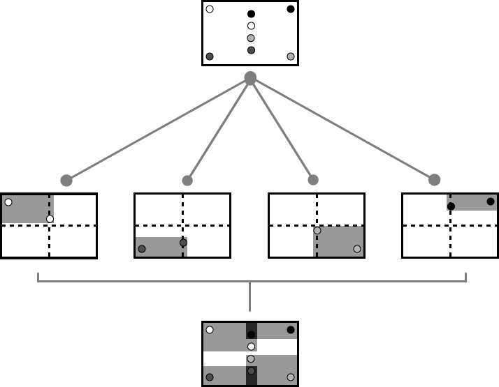<br/>
  Quadtree with non-uniform and overlapping tiles.
</p>

Below, the green buildings are in the left child and the purple buildings are in the right child. Note that the tiles overlap so the two green and one purple building in the center are not split.

<p align="center">
  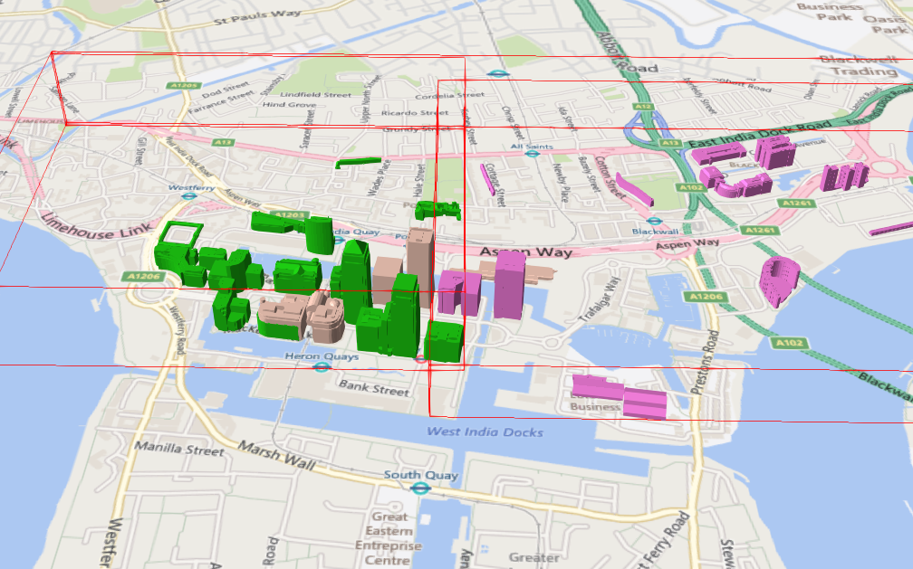
</p>

#### K-d trees

A k-d tree is created when each tile has two children separated by a *splitting plane* parallel to the *x*, *y*, or *z* axis (or latitude, longitude, height). The split axis is often round-robin rotated as levels increase down the tree, and the splitting plane may be selected using the median split, surface area heuristics, or other approaches.

<p align="center">
  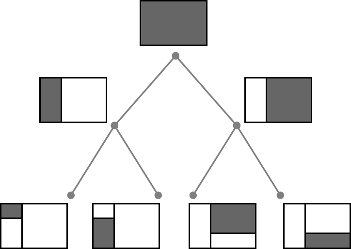<br/>
  Example k-d tree. Note the non-uniform subdivision.
</p>

Note that a k-d tree does not have uniform subdivision like typical 2D geospatial tiling schemes and, therefore, can create a more balanced tree for sparse and non-uniformly distributed datasets.

3D Tiles enables variations on k-d trees such as [multi-way k-d trees](http://www.crs4.it/vic/cgi-bin/bib-page.cgi?id=%27Goswami:2013:EMF%27) where, at each leaf of the tree, there are multiple splits along an axis. Instead of having two children per tile, there are `n` children.

#### Octrees

An octree extends a quadtree by using three orthogonal splitting planes to subdivide a tile into eight children. Like quadtrees, 3D Tiles allows variations to octrees such as non-uniform subdivision, tight bounding volumes, and overlapping children.

<p align="center">
  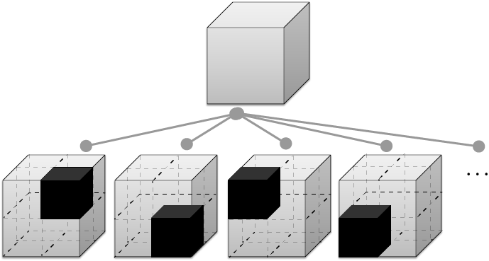<br/>
  Traditional octree subdivision.
</p>

<p align="center">
  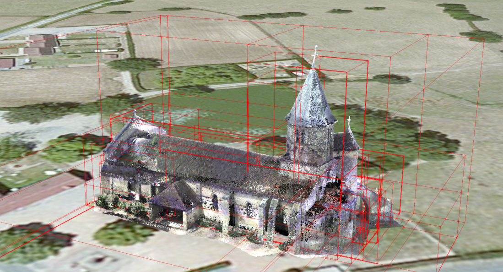<br/>
  Non-uniform octree subdivision for a point cloud using additive refinement. Point Cloud of <a href="http://robotics.cs.columbia.edu/~atroccol/ijcv/chappes.html">the Church of St Marie at Chappes, France</a> by Prof. Peter Allen, Columbia University Robotics Lab. Scanning by Alejandro Troccoli and Matei Ciocarlie.
</p>

#### Grids

3D Tiles enables uniform, non-uniform, and overlapping grids by supporting an arbitrary number of child tiles. For example, here is a top-down view of a non-uniform overlapping grid of Cambridge:

<p align="center">
  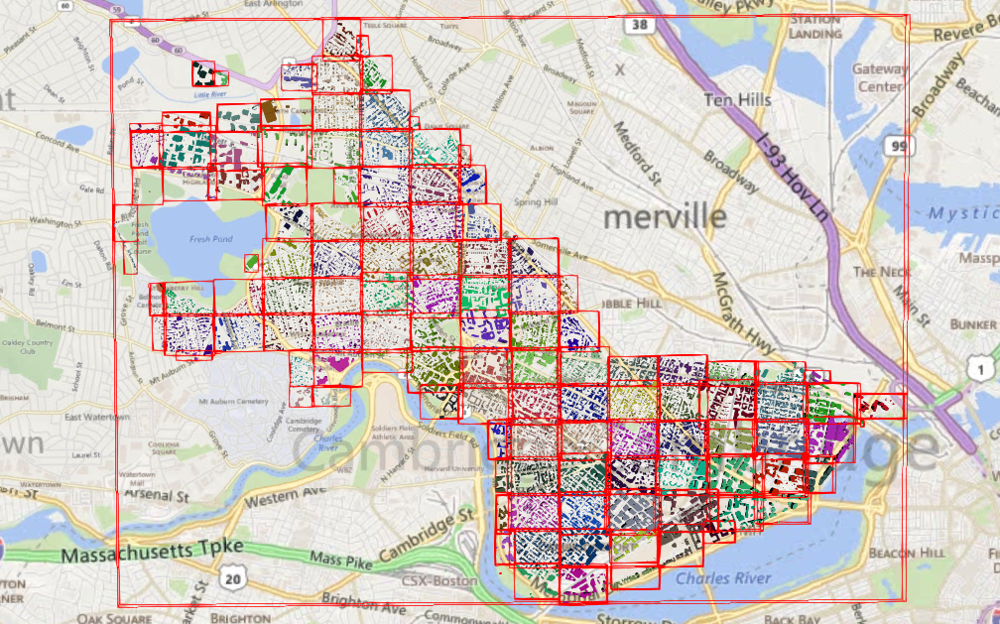
</p>

3D Tiles takes advantage of empty tiles: those tiles that have a bounding volume, but no content. Since a tile's `content` property does not need to be defined, empty non-leaf tiles can be used to accelerate non-uniform grids with hierarchical culling. This essentially creates a quadtree or octree without hierarchical levels of detail (HLOD).

## TODO

- Finalize approach for content bounding volumes
- Re-introduce viewerRequestVolume as extension
- Better picture for replacement refinement
- More examples of geometric error in appendix
- Add geometric error image from reference card
- Section on unconditional refinement
- Update external tilesets image
