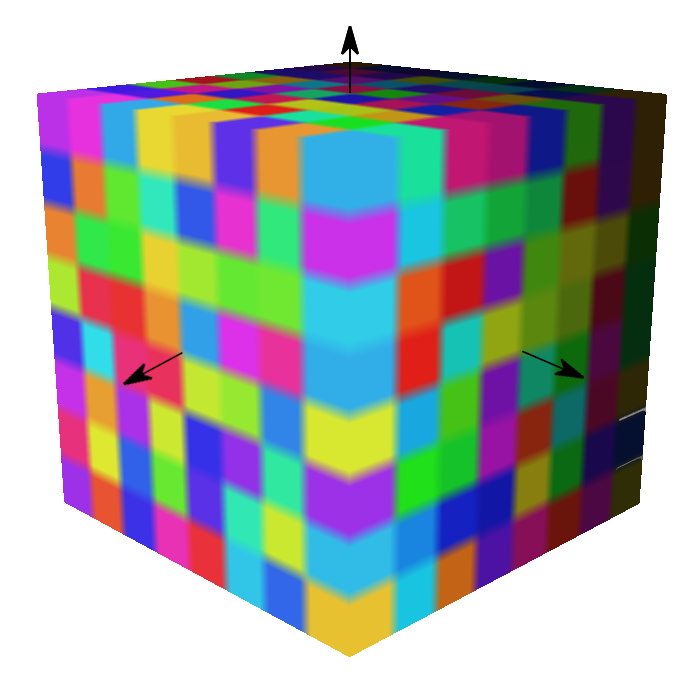
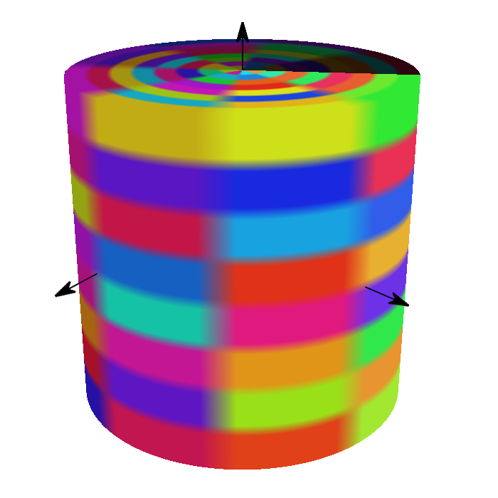

<!--
SPDX-FileCopyrightText: 2026 Bentley Systems, Incorporated

SPDX-License-Identifier: CC-BY-4.0
-->

# 3DTILES\_tileset\_voxels

## Contributors

- Sean Lilley, Cesium
- Ian Lilley, Cesium
- Janine Liu, Cesium
- Jeshurun Hembd, Cesium

## Status

Draft

## Dependencies

Written against the glTF 2.1 spec.

Depends on [3DTILES_tileset](../3DTILES_tileset/README.md).
Depends on [EXT_structural_metadata](https://github.com/CesiumGS/glTF/tree/3d-tiles-next/extensions/2.0/Vendor/EXT_structural_metadata).

## Optional vs. Required

This extension is required, meaning it **MUST** be placed in both `extensionsRequired` and `extensionsUsed`.

## Contents

- [Overview](#overview)
- [Example](#example)
- [Notes](#notes)

## Overview

This extension indicates the presence of voxel content and associates it with metadata definitions. Voxels are stored as glTFs with the [`EXT_voxels`](../EXT_voxels) extension and are paired with [`EXT_structural_metadata`](https://github.com/CesiumGS/glTF/tree/3d-tiles-next/extensions/2.0/Vendor/EXT_structural_metadata) to unify the metadata schema across all the tiles of the tileset.

This extension is often paired with [Implicit Tiling](../3DTILES_implicit_tiling/README.md) for efficient representation of massive sparse voxel datasets. Although rendering implementations may vary, this extension can let runtimes detect voxel content in advance, such that they can allocate the necessary resources before any tiles load.

The document-level extension describes the structure of the voxel grid that each tile will contain.

```json
{
  "extensions": {
    "3DTILES_tileset": {
      "geometricError": 500.0,
    },
    "EXT_structural_metadata": {
      "schemaUri": "schema.json"
    },
    "3DTILES_tileset_voxels": {
      "shape": 0,
      "dimensions": [8, 8, 8],
      "padding": {
        "before": [1, 1, 1],
        "after": [1, 1, 1]
      },
      "class": "voxel"
    }
  }
}
```

#### Shape

The shape and coordinate system of the voxel grid is determined by the `shape` property.

The shape type **MUST** be `"box"` unless additional shape types are enabled through extensions. These extensions include:

- [3DTILES_shape_ellipsoid_region](../3DTILES_shape_ellipsoid_region/README.md)
- [3DTILES_shape_cylinder_region](../3DTILES_shape_cylinder_region/README.md)

The `shape` type **MUST** match the `shape` used for the per-node voxel grids, as specified in the [EXT_voxels extension](../EXT_voxels/README.md)

#### Dimensions

The `dimensions` property of the extension specifies the voxel grid's dimensions along each axis. Dimensions must be nonzero, and elements must be laid out on a first-axis contiguous basis. The meaning of each "axis" depends on the voxel grid's shape, explained below.

For `box` bounding volumes:

Axis|Coordinate|Positive Direction
--|--|--
0|`right`|Along the `+x` to `-x` axis of the bounding volume
1|`forward`|Along the `+z` axis of the bounding volume
2|`up`|Along the `+y` axis of the bounding volume

For `3DTILES_shape_ellipsoid_region` bounding volumes:

Axis|Coordinate|Positive Direction
--|--|--
0|`longitude`|From west to east (increasing longitude)
1|`latitude`|From south to north (increasing latitude)
2|`height`|From bottom to top (increasing height)

For `3DTILES_shape_cylinder_region` bounding volumes:

Axis|Coordinate|Positive Direction
--|--|--
0|`radius`|From center (increasing radius)
1|`angle`|From `-pi` to `pi` counter-clockwise (see figure below)
2|`height`|From bottom to top (increasing height)


These conventions align with how implicit tile coordinates defined in [Implicit Tiling](../../specification/ImplicitTiling/). The figure below shows `"dimensions": [8, 8, 8]` for each shape type:

|Box|Region|Cylinder|
| ------------- | ------------- | ------------- |
||||

#### Padding

The `padding` property specifies how many rows of voxel data in each dimension come from neighboring grids. This is useful in situations where the content represents a single tile in a larger grid, and data from neighboring tiles is needed for non-local effects, e.g., trilinear interpolation, blurring, or anti-aliasing.

`padding.before` and `padding.after` specify the number of rows before and after the grid in each dimension, e.g., a `padding.before` of 1 and a `padding.after` of 2 in the `y` dimension mean that each series of values in a given `y`-slice is preceded by one value and followed by two.

The `padding` property is optional; when omitted, `padding.before` and `padding.after` are both `[0, 0, 0]`. However, it **MUST** match the `padding` property specified in `EXT_voxels` on the glTF voxel grids.

#### Class

The `class` property refers to a class ID in the metadata schema associated with the tileset, as defined in the [`EXT_structural_metadata` extension](https://github.com/CesiumGS/glTF/tree/3d-tiles-next/extensions/2.0/Vendor/EXT_structural_metadata). The class describes which properties exist in the voxel grid. In the example below, each voxel has a `temperature` value and a `salinity` value. When a property value equals the `noData` value it indicates that no data exists for that voxel.

```json
{
  "extensions": {
    "EXT_structural_metadata": {
      "schema": {
        "classes": {
          "voxel": {
            "properties": {
              "temperature": {
                "type": "SCALAR",
                "componentType": "FLOAT32",
                "noData": 999.9
              },
              "salinity": {
                "type": "SCALAR",
                "componentType": "UINT8",
                "normalized": true,
                "noData": 255
              }
            }
          }
        }
      }
    },
    "3DTILES_tileset": {
      "geometricError": 500.0,
    },
    "3DTILES_tileset_voxels": {
      "shape": 0,
      "dimensions": [8, 8, 8],
      "class": "voxel"
    }
  }
}
```

The `class` **MUST** match the `class` used to classify the glTF voxels in their `EXT_strutural_metadata` extension.

## Example

_This section is non-normative_

The following example is a tileset JSON that uses voxel content with implicit tiling.

```json
{
  "extensionsUsed": ["3DTILES_tileset", "3DTILES_tileset_voxels", "EXT_structural_metadata"],
  "extensionsRequired": ["3DTILES_tileset", "3DTILES_tileset_voxels"],
  "asset": {
    "version": "2.1"
  },
  "shapes": [
    {
      "type": "box",
      "box": {
        "size": [1.0, 1.0, 1.0]
      }
    }
  ],
  "extensions": {
    "EXT_structural_metadata": {
      "schema": {
        "classes": {
          "voxel": {
            "properties": {
              "temperature": {
                "type": "SCALAR",
                "componentType": "FLOAT32",
                "noData": 999.9
              },
              "salinity": {
                "type": "SCALAR",
                "componentType": "UINT8",
                "normalized": true,
                "noData": 255
              }
            }
          }
        }
      }
    },
    "3DTILES_tileset": {
      "geometricError": 240
    },
    "3DTILES_tileset_voxels": {
      "shape": 0,
      "dimensions": [8, 8, 8],
      "padding": {
        "before": [1, 1, 1],
        "after": [1, 1, 1]
      },
      "class": "voxel"
    }
  },
  "nodes": [
    {
      "extensions": {
        "3DTILES_tileset": {
          "geometricError": 70.0,
          "refine": "REPLACE"
        },
        "3DTILES_implicit_tiling": {
          "contentUri": "content/{level}/{right}/{forward}/{up}.glb",
          "subtreeUri": "subtrees/{level}/{right}/{forward}{up}.subtree.glb",
          "subdivisionScheme": "OCTREE",
          "availableLevels": 9,
          "subtreeLevels": 3
        }
      },
      "boundingVolume": {
        "shape": 0
      }
    }
  ]
}
```
