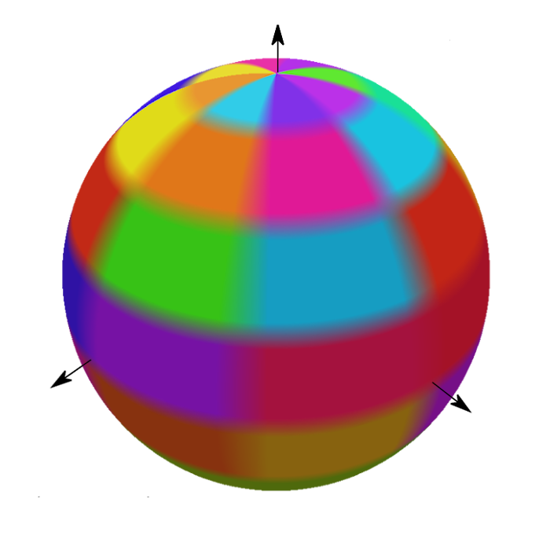
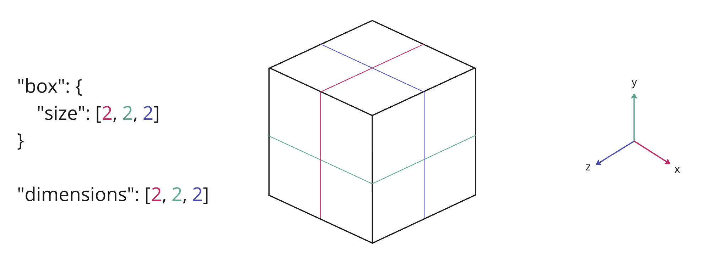
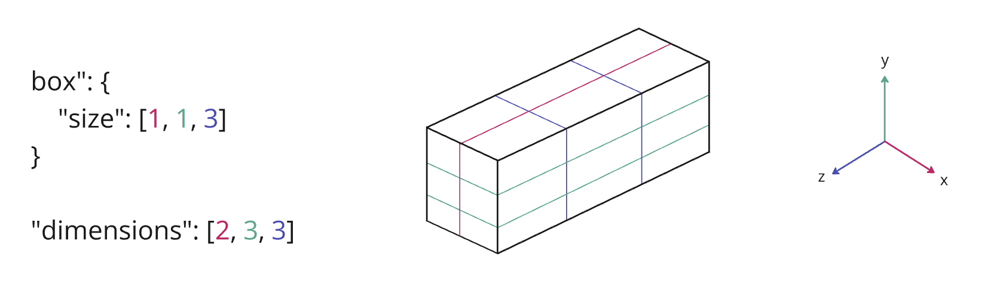
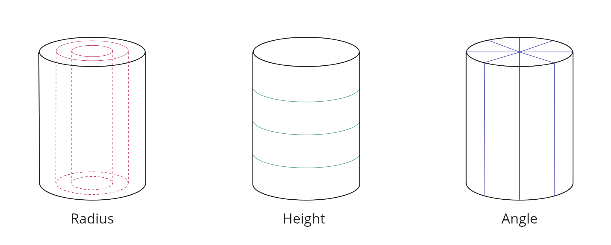
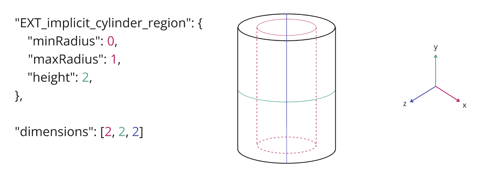
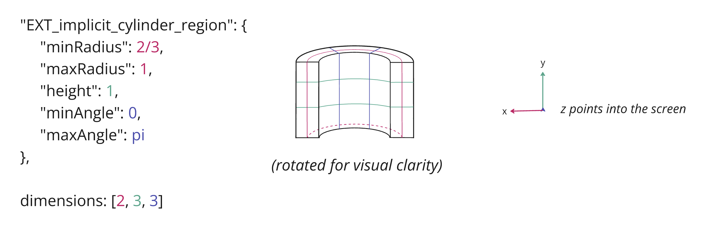
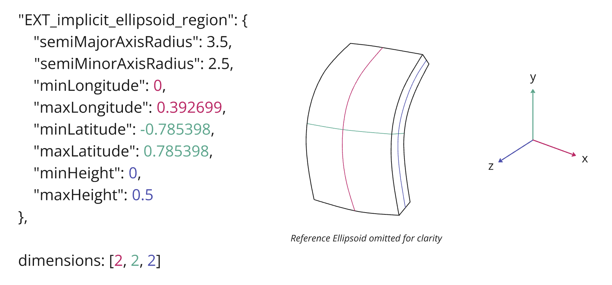
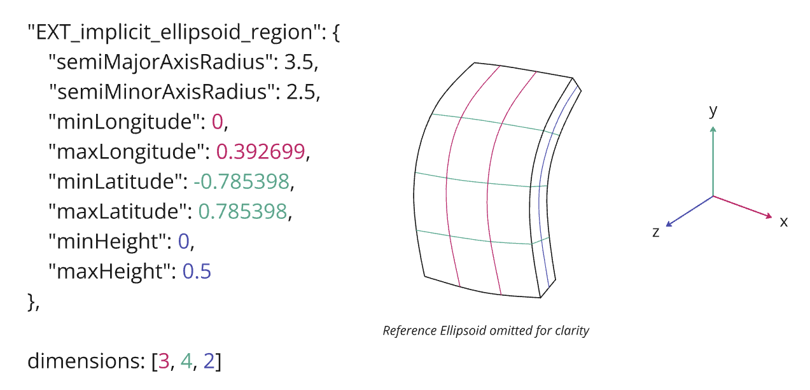
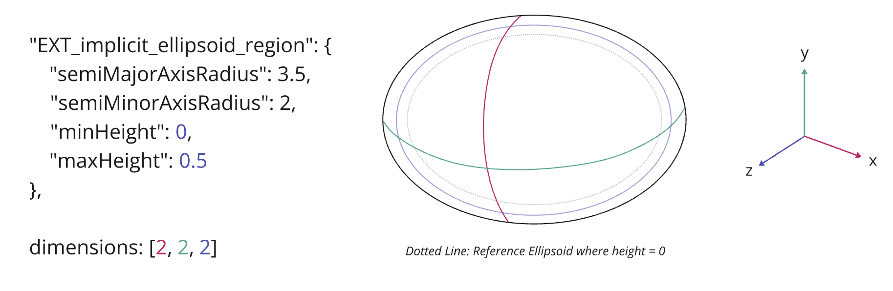

<!--
SPDX-FileCopyrightText: 2026 Bentley Systems, Incorporated

SPDX-License-Identifier: CC-BY-4.0
-->

# EXT_voxels

## Contributors

- Janine Liu, Cesium
- Daniel Krupka, Cesium
- Ian Lilley, Cesium
- Sean Lilley, Cesium
- Jeshurun Hembd, Cesium

## Status

Draft

## Dependencies

Written against the glTF 2.1 specification.

## Optional vs. Required

This extension is required, meaning it **MUST** be placed in both `extensionsUsed` and `extensionsRequired`.

## Contents

- [Overview](#overview)
- [Bounding Volume](#bounding-volume)
- [Dimensions](#dimensions)
  - [Box Shape](#box-shape)
  - [Cylinder Region Shape](#cylinder-region-shape)
  - [Ellipsoid Region Shape](#ellipsoid-region-shape)
- [Padding](#padding)
- [No Data Values](#no-data-values)
- [Metadata](#metadata)

## Overview

This extension allows nodes to represent volumetric (voxel) data via attributes.

```json
{
  "shapes": [
      {
        "type": "box",
        "box": {
          "size": [1.0, 1.0, 1.0]
        }
      },
  ],
  "accessors": [
    {    
      "bufferView": 0,
      "byteOffset": 0,
      "componentType": 5126,
      "count": 24,
      "type": "SCALAR"
    }
  ],
  "nodes": [
    {
      "extensions": {
        "EXT_voxels": {
          "dimensions": [8, 8, 8],
          "attributes": {
            "TEMPERATURE": 0
          }
        }
      },
      "boundingVolume": {
        "shape": 0
      }
    }
  ]
}
```

The attributes directly reference an accessor, describing data associated with the voxel grid.

The `mesh` property **MUST** be omitted.

## Bounding Volume

Voxels exist inside a bounding volume that conforms to the shape of the grid.

The `boundingVolume` property **MUST** be provided when the node uses the `EXT_voxels` extension.

Though voxels are commonly associated with cubic geometry on a box-based grid, this extension also allows voxels to be based on other shapes, including cylinder-based regions specified by [`EXT_implicit_cylinder_region`](../EXT_implicit_cylinder_region/) and ellipsoid-based regions specified by [`EXT_implicit_ellipsoid_region`](../EXT_implicit_ellipsoid_region/). The supported shapes are visualized below.

|Box|Cylinder|Ellipsoid|
| ------------- | ------------- | ------------- |
||||

## Dimensions

The `dimensions` property refers to the number of subdivisions within the bounding volume. Each value of `dimensions` must be a positive integer. The way that `dimensions` is interpreted depends on the shape of the bounding volume, as explained below.

> [!NOTE]
> The following examples use small voxel `dimensions` for illustrative purposes. In practice, voxel nodes will use much larger values for their `dimensions`.

### Box Shape

A **box** shape is divided into a Cartesian grid defined by `right`, `forward`, and `up` axes with equally-sized boxes. The `dimensions` correspond to the subdivisions of the box along the `right`, `forward`, and `up` axes respectively.

Axis|Coordinate|Positive Direction
--|--|--
0|`right`|Along the right axis of the bounding box ($+x$ to $-x$)
1|`forward`|Along the forward axis of the bounding box ($-z$ to $+z$)
2|`up`|Along the up axis of the bounding box ($-y$ to $+y$)

Elements are laid out in memory where the `right` data is contiguous in strides along the `forward` axis, and each group of `forward` strides represents a `up` slice.


<p align="center"><i>A uniform box grid that is subdivided into two cells along each axis.</i></p>


<p align="center"><i>A box grid that is non-uniformly scaled and also non-uniformly subdivided.</i></p>

### Cylinder Region Shape

A **cylinder** region shape is subdivided along the radius, angle, and height ranges of the region. The `dimensions` correspond to the subdivisions of those ranges, respectively.



The cylinder is aligned with the local up-axis (`y`-axis) in the node's local space. Its height is subdivided along that local `y`-axis from bottom to top. Subdivisions along the radius are concentric, centered around the `y`-axis and extending outwards. Finally, the angular bounds are subdivided counter-clockwise around the circumference of the cylinder.

Axis|Coordinate|Positive Direction
--|--|--
0|`radius`|From center (increasing radius)
1|`angle`|From $-\pi$ to $\pi$ counter-clockwise (see figure below)
2|`height`|From bottom to top (increasing height)

Elements are laid out in memory where the radial data is contiguous in strides along the cylinder angle. Each group of angle strides represents a height slice on the cylinder.


<p align="center"><i>A cylinder that is subdivided into two cells along each axis.</i></p>


<p align="center"><i>A smaller cylinder region with radial and angular bounds that is non-uniformly subdivided.</i></p>

### Ellipsoid Region Shape

An **ellipsoid** region shape is subdivided along the longitude, latitude, and height ranges of the region. The `dimensions` correspond to the subdivisions of those ranges, respectively.

Axis|Coordinate|Positive Direction
--|--|--
0|`longitude`|From west to east (increasing longitude)
1|`latitude`|From south to north (increasing latitude)
2|`height`|From bottom to top (increasing height)

Elements are laid out in memory where the longitude data is contiguous in strides along the region's latitude. Each group of latitude strides represents a height slice on the region.


<p align="center"><i>An ellipsoid region that is subdivided into two cells along each axis.</i></p>



<p align="center"><i>An ellipsoid region that is non-uniformly subdivided.</i></p>


<p align="center"><i>A hollow ellipsoid region that covers the entire ellipsoid, subdivided into two cells along each axis.</i></p>

## Padding

The `padding` property specifies how many rows of attribute data in each dimension come from neighboring grids. This is useful in situations where the node represents a single tile in a larger grid, and data from neighboring tiles is needed for non-local effects e.g. trilinear interpolation, blurring, or antialiasing.

`padding.before` and `padding.after` specify the number of rows before and after the grid in each dimension, e.g. a `padding.before` of 1 and a `padding.after` of 2 in the `y` dimension mean that each series of values in a given `y`-slice is preceded by one value and followed by two.

Padding data must be included with the rest of the voxel data. In other words, given `dimensions` of $[d_1, d_2, d_3]$, `padding.before` of $[b_1, b_2, b_3]$, and `padding.after` of $[a_1, a_2, a_3]$, the voxel node's attributes must contain $(d_1 + a_1 + b_1)*(d_2 + a_2 + b_2)*(d_3 + a_3 + b_3)$ elements. In the following example, the attributes on this voxel node must supply $(8 + 1 + 1)*(8 + 1 + 1)*(8 + 1 + 1) = 1000$ elements.

```json
"extensions": {
  "EXT_voxels": {
    "dimensions": [8, 8, 8],
    "padding": {
      "before": [1, 1, 1],
      "after": [1, 1, 1]
    }
  }
}
```

## No Data Values

A voxel node may optionally specify a "No Data" value (or "sentinel value") for its attributes to indicate where property values do not exist. This "No Data" value may be provided for any type of attribute, but must be defined according to the type of its `accessor`. For `normalized` accessors, the `noData` value should be specified as the raw data value *before* normalization.

The "No Data" values for attributes must be defined in the `noData` object. Any key in `noData` must match an existing key in the extension's `attributes` object. However, not all `attributes` are required to provide a `noData` value.

For instance, if an attribute references the following accessors...

```json
"accessors": [
  {
    "type": "SCALAR",
    "componentType": 5122, // SHORT
    "normalized": true
  },
  {
    "type": "VEC3",
    "componentType": 5126, // FLOAT
  },
  // ....
]
```

...then it may define `noData` values for its corresponding attributes like so:

```json
"nodes": [
  {
    "extensions": {
      "EXT_voxels": {
        "dimensions": [8, 8, 8],
        "attributes": {
          "_TEMPERATURE": 0,
          "_DIRECTION": 1,
          "_DATA_CONFIDENCE": 2
        },
        "noData": {
          "_TEMPERATURE": [-32768],
          "_DIRECTION": [-999.99, -999.99, -999.99]
        }
      }
    }
  }
]
```

Note that `_DATA_CONFIDENCE` intentionally does not specify a `noData` value. The attribute is expected to contain a valid value for every voxel cell.

## Metadata

This extension may be paired with the `EXT_structural_metadata` extension to convey more semantic information about the voxel attributes.

```json
{
  "extensions": {
    "EXT_structural_metadata": {
      "schema": {
        "classes": {
          "voxels": {
            "properties": {
              "temperature": {
                "type": "SCALAR",
                "componentType": "UINT32",
                "normalized": true,
                "offset": 32.0,
                "scale": 1.8
              }
            }
          }
        }
      },
      "propertyAttributes": [
        {
          "class": "voxels",
          "properties": {
            "temperature":{
              "attribute": "_TEMPERATURE"
            }
          }
        }
      ]
    }
  },
  "nodes": [
    {
      "extensions": {
        "EXT_voxels": {
          "dimensions": [8, 8, 8],
          "padding": {
            "before": [1, 1, 1],
            "after": [1, 1, 1]
          },
          "attributes": {
            "_TEMPERATURE": 0
          },
          "extensions": {
            "EXT_structural_metadata": {
              "propertyAttributes": [0]
            }
          }
        }
      }
    }
  ]
}
```

`EXT_structural_metadata` may also specify a `noData` value for a property attribute property. If `EXT_voxels` contains an entry in `noData` for the same attribute, the values **SHOULD** match betwen the two extensions.
